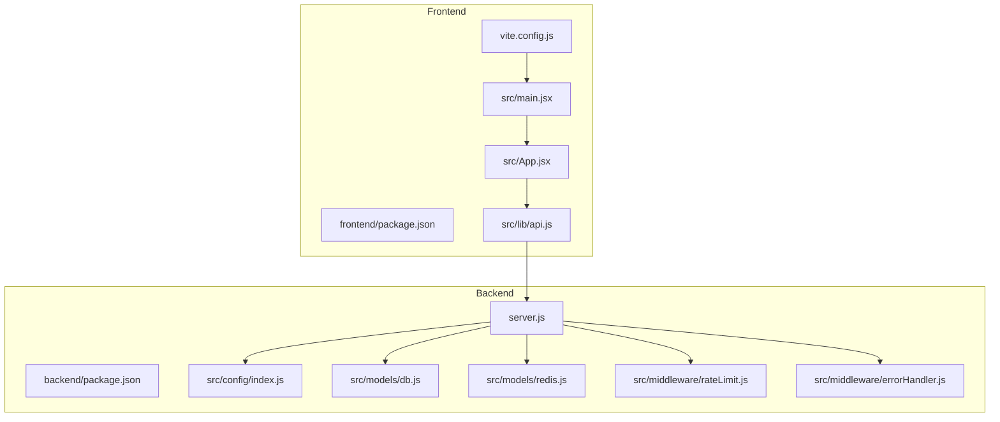
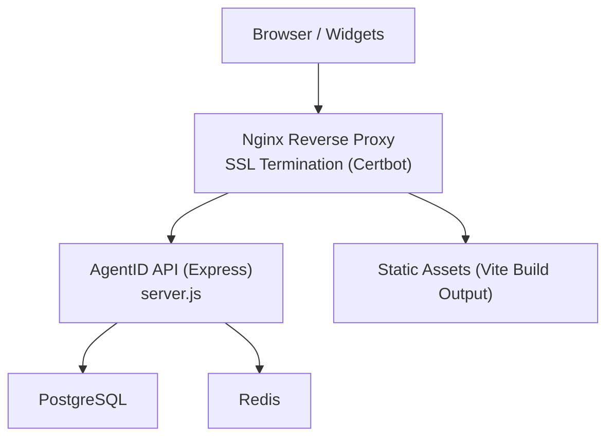
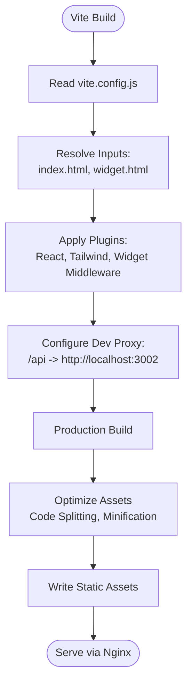
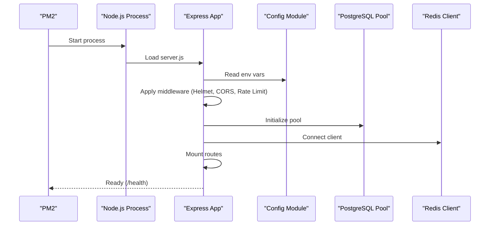
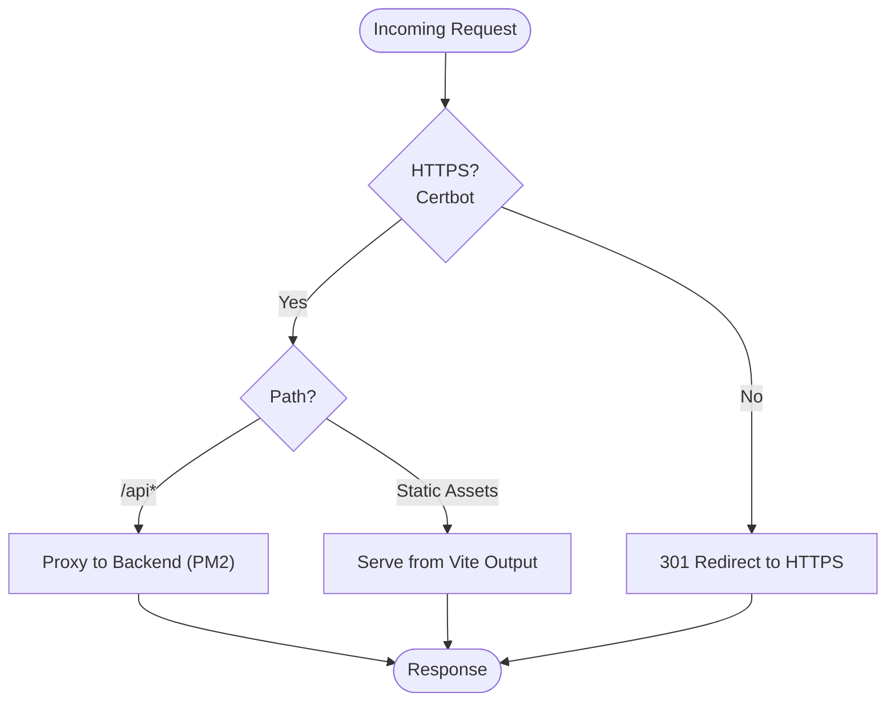
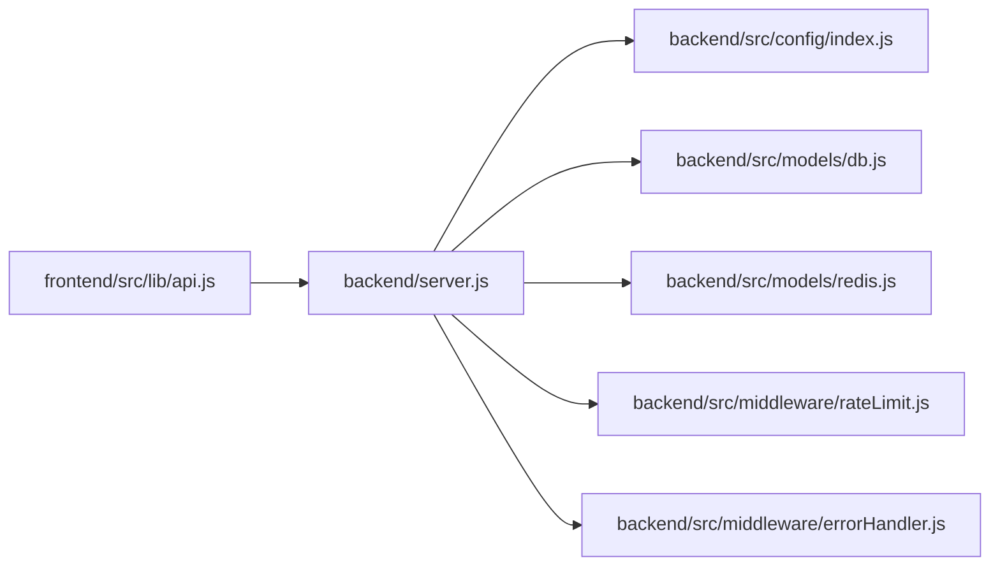

# Build & Deployment

<cite>
**Referenced Files in This Document**
- [backend/package.json](file://backend/package.json)
- [frontend/package.json](file://frontend/package.json)
- [vite.config.js](file://frontend/vite.config.js)
- [server.js](file://backend/server.js)
- [index.js](file://backend/src/config/index.js)
- [db.js](file://backend/src/models/db.js)
- [redis.js](file://backend/src/models/redis.js)
- [rateLimit.js](file://backend/src/middleware/rateLimit.js)
- [errorHandler.js](file://backend/src/middleware/errorHandler.js)
- [api.js](file://frontend/src/lib/api.js)
- [main.jsx](file://frontend/src/main.jsx)
- [App.jsx](file://frontend/src/App.jsx)
- [agentid_build_plan.md](file://agentid_build_plan.md)
</cite>

## Table of Contents
1. [Introduction](#introduction)
2. [Project Structure](#project-structure)
3. [Core Components](#core-components)
4. [Architecture Overview](#architecture-overview)
5. [Detailed Component Analysis](#detailed-component-analysis)
6. [Dependency Analysis](#dependency-analysis)
7. [Performance Considerations](#performance-considerations)
8. [Troubleshooting Guide](#troubleshooting-guide)
9. [Conclusion](#conclusion)
10. [Appendices](#appendices)

## Introduction
This document provides comprehensive build and deployment guidance for the AgentID system. It covers the frontend build process (Vite compilation, asset optimization, bundle analysis, and static asset generation), backend deployment (Node.js application setup, process management with PM2, and server configuration), and the deployment architecture (Nginx server blocks, SSL certificate configuration with Certbot, and reverse proxy setup). It also includes CI/CD pipeline considerations, automated testing integration, deployment automation strategies, load balancing setup, monitoring configuration, rollback procedures, scaling considerations, performance optimization, and maintenance procedures for production deployments.

## Project Structure
The AgentID project is organized into two primary areas:
- Backend: Node.js/Express application with routing, middleware, database, and Redis integration.
- Frontend: React/Vite application serving the registry explorer UI and embeddable widget.

**Diagram sources**
- [server.js:1-76](file://backend/server.js#L1-L76)
- [index.js:1-30](file://backend/src/config/index.js#L1-L30)
- [db.js:1-45](file://backend/src/models/db.js#L1-L45)
- [redis.js:1-94](file://backend/src/models/redis.js#L1-L94)
- [rateLimit.js:1-62](file://backend/src/middleware/rateLimit.js#L1-L62)
- [errorHandler.js:1-44](file://backend/src/middleware/errorHandler.js#L1-L44)
- [frontend/package.json:1-33](file://frontend/package.json#L1-L33)
- [vite.config.js:1-42](file://frontend/vite.config.js#L1-L42)
- [main.jsx:1-11](file://frontend/src/main.jsx#L1-L11)
- [App.jsx:1-107](file://frontend/src/App.jsx#L1-L107)
- [api.js:1-140](file://frontend/src/lib/api.js#L1-L140)

**Section sources**
- [agentid_build_plan.md:258-302](file://agentid_build_plan.md#L258-L302)

## Core Components
- Backend application: Express server with health checks, CORS, rate limiting, and global error handling. Routes are mounted for registration, verification, badges, reputation, agents, attestations, and widgets.
- Configuration: Centralized environment-driven configuration for ports, external APIs, database, Redis, CORS, and cache TTLs.
- Data persistence: PostgreSQL connection pool with production SSL handling and robust error logging.
- Caching: Redis client with retry strategy, offline queue, and cache helpers for badge and challenge storage.
- Middleware: Rate limiting with configurable windows and limits, plus a global error handler.
- Frontend: React application built with Vite, Tailwind, and React Router, with an Axios-based API client that proxies to the backend via /api.

**Section sources**
- [server.js:1-76](file://backend/server.js#L1-L76)
- [index.js:1-30](file://backend/src/config/index.js#L1-L30)
- [db.js:1-45](file://backend/src/models/db.js#L1-L45)
- [redis.js:1-94](file://backend/src/models/redis.js#L1-L94)
- [rateLimit.js:1-62](file://backend/src/middleware/rateLimit.js#L1-L62)
- [errorHandler.js:1-44](file://backend/src/middleware/errorHandler.js#L1-L44)
- [frontend/package.json:1-33](file://frontend/package.json#L1-L33)
- [vite.config.js:1-42](file://frontend/vite.config.js#L1-L42)
- [api.js:1-140](file://frontend/src/lib/api.js#L1-L140)

## Architecture Overview
The deployment architecture centers around a Node.js/Express backend exposed via Nginx reverse proxy with SSL termination handled by Certbot. The frontend is served statically by Nginx after Vite build. PM2 manages the backend process with environment-specific configuration.

**Diagram sources**
- [server.js:1-76](file://backend/server.js#L1-L76)
- [db.js:1-45](file://backend/src/models/db.js#L1-L45)
- [redis.js:1-94](file://backend/src/models/redis.js#L1-L94)
- [agentid_build_plan.md:14-38](file://agentid_build_plan.md#L14-L38)

## Detailed Component Analysis

### Frontend Build Process (Vite)
- Build targets: Multi-page build with separate entry points for the main application and the widget.
- Development server: Local port with proxy configuration to forward /api requests to the backend.
- Plugins: React and Tailwind integrations; custom middleware to serve the widget entry for widget routes in development.
- Asset optimization: Vite handles code splitting, minification, and asset hashing in production builds.
- Bundle analysis: Recommended to integrate Vite bundle analyzers during CI for visibility into bundle composition.
- Static asset generation: Production build outputs static assets under the Vite output directory for Nginx serving.

**Diagram sources**
- [vite.config.js:1-42](file://frontend/vite.config.js#L1-L42)

**Section sources**
- [vite.config.js:1-42](file://frontend/vite.config.js#L1-L42)
- [frontend/package.json:1-33](file://frontend/package.json#L1-L33)

### Backend Deployment (Node.js + PM2)
- Application startup: Express app exported for modular use and started when executed as main module.
- Environment configuration: Centralized configuration reads from environment variables with sensible defaults.
- Process management: PM2 recommended for process lifecycle, restart policies, and environment isolation.
- Health checks: Built-in /health endpoint supports readiness/liveness probes.
- Security middleware: Helmet, CORS, and rate limiting applied globally.

**Diagram sources**
- [server.js:1-76](file://backend/server.js#L1-L76)
- [index.js:1-30](file://backend/src/config/index.js#L1-L30)
- [db.js:1-45](file://backend/src/models/db.js#L1-L45)
- [redis.js:1-94](file://backend/src/models/redis.js#L1-L94)

**Section sources**
- [server.js:1-76](file://backend/server.js#L1-L76)
- [index.js:1-30](file://backend/src/config/index.js#L1-L30)
- [rateLimit.js:1-62](file://backend/src/middleware/rateLimit.js#L1-L62)
- [errorHandler.js:1-44](file://backend/src/middleware/errorHandler.js#L1-L44)

### Deployment Architecture (Nginx + SSL + Reverse Proxy)
- Server blocks: Configure virtual hosts for the domain(s) hosting AgentID.
- SSL certificates: Provision and renew certificates using Certbot.
- Reverse proxy: Forward /api requests to the backend service while serving static assets directly.
- Static delivery: Serve frontend build artifacts from the Vite output directory.
- Security headers: Enforce HTTPS, HSTS, and other security best practices via Nginx.

**Diagram sources**
- [vite.config.js:31-40](file://frontend/vite.config.js#L31-L40)
- [api.js:3-8](file://frontend/src/lib/api.js#L3-L8)
- [agentid_build_plan.md:14-38](file://agentid_build_plan.md#L14-L38)

**Section sources**
- [vite.config.js:31-40](file://frontend/vite.config.js#L31-L40)
- [api.js:3-8](file://frontend/src/lib/api.js#L3-L8)

### CI/CD Pipeline Considerations
- Automated testing: Integrate unit and integration tests into the pipeline to validate backend routes and frontend API interactions.
- Build stages: Separate frontend build and backend build steps; publish artifacts for deployment.
- Deployment automation: Use PM2 ecosystem files to manage environments and deploy hooks; orchestrate Nginx reloads post-deploy.
- Rollback procedures: Maintain artifact versions and use blue/green or rolling updates with health checks; rollback to previous version on failure.
- Monitoring: Instrument backend with metrics and logs; configure alerting for error rates, latency, and resource utilization.

[No sources needed since this section provides general guidance]

### Load Balancing Setup
- Horizontal scaling: Run multiple Node.js instances behind a load balancer (e.g., Nginx or cloud LB).
- Sticky sessions: Not required for stateless API; ensure Redis is shared for challenge caches.
- Health checks: Use /health endpoint for readiness probes; auto-remove unhealthy nodes.
- Graceful shutdown: Implement SIGTERM handling to drain connections before restart.

[No sources needed since this section provides general guidance]

### Monitoring Configuration
- Backend metrics: Expose metrics endpoints and integrate with monitoring stacks (Prometheus/Grafana).
- Logs: Centralize application logs and correlate with request IDs for debugging.
- Uptime: Monitor API availability and response times; alert on SLA breaches.
- Frontend monitoring: Track Core Web Vitals and error tracking for the React app.

[No sources needed since this section provides general guidance]

### Rollback Procedures
- Version tagging: Tag releases with semantic versions and maintain rollback images.
- Blue/green: Keep inactive environment ready; switch traffic on successful validation.
- Database migrations: Use reversible migrations and maintain migration checkpoints.
- Configuration drift: Manage environment variables via secure secret managers and version control.

[No sources needed since this section provides general guidance]

### Scaling Considerations
- Stateless backend: Design API to be stateless; rely on Redis for transient state.
- Database scaling: Use read replicas and connection pooling; optimize queries and indexes.
- CDN: Offload static assets to CDN for global distribution.
- Auto-scaling: Scale backend instances based on CPU/memory or request rate; adjust Redis cluster as needed.

[No sources needed since this section provides general guidance]

### Performance Optimization
- Frontend: Enable code splitting, lazy loading, and image optimization; monitor bundle size.
- Backend: Tune connection pool sizes, implement efficient caching with Redis TTLs, and minimize database round-trips.
- Network: Use compression, HTTP/2, and keep-alive connections; reduce latency with geographically closer infrastructure.

[No sources needed since this section provides general guidance]

### Maintenance Procedures
- Patch Node.js and dependencies regularly; validate against test suites.
- Rotate secrets and update environment variables via secure channels.
- Review and prune unused Redis keys; monitor memory usage.
- Audit database indexes and query plans; archive old verification records.

[No sources needed since this section provides general guidance]

## Dependency Analysis
The backend depends on configuration, database, and Redis modules. The frontend depends on Vite configuration and the Axios API client that proxies to the backend.

**Diagram sources**
- [api.js:1-140](file://frontend/src/lib/api.js#L1-L140)
- [server.js:1-76](file://backend/server.js#L1-L76)
- [index.js:1-30](file://backend/src/config/index.js#L1-L30)
- [db.js:1-45](file://backend/src/models/db.js#L1-L45)
- [redis.js:1-94](file://backend/src/models/redis.js#L1-L94)
- [rateLimit.js:1-62](file://backend/src/middleware/rateLimit.js#L1-L62)
- [errorHandler.js:1-44](file://backend/src/middleware/errorHandler.js#L1-L44)

**Section sources**
- [api.js:1-140](file://frontend/src/lib/api.js#L1-L140)
- [server.js:1-76](file://backend/server.js#L1-L76)

## Performance Considerations
- Database: Use connection pooling and SSL in production; monitor slow queries and tune indexes.
- Cache: Set appropriate TTLs for badges and challenges; monitor hit ratios and latency.
- Frontend: Analyze bundle size and remove unused dependencies; leverage lazy loading for routes.
- Network: Enable gzip/deflate and HTTP/2; consider CDN for static assets.

[No sources needed since this section provides general guidance]

## Troubleshooting Guide
- Health checks: Use the /health endpoint to verify service readiness.
- Error logging: Inspect centralized logs for stack traces and error details.
- Rate limiting: Investigate 429 responses and adjust limits for authenticated endpoints.
- CORS: Verify allowed origins and credentials configuration.
- Database connectivity: Confirm connection string and SSL settings; check pool error logs.
- Redis connectivity: Validate connection retry strategy and offline queue behavior.

**Section sources**
- [server.js:34-41](file://backend/server.js#L34-L41)
- [errorHandler.js:15-41](file://backend/src/middleware/errorHandler.js#L15-L41)
- [rateLimit.js:23-42](file://backend/src/middleware/rateLimit.js#L23-L42)
- [index.js:21-26](file://backend/src/config/index.js#L21-L26)
- [db.js:10-18](file://backend/src/models/db.js#L10-L18)
- [redis.js:9-20](file://backend/src/models/redis.js#L9-L20)

## Conclusion
The AgentID system combines a React/Vite frontend with a Node.js/Express backend, supported by PostgreSQL and Redis. For production, deploy behind Nginx with SSL managed by Certbot, run the backend with PM2, and implement CI/CD with automated testing and deployment automation. Use monitoring, load balancing, and careful maintenance to ensure reliability and scalability.

[No sources needed since this section summarizes without analyzing specific files]

## Appendices
- Environment variables and deployment notes are documented in the build plan, including database URLs, Redis configuration, CORS origins, and cache TTLs.

**Section sources**
- [agentid_build_plan.md:309-330](file://agentid_build_plan.md#L309-L330)