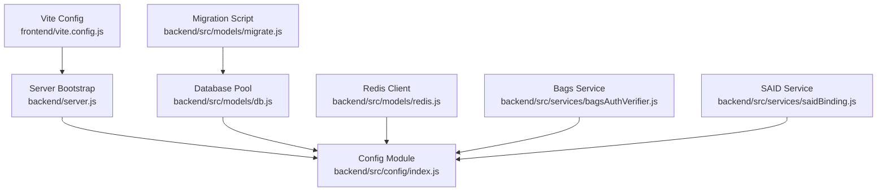
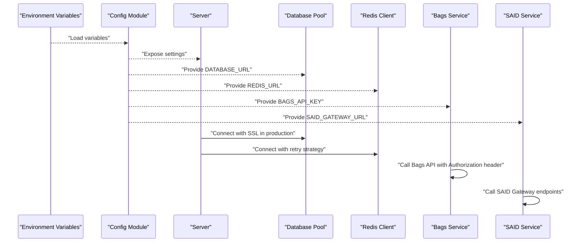
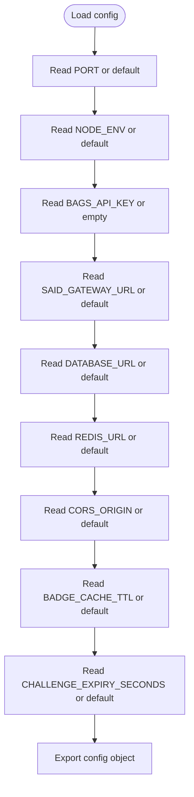
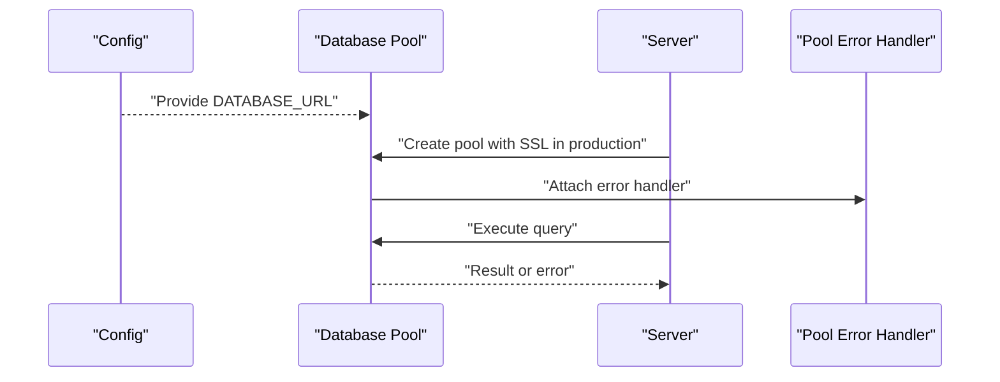
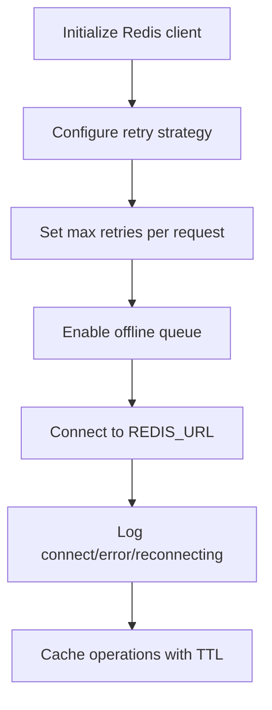
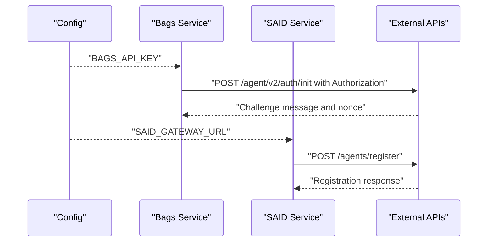
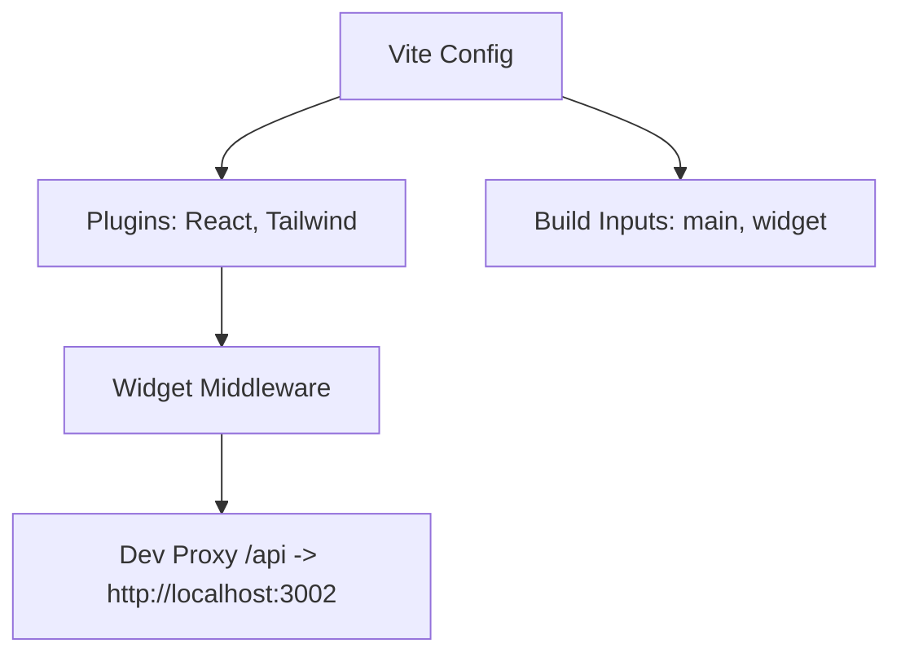
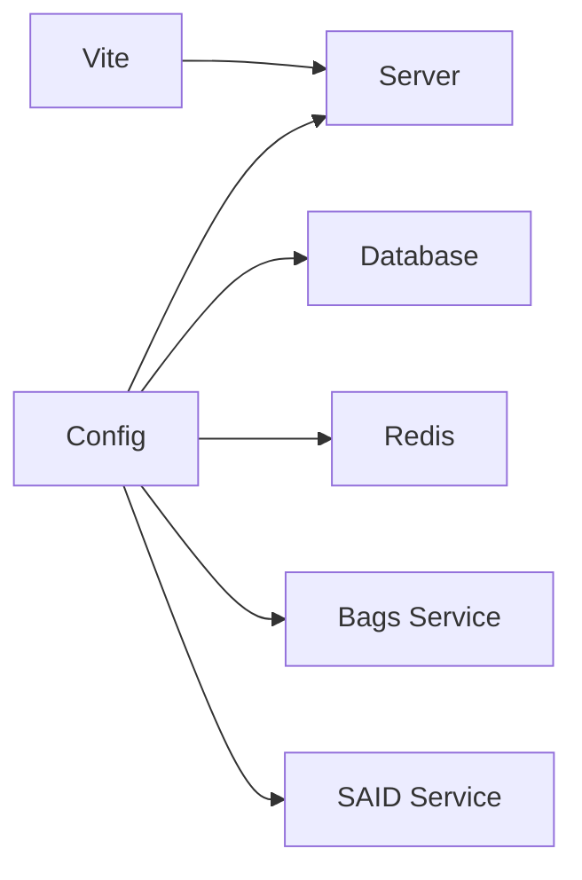

# Configuration Management

<cite>
**Referenced Files in This Document**
- [backend/src/config/index.js](file://backend/src/config/index.js)
- [backend/server.js](file://backend/server.js)
- [backend/src/models/db.js](file://backend/src/models/db.js)
- [backend/src/models/redis.js](file://backend/src/models/redis.js)
- [backend/src/models/migrate.js](file://backend/src/models/migrate.js)
- [backend/src/services/bagsAuthVerifier.js](file://backend/src/services/bagsAuthVerifier.js)
- [backend/src/services/saidBinding.js](file://backend/src/services/saidBinding.js)
- [backend/package.json](file://backend/package.json)
- [frontend/vite.config.js](file://frontend/vite.config.js)
- [frontend/package.json](file://frontend/package.json)
- [agentid_build_plan.md](file://agentid_build_plan.md)
</cite>

## Table of Contents
1. [Introduction](#introduction)
2. [Project Structure](#project-structure)
3. [Core Components](#core-components)
4. [Architecture Overview](#architecture-overview)
5. [Detailed Component Analysis](#detailed-component-analysis)
6. [Dependency Analysis](#dependency-analysis)
7. [Performance Considerations](#performance-considerations)
8. [Troubleshooting Guide](#troubleshooting-guide)
9. [Conclusion](#conclusion)
10. [Appendices](#appendices)

## Introduction
This document describes the configuration management system for the AgentID project, focusing on centralized environment configuration, service settings, and frontend build configuration. It explains how environment variables are used to control external integrations (Bags API and SAID Protocol gateway), database and Redis connectivity, CORS, and cache behavior. It also covers development versus production differences, security considerations for sensitive configuration, validation approaches, and practical deployment examples for local, containerized, and cloud environments.

## Project Structure
The configuration system spans three primary areas:
- Backend configuration module that reads environment variables and exposes a central config object
- Backend services that consume configuration for external API endpoints and timeouts
- Frontend Vite configuration for development proxying and build targets

**Diagram sources**
- [backend/src/config/index.js:1-30](file://backend/src/config/index.js#L1-L30)
- [backend/server.js:1-76](file://backend/server.js#L1-L76)
- [backend/src/models/db.js:1-45](file://backend/src/models/db.js#L1-L45)
- [backend/src/models/redis.js:1-94](file://backend/src/models/redis.js#L1-L94)
- [backend/src/models/migrate.js:1-99](file://backend/src/models/migrate.js#L1-L99)
- [backend/src/services/bagsAuthVerifier.js:1-87](file://backend/src/services/bagsAuthVerifier.js#L1-L87)
- [backend/src/services/saidBinding.js:1-119](file://backend/src/services/saidBinding.js#L1-L119)
- [frontend/vite.config.js:1-42](file://frontend/vite.config.js#L1-L42)

**Section sources**
- [backend/src/config/index.js:1-30](file://backend/src/config/index.js#L1-L30)
- [backend/server.js:1-76](file://backend/server.js#L1-L76)
- [frontend/vite.config.js:1-42](file://frontend/vite.config.js#L1-L42)

## Core Components
Centralized environment configuration is defined in a single module and consumed across services and models. The configuration includes:
- Server settings: port and environment mode
- External API integration: Bags API key and SAID gateway URL
- Database connectivity: connection string
- Redis connectivity: connection URL
- CORS origin for the frontend domain
- Cache and expiry settings: badge cache TTL and challenge expiry

These values are read from environment variables with sensible defaults, enabling quick setup in development while allowing overrides in production.

**Section sources**
- [backend/src/config/index.js:6-27](file://backend/src/config/index.js#L6-L27)

## Architecture Overview
The configuration architecture ensures that all runtime behavior is controlled by environment variables. The server loads configuration, applies security middleware, and mounts routes. Services use configuration to call external APIs and manage timeouts. Models use configuration to connect to PostgreSQL and Redis. The frontend Vite configuration proxies API requests to the backend during development and defines build targets for both the main app and the widget.

**Diagram sources**
- [backend/src/config/index.js:6-27](file://backend/src/config/index.js#L6-L27)
- [backend/server.js:19-64](file://backend/server.js#L19-L64)
- [backend/src/models/db.js:10-18](file://backend/src/models/db.js#L10-L18)
- [backend/src/models/redis.js:10-20](file://backend/src/models/redis.js#L10-L20)
- [backend/src/services/bagsAuthVerifier.js:18-35](file://backend/src/services/bagsAuthVerifier.js#L18-L35)
- [backend/src/services/saidBinding.js:21-54](file://backend/src/services/saidBinding.js#L21-L54)

## Detailed Component Analysis

### Backend Configuration Module
The configuration module reads environment variables and provides defaults for:
- Port and environment mode
- Bags API key and SAID gateway URL
- Database URL and Redis URL
- CORS origin
- Cache TTL and challenge expiry

It is imported by the server, database pool, Redis client, and services to ensure consistent behavior across the application.

**Diagram sources**
- [backend/src/config/index.js:6-27](file://backend/src/config/index.js#L6-L27)

**Section sources**
- [backend/src/config/index.js:6-27](file://backend/src/config/index.js#L6-L27)

### Database Configuration and SSL Behavior
The database pool is created using the configuration’s database URL. In production mode, SSL is enabled with a disabled certificate verification setting to accommodate various hosting environments. Queries are wrapped with error logging and rethrown to prevent silent failures.

**Diagram sources**
- [backend/src/models/db.js:10-18](file://backend/src/models/db.js#L10-L18)
- [backend/src/models/db.js:21-23](file://backend/src/models/db.js#L21-L23)
- [backend/src/models/db.js:31-39](file://backend/src/models/db.js#L31-L39)

**Section sources**
- [backend/src/models/db.js:10-18](file://backend/src/models/db.js#L10-L18)
- [backend/src/models/db.js:21-23](file://backend/src/models/db.js#L21-L23)
- [backend/src/models/db.js:31-39](file://backend/src/models/db.js#L31-L39)

### Redis Configuration and Retry Strategy
The Redis client is initialized with a retry strategy, maximum retries, and offline queue enabled. Connection events are logged, and cache operations wrap errors for resilience. TTL-based caching is supported for badge data and challenge nonces.

**Diagram sources**
- [backend/src/models/redis.js:10-20](file://backend/src/models/redis.js#L10-L20)
- [backend/src/models/redis.js:23-34](file://backend/src/models/redis.js#L23-L34)
- [backend/src/models/redis.js:58-71](file://backend/src/models/redis.js#L58-L71)

**Section sources**
- [backend/src/models/redis.js:10-20](file://backend/src/models/redis.js#L10-L20)
- [backend/src/models/redis.js:23-34](file://backend/src/models/redis.js#L23-L34)
- [backend/src/models/redis.js:58-71](file://backend/src/models/redis.js#L58-L71)

### External API Integrations Using Configuration
Services use configuration to:
- Call Bags API with Authorization header using the configured API key
- Call SAID Gateway endpoints using the configured gateway URL
- Apply timeouts for external calls

**Diagram sources**
- [backend/src/services/bagsAuthVerifier.js:18-35](file://backend/src/services/bagsAuthVerifier.js#L18-L35)
- [backend/src/services/bagsAuthVerifier.js:65-80](file://backend/src/services/bagsAuthVerifier.js#L65-L80)
- [backend/src/services/saidBinding.js:21-54](file://backend/src/services/saidBinding.js#L21-L54)
- [backend/src/services/saidBinding.js:61-87](file://backend/src/services/saidBinding.js#L61-L87)

**Section sources**
- [backend/src/services/bagsAuthVerifier.js:18-35](file://backend/src/services/bagsAuthVerifier.js#L18-L35)
- [backend/src/services/bagsAuthVerifier.js:65-80](file://backend/src/services/bagsAuthVerifier.js#L65-L80)
- [backend/src/services/saidBinding.js:21-54](file://backend/src/services/saidBinding.js#L21-L54)
- [backend/src/services/saidBinding.js:61-87](file://backend/src/services/saidBinding.js#L61-L87)

### Frontend Build Configuration (Vite)
The frontend Vite configuration:
- Enables React and Tailwind plugins
- Adds a development middleware to serve the widget entry for widget routes
- Defines build inputs for both the main app and the widget
- Proxies API requests to the backend during development

**Diagram sources**
- [frontend/vite.config.js:5-41](file://frontend/vite.config.js#L5-L41)

**Section sources**
- [frontend/vite.config.js:5-41](file://frontend/vite.config.js#L5-L41)

### Environment Variables and Defaults
The authoritative list of environment variables and defaults is defined in the build plan. These include:
- Server: PORT, NODE_ENV
- Bags API: BAGS_API_KEY
- SAID Protocol: SAID_GATEWAY_URL
- Database: DATABASE_URL
- Redis: REDIS_URL
- CORS: CORS_ORIGIN
- Cache and expiry: BADGE_CACHE_TTL, CHALLENGE_EXPIRY_SECONDS

**Section sources**
- [agentid_build_plan.md:309-329](file://agentid_build_plan.md#L309-L329)

## Dependency Analysis
Configuration dependencies across modules are straightforward and centralized:
- Server depends on config for port, environment, CORS origin, and rate limiting
- Database and Redis depend on config for connection URLs and production SSL behavior
- Services depend on config for external API keys and gateway URLs
- Frontend Vite depends on backend availability for proxying during development

**Diagram sources**
- [backend/src/config/index.js:6-27](file://backend/src/config/index.js#L6-L27)
- [backend/server.js:19-64](file://backend/server.js#L19-L64)
- [backend/src/models/db.js:10-18](file://backend/src/models/db.js#L10-L18)
- [backend/src/models/redis.js:10-20](file://backend/src/models/redis.js#L10-L20)
- [backend/src/services/bagsAuthVerifier.js:9](file://backend/src/services/bagsAuthVerifier.js#L9)
- [backend/src/services/saidBinding.js:7](file://backend/src/services/saidBinding.js#L7)
- [frontend/vite.config.js:33-39](file://frontend/vite.config.js#L33-L39)

**Section sources**
- [backend/src/config/index.js:6-27](file://backend/src/config/index.js#L6-L27)
- [backend/server.js:19-64](file://backend/server.js#L19-L64)
- [backend/src/models/db.js:10-18](file://backend/src/models/db.js#L10-L18)
- [backend/src/models/redis.js:10-20](file://backend/src/models/redis.js#L10-L20)
- [backend/src/services/bagsAuthVerifier.js:9](file://backend/src/services/bagsAuthVerifier.js#L9)
- [backend/src/services/saidBinding.js:7](file://backend/src/services/saidBinding.js#L7)
- [frontend/vite.config.js:33-39](file://frontend/vite.config.js#L33-L39)

## Performance Considerations
- Database SSL in production improves transport security but may add latency; ensure connection pooling parameters are tuned for expected load.
- Redis retry strategy and offline queue improve resilience under transient failures; monitor reconnect logs to detect persistent issues.
- Cache TTL for badges balances freshness and load reduction; adjust based on observed traffic patterns.
- Challenge expiry prevents replay attacks and limits stale nonce usage; ensure clients handle expiration gracefully.

## Troubleshooting Guide
Common configuration-related issues and resolutions:
- CORS errors: Verify CORS_ORIGIN matches the frontend origin used in development and production.
- Database connection failures: Confirm DATABASE_URL format and credentials; in production, SSL is enabled automatically.
- Redis unavailability: Check REDIS_URL and network connectivity; note that Redis is treated as a cache and the system continues operating without it.
- External API timeouts: Ensure BAGS_API_KEY is valid and reachable; timeouts are applied to external calls.
- Migration failures: Run the migration script to create required tables and indexes.

**Section sources**
- [backend/src/models/db.js:10-18](file://backend/src/models/db.js#L10-L18)
- [backend/src/models/redis.js:23-34](file://backend/src/models/redis.js#L23-L34)
- [backend/src/services/bagsAuthVerifier.js:18-35](file://backend/src/services/bagsAuthVerifier.js#L18-L35)
- [backend/src/models/migrate.js:66-91](file://backend/src/models/migrate.js#L66-L91)

## Conclusion
The AgentID configuration system is intentionally simple and centralized. Environment variables control all runtime behavior, enabling consistent deployments across environments. By keeping secrets out of source and validating configuration in services, the system remains secure and maintainable. The frontend Vite configuration supports efficient development workflows and predictable production builds.

## Appendices

### Environment Variable Reference
- PORT: Server port (default: 3002)
- NODE_ENV: Environment mode (default: development)
- BAGS_API_KEY: Authorization key for Bags API
- SAID_GATEWAY_URL: Base URL for SAID Protocol gateway
- DATABASE_URL: PostgreSQL connection string
- REDIS_URL: Redis connection URL
- CORS_ORIGIN: Allowed origin for CORS
- BADGE_CACHE_TTL: Badge cache TTL in seconds
- CHALLENGE_EXPIRY_SECONDS: Challenge expiry in seconds

**Section sources**
- [agentid_build_plan.md:309-329](file://agentid_build_plan.md#L309-L329)

### Development vs Production Differences
- Database SSL: Enabled in production mode to enforce encrypted connections.
- CORS origin: Defaults differ between development and production origins.
- Node environment: Controls logging verbosity and security middleware behavior.

**Section sources**
- [backend/src/models/db.js:13-17](file://backend/src/models/db.js#L13-L17)
- [backend/src/config/index.js:22](file://backend/src/config/index.js#L22)
- [backend/server.js:21-28](file://backend/server.js#L21-L28)

### Security Considerations
- Keep secrets out of version control; use environment variables or secret managers.
- Validate and sanitize environment variables at startup if adding strict checks.
- Limit exposure of internal endpoints and rely on HTTPS in production.
- Treat Redis as non-critical; ensure application logic does not fail when cache is unavailable.

### Configuration Validation Approaches
- At startup, log effective configuration values and environment mode.
- Add early validation to ensure required variables are present (e.g., API keys, URLs).
- Use typed parsing for numeric values (e.g., ports, TTLs) and apply bounds checking.

### Frontend Build Configuration Notes
- Development proxy targets the backend port for seamless API calls.
- Build inputs include both the main app and the widget entry for standalone embedding.
- Widget middleware rewrites widget routes to the widget entry during development.

**Section sources**
- [frontend/vite.config.js:33-39](file://frontend/vite.config.js#L33-L39)
- [frontend/vite.config.js:24-29](file://frontend/vite.config.js#L24-L29)
- [frontend/vite.config.js:10-21](file://frontend/vite.config.js#L10-L21)

### Deployment Scenarios and Examples
- Local development: Start backend and frontend; Vite proxies API requests to the backend.
- Containerization: Expose backend port, set environment variables, and mount volumes for static assets if needed.
- Cloud platforms: Set environment variables in platform configuration; ensure database and Redis endpoints are reachable; configure SSL for database connections in production.

[No sources needed since this section provides general guidance]