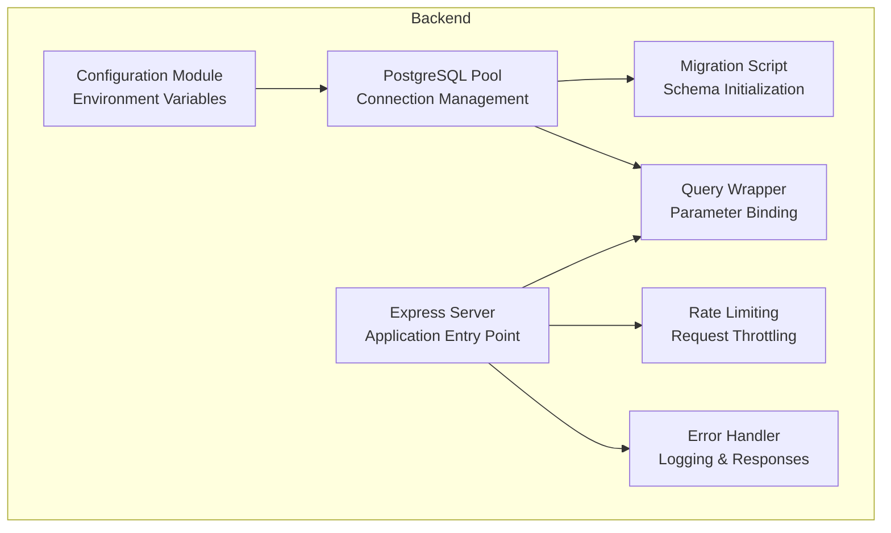
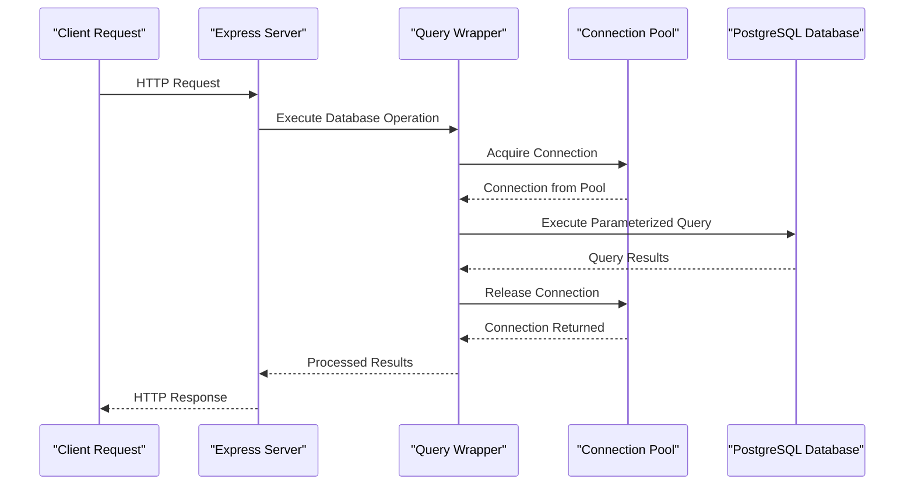
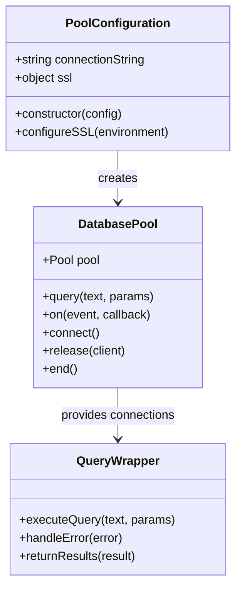
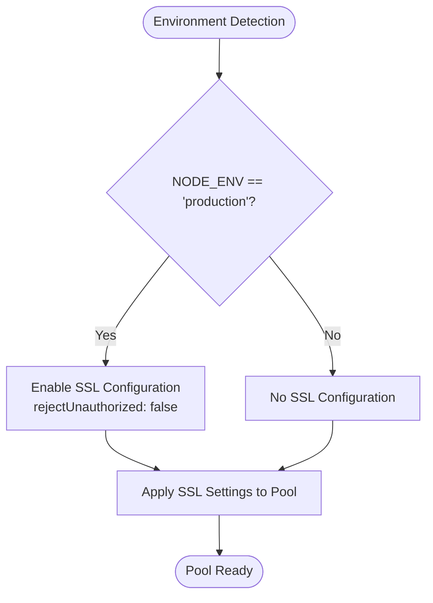
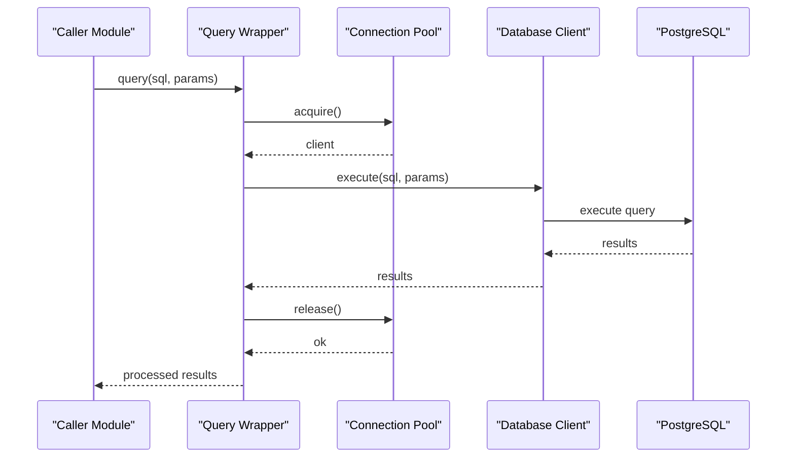
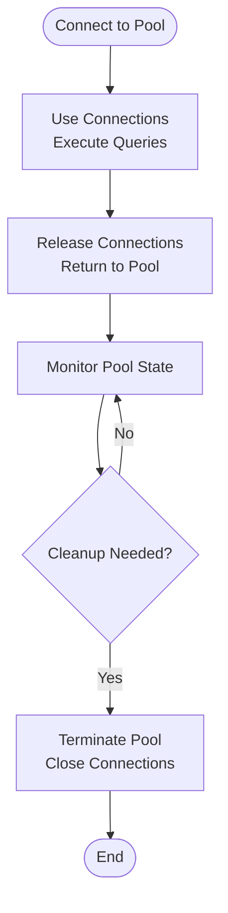
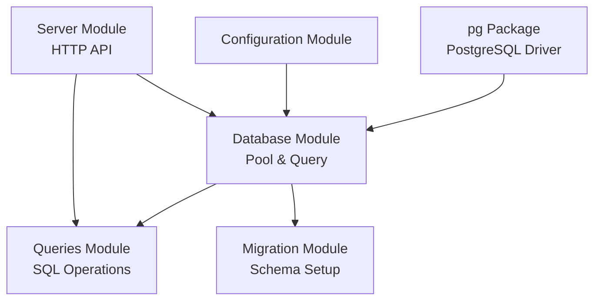

# Connection Management

<cite>
**Referenced Files in This Document**
- [db.js](file://backend/src/models/db.js)
- [index.js](file://backend/src/config/index.js)
- [migrate.js](file://backend/src/models/migrate.js)
- [queries.js](file://backend/src/models/queries.js)
- [server.js](file://backend/server.js)
- [errorHandler.js](file://backend/src/middleware/errorHandler.js)
- [rateLimit.js](file://backend/src/middleware/rateLimit.js)
- [package.json](file://backend/package.json)
</cite>

## Table of Contents
1. [Introduction](#introduction)
2. [Project Structure](#project-structure)
3. [Core Components](#core-components)
4. [Architecture Overview](#architecture-overview)
5. [Detailed Component Analysis](#detailed-component-analysis)
6. [Dependency Analysis](#dependency-analysis)
7. [Performance Considerations](#performance-considerations)
8. [Troubleshooting Guide](#troubleshooting-guide)
9. [Conclusion](#conclusion)

## Introduction
This document provides comprehensive documentation for PostgreSQL connection management in AgentID. It focuses on the connection pool configuration using the 'pg' package, SSL settings for production environments, connection string handling, and error management. It also explains the connection pooling strategy, pool size limits, connection lifecycle management, and the query execution wrapper that handles parameter binding and result processing. Additionally, it covers environment-specific configurations, SSL certificate handling for production deployments, connection troubleshooting, monitoring approaches, performance optimization techniques, connection leak prevention, and proper resource cleanup patterns.

## Project Structure
The PostgreSQL connection management is implemented within the backend service and consists of the following key components:
- Connection pool creation and configuration
- Environment-based SSL settings
- Centralized configuration module
- Migration script for database initialization
- Query execution wrapper with parameter binding
- Error handling and logging
- Rate limiting middleware

**Diagram sources**
- [db.js:1-45](file://backend/src/models/db.js#L1-L45)
- [index.js:1-31](file://backend/src/config/index.js#L1-L31)
- [migrate.js:1-100](file://backend/src/models/migrate.js#L1-L100)
- [queries.js:1-404](file://backend/src/models/queries.js#L1-L404)
- [server.js:1-85](file://backend/server.js#L1-L85)
- [errorHandler.js:1-44](file://backend/src/middleware/errorHandler.js#L1-L44)
- [rateLimit.js:1-62](file://backend/src/middleware/rateLimit.js#L1-L62)

**Section sources**
- [db.js:1-45](file://backend/src/models/db.js#L1-L45)
- [index.js:1-31](file://backend/src/config/index.js#L1-L31)
- [migrate.js:1-100](file://backend/src/models/migrate.js#L1-L100)
- [queries.js:1-404](file://backend/src/models/queries.js#L1-L404)
- [server.js:1-85](file://backend/server.js#L1-L85)
- [errorHandler.js:1-44](file://backend/src/middleware/errorHandler.js#L1-L44)
- [rateLimit.js:1-62](file://backend/src/middleware/rateLimit.js#L1-L62)

## Core Components
This section documents the core components responsible for PostgreSQL connection management and related operations.

### Connection Pool Configuration
The connection pool is configured using the 'pg' package and reads the connection string from the centralized configuration module. Production environments automatically enable SSL with certificate verification disabled for compatibility reasons.

Key characteristics:
- Connection string sourced from environment configuration
- Conditional SSL configuration for production environments
- Centralized error handling for pool-level errors
- Exported pool instance for reuse across modules

**Section sources**
- [db.js:6-23](file://backend/src/models/db.js#L6-L23)
- [index.js:16-17](file://backend/src/config/index.js#L16-L17)

### Query Execution Wrapper
The query wrapper provides a centralized mechanism for executing SQL statements with parameter binding and result processing. It ensures all queries use parameterized statements for security and handles errors consistently.

Key characteristics:
- Parameterized query execution
- Consistent error logging and propagation
- Promise-based asynchronous execution
- Exported for use across application modules

**Section sources**
- [db.js:25-39](file://backend/src/models/db.js#L25-L39)
- [queries.js:6](file://backend/src/models/queries.js#L6)

### Environment Configuration
The configuration module centralizes environment variable management with sensible defaults for local development and production deployment scenarios.

Key characteristics:
- Port configuration with default fallback
- Environment detection (development vs production)
- Database URL configuration with default local connection
- Redis URL configuration for caching
- CORS origin configuration for cross-origin requests
- Cache and expiry configurations for badges and challenges

**Section sources**
- [index.js:6-28](file://backend/src/config/index.js#L6-L28)

### Migration Script
The migration script initializes the database schema and indexes required for AgentID operations. It demonstrates proper connection lifecycle management using dedicated client connections and ensures cleanup after completion.

Key characteristics:
- Dedicated client connection for migration operations
- Transactional migration with rollback on failure
- Proper client release and pool termination
- Schema creation for agent identities, verifications, and flags

**Section sources**
- [migrate.js:67-91](file://backend/src/models/migrate.js#L67-L91)

### Error Handling and Logging
The error handling middleware provides structured logging and standardized error responses across the application, including database-related errors.

Key characteristics:
- Structured error logging with request context
- Environment-aware error details
- Standardized JSON error responses
- Stack trace inclusion in development mode

**Section sources**
- [errorHandler.js:15-41](file://backend/src/middleware/errorHandler.js#L15-L41)

## Architecture Overview
The PostgreSQL connection management follows a layered architecture pattern with clear separation of concerns:

**Diagram sources**
- [db.js:31-39](file://backend/src/models/db.js#L31-L39)
- [queries.js:17-29](file://backend/src/models/queries.js#L17-L29)

The architecture ensures:
- Connection pooling for efficient resource utilization
- Parameterized queries for security against SQL injection
- Centralized error handling and logging
- Proper connection lifecycle management

## Detailed Component Analysis

### Connection Pool Implementation
The connection pool implementation demonstrates best practices for PostgreSQL connection management in Node.js applications.

**Diagram sources**
- [db.js:10-18](file://backend/src/models/db.js#L10-L18)
- [db.js:31-39](file://backend/src/models/db.js#L31-L39)

Key implementation details:
- Pool creation with connection string from configuration
- Conditional SSL configuration for production environments
- Event-driven error handling for pool-level issues
- Asynchronous query execution with parameter binding

**Section sources**
- [db.js:10-18](file://backend/src/models/db.js#L10-L18)
- [db.js:20-23](file://backend/src/models/db.js#L20-L23)
- [db.js:31-39](file://backend/src/models/db.js#L31-L39)

### SSL Configuration Strategy
The SSL configuration strategy adapts to different deployment environments while maintaining security considerations.

**Diagram sources**
- [db.js:13-17](file://backend/src/models/db.js#L13-L17)
- [index.js:9](file://backend/src/config/index.js#L9)

Production SSL configuration considerations:
- Certificate verification disabled for compatibility
- Environment-based conditional configuration
- Connection string flexibility for different providers

**Section sources**
- [db.js:13-17](file://backend/src/models/db.js#L13-L17)
- [index.js:9](file://backend/src/config/index.js#L9)

### Query Execution Pipeline
The query execution pipeline ensures secure and efficient database operations with proper parameter binding and result processing.

**Diagram sources**
- [queries.js:17-29](file://backend/src/models/queries.js#L17-L29)
- [db.js:31-39](file://backend/src/models/db.js#L31-L39)

Security and performance benefits:
- Parameterized queries prevent SQL injection attacks
- Connection pooling reduces overhead
- Centralized error handling improves reliability
- JSON serialization for complex data types

**Section sources**
- [queries.js:17-29](file://backend/src/models/queries.js#L17-L29)
- [queries.js:47-73](file://backend/src/models/queries.js#L47-L73)

### Connection Lifecycle Management
The connection lifecycle management demonstrates proper resource cleanup patterns for database connections.

**Diagram sources**
- [migrate.js:68-91](file://backend/src/models/migrate.js#L68-L91)

Lifecycle management patterns:
- Dedicated client connections for migrations
- Proper client release after operations
- Pool termination after migration completion
- Transactional operations with rollback on failure

**Section sources**
- [migrate.js:68-91](file://backend/src/models/migrate.js#L68-L91)

## Dependency Analysis
The connection management system has clear dependencies and relationships between components.

**Diagram sources**
- [package.json:27](file://backend/package.json#L27)
- [db.js:6](file://backend/src/models/db.js#L6)
- [queries.js:6](file://backend/src/models/queries.js#L6)

Dependency relationships:
- Direct dependency on 'pg' package for PostgreSQL connectivity
- Configuration dependency for environment variables
- Module exports for shared functionality
- Middleware integration for request handling

**Section sources**
- [package.json:18-30](file://backend/package.json#L18-L30)
- [db.js:6](file://backend/src/models/db.js#L6)
- [queries.js:6](file://backend/src/models/queries.js#L6)

## Performance Considerations
This section addresses performance optimization techniques and monitoring approaches for PostgreSQL connection management.

### Connection Pool Sizing
The current implementation uses default pool settings from the 'pg' package. For production environments, consider implementing explicit pool sizing based on workload characteristics:

- Minimum pool size: 2-5 connections for low to moderate load
- Maximum pool size: 10-25 connections for higher throughput
- Connection timeout: 30-60 seconds for graceful handling
- Idle timeout: 10-30 seconds for resource cleanup

### Monitoring and Metrics
Implement monitoring for connection pool health and performance:

- Pool utilization metrics (active, idle, total connections)
- Query execution time distribution
- Connection acquisition wait times
- Error rates and retry counts
- Memory usage patterns

### Connection Leak Prevention
Several mechanisms prevent connection leaks in the current implementation:

- Automatic connection release through pool management
- Proper client release in migration operations
- Centralized error handling prevents unhandled exceptions
- Transaction rollback ensures cleanup on failures

Best practices for preventing leaks:
- Always release connections after use
- Use try-catch blocks around database operations
- Implement connection timeout handling
- Monitor for long-running transactions

## Troubleshooting Guide
This section provides guidance for diagnosing and resolving common PostgreSQL connection issues.

### Common Connection Issues
- **Connection refused**: Verify DATABASE_URL format and database availability
- **SSL handshake failures**: Check SSL configuration for production environments
- **Authentication errors**: Validate database credentials in connection string
- **Pool exhaustion**: Monitor pool utilization and adjust sizing

### Diagnostic Steps
1. **Verify environment variables**: Ensure DATABASE_URL is set correctly
2. **Test connection string**: Validate PostgreSQL connection string format
3. **Check SSL configuration**: Review production SSL settings
4. **Monitor pool metrics**: Track connection usage patterns
5. **Review error logs**: Examine structured error logs for patterns

### Error Handling Patterns
The current error handling provides comprehensive logging and response formatting:

- Structured error logging with request context
- Environment-aware error details (development vs production)
- Standardized JSON error responses
- Stack trace inclusion for debugging in development

**Section sources**
- [errorHandler.js:15-41](file://backend/src/middleware/errorHandler.js#L15-L41)
- [db.js:20-23](file://backend/src/models/db.js#L20-L23)

## Conclusion
The PostgreSQL connection management in AgentID demonstrates robust implementation patterns for Node.js applications. The system provides:

- Secure parameterized query execution
- Environment-aware SSL configuration
- Centralized error handling and logging
- Proper connection lifecycle management
- Modular design for maintainability

Key strengths include the use of connection pooling for efficiency, parameterized queries for security, and comprehensive error handling. The implementation serves as a solid foundation for production deployments while maintaining flexibility for different environments.

Areas for potential enhancement include explicit pool sizing configuration, advanced monitoring capabilities, and additional SSL security options for production environments. The current implementation provides a strong baseline for reliable PostgreSQL connectivity in the AgentID system.