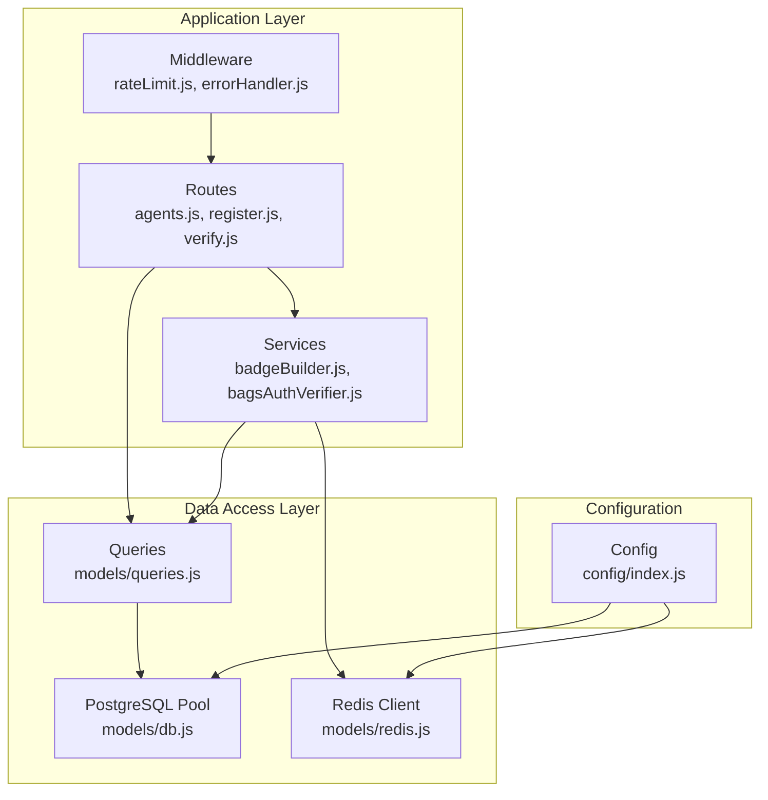
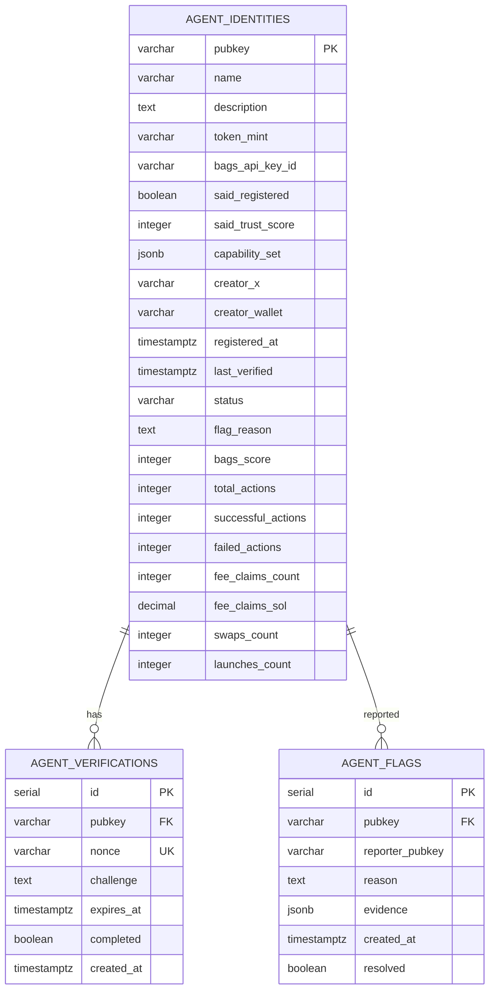
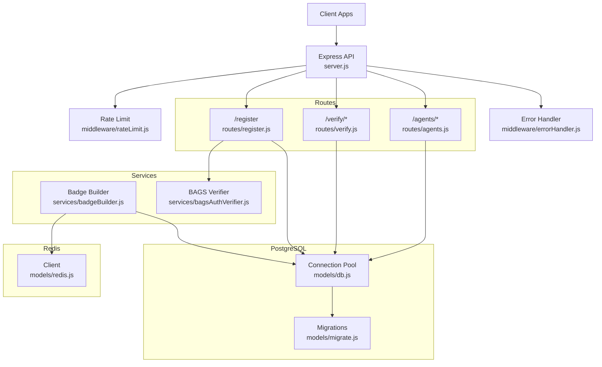
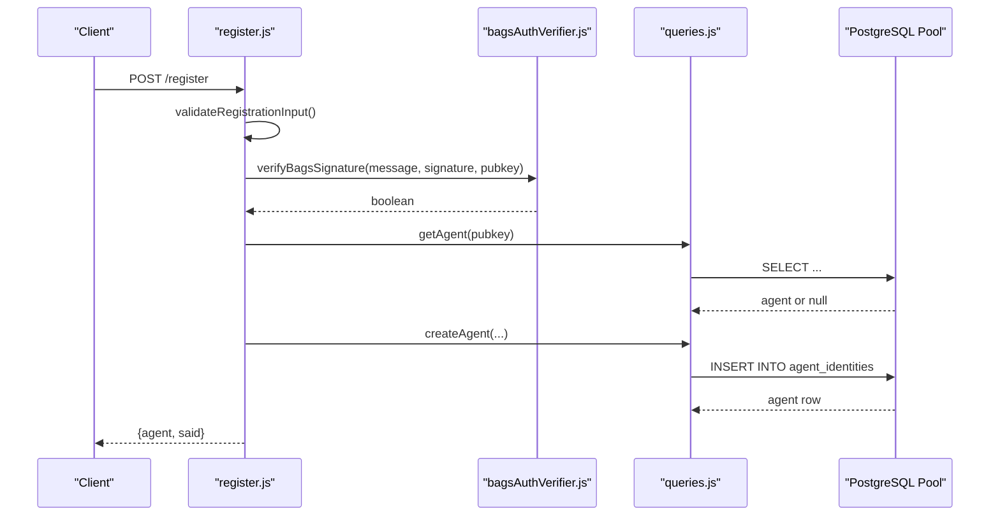
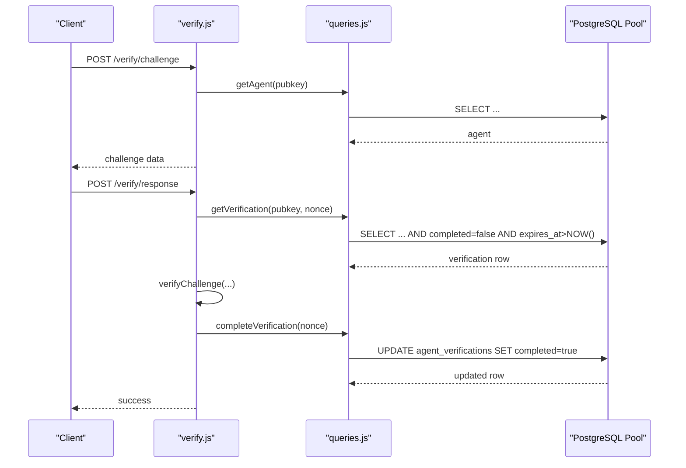
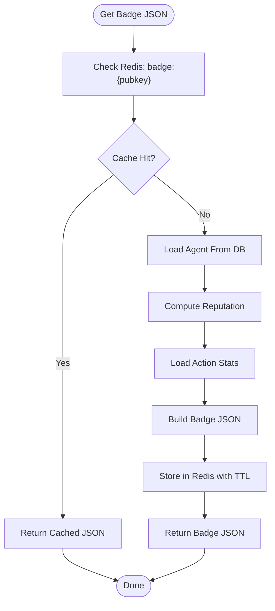
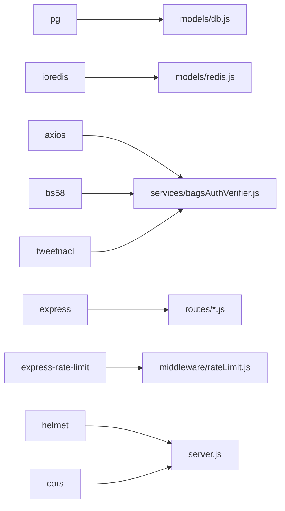

# Database Design

<cite>
**Referenced Files in This Document**
- [server.js](file://backend/server.js)
- [config/index.js](file://backend/src/config/index.js)
- [models/db.js](file://backend/src/models/db.js)
- [models/migrate.js](file://backend/src/models/migrate.js)
- [models/redis.js](file://backend/src/models/redis.js)
- [models/queries.js](file://backend/src/models/queries.js)
- [routes/agents.js](file://backend/src/routes/agents.js)
- [routes/register.js](file://backend/src/routes/register.js)
- [routes/verify.js](file://backend/src/routes/verify.js)
- [services/badgeBuilder.js](file://backend/src/services/badgeBuilder.js)
- [services/bagsAuthVerifier.js](file://backend/src/services/bagsAuthVerifier.js)
- [middleware/errorHandler.js](file://backend/src/middleware/errorHandler.js)
- [middleware/rateLimit.js](file://backend/src/middleware/rateLimit.js)
- [package.json](file://backend/package.json)
</cite>

## Table of Contents
1. [Introduction](#introduction)
2. [Project Structure](#project-structure)
3. [Core Components](#core-components)
4. [Architecture Overview](#architecture-overview)
5. [Detailed Component Analysis](#detailed-component-analysis)
6. [Dependency Analysis](#dependency-analysis)
7. [Performance Considerations](#performance-considerations)
8. [Troubleshooting Guide](#troubleshooting-guide)
9. [Conclusion](#conclusion)
10. [Appendices](#appendices)

## Introduction
This document provides comprehensive data model documentation for the AgentID database schema and Redis caching strategy. It focuses on the PostgreSQL tables and Redis integration used to power agent identity management, verification challenges, and community moderation. The documentation covers table definitions, relationships, indexes, constraints, business rules, and operational patterns including connection pooling, SSL configuration, error handling, and cache strategies.

## Project Structure
The backend is organized around a layered architecture:
- Configuration and environment variables
- Database connectivity and migrations
- Query layer for reusable SQL operations
- Route handlers for API endpoints
- Services for external integrations and badge building
- Middleware for security, rate limiting, and error handling

**Diagram sources**
- [server.js:10-53](file://backend/server.js#L10-L53)
- [routes/agents.js:1-251](file://backend/src/routes/agents.js#L1-L251)
- [routes/register.js:1-156](file://backend/src/routes/register.js#L1-L156)
- [routes/verify.js:1-115](file://backend/src/routes/verify.js#L1-L115)
- [services/badgeBuilder.js:1-512](file://backend/src/services/badgeBuilder.js#L1-L512)
- [services/bagsAuthVerifier.js:1-87](file://backend/src/services/bagsAuthVerifier.js#L1-L87)
- [models/queries.js:1-385](file://backend/src/models/queries.js#L1-L385)
- [models/db.js:1-45](file://backend/src/models/db.js#L1-L45)
- [models/redis.js:1-94](file://backend/src/models/redis.js#L1-L94)
- [config/index.js:1-30](file://backend/src/config/index.js#L1-L30)

**Section sources**
- [server.js:10-53](file://backend/server.js#L10-L53)
- [config/index.js:6-27](file://backend/src/config/index.js#L6-L27)

## Core Components
This section documents the core database schema and caching strategy.

### PostgreSQL Schema: agent_identities
- Purpose: Primary agent registry with reputation metrics and metadata.
- Primary key: pubkey (VARCHAR(88))
- Notable fields:
  - name (VARCHAR(255), NOT NULL)
  - description (TEXT)
  - token_mint (VARCHAR(88))
  - bags_api_key_id (VARCHAR(255))
  - said_registered (BOOLEAN DEFAULT false)
  - said_trust_score (INTEGER DEFAULT 0)
  - capability_set (JSONB)
  - creator_x (VARCHAR(255))
  - creator_wallet (VARCHAR(88))
  - registered_at (TIMESTAMPTZ DEFAULT NOW())
  - last_verified (TIMESTAMPTZ)
  - status (VARCHAR(20) DEFAULT 'verified')
  - flag_reason (TEXT)
  - bags_score (INTEGER DEFAULT 0)
  - total_actions (INTEGER DEFAULT 0)
  - successful_actions (INTEGER DEFAULT 0)
  - failed_actions (INTEGER DEFAULT 0)
  - fee_claims_count (INTEGER DEFAULT 0)
  - fee_claims_sol (DECIMAL(18,9) DEFAULT 0)
  - swaps_count (INTEGER DEFAULT 0)
  - launches_count (INTEGER DEFAULT 0)

Constraints and indexes:
- Primary key on pubkey
- Indexes:
  - idx_agent_identities_status on status
  - idx_agent_identities_bags_score on bags_score DESC

Business rules enforced by application logic:
- Status transitions and flag_reason updates are handled via dedicated update functions.
- Action counters are incremented atomically via SQL updates.
- Discovery queries filter by status = 'verified' and order by bags_score DESC.

**Section sources**
- [models/migrate.js:11-34](file://backend/src/models/migrate.js#L11-L34)
- [models/migrate.js:58-63](file://backend/src/models/migrate.js#L58-L63)
- [models/queries.js:17-29](file://backend/src/models/queries.js#L17-L29)
- [models/queries.js:80-109](file://backend/src/models/queries.js#L80-L109)
- [models/queries.js:118-127](file://backend/src/models/queries.js#L118-L127)
- [models/queries.js:168-180](file://backend/src/models/queries.js#L168-L180)
- [models/queries.js:332-357](file://backend/src/models/queries.js#L332-L357)

### PostgreSQL Schema: agent_verifications
- Purpose: Challenge-response tracking for PKI verification.
- Primary key: id (SERIAL)
- Foreign key: pubkey references agent_identities(pubkey)
- Notable fields:
  - nonce (VARCHAR(64), UNIQUE, NOT NULL)
  - challenge (TEXT NOT NULL)
  - expires_at (TIMESTAMPTZ NOT NULL)
  - completed (BOOLEAN DEFAULT false)
  - created_at (TIMESTAMPTZ DEFAULT NOW())

Constraints and indexes:
- Unique constraint on nonce
- Indexes:
  - idx_agent_verifications_pubkey on pubkey

Business rules enforced by application logic:
- Pending verifications are filtered by completed = false and expires_at > NOW().
- Challenges are created with an expiration derived from configuration.
- Responses mark the verification as completed upon successful signature verification.

**Section sources**
- [models/migrate.js:37-45](file://backend/src/models/migrate.js#L37-L45)
- [models/migrate.js:62](file://backend/src/models/migrate.js#L62)
- [models/queries.js:213-222](file://backend/src/models/queries.js#L213-L222)
- [models/queries.js:230-240](file://backend/src/models/queries.js#L230-L240)
- [models/queries.js:247-256](file://backend/src/models/queries.js#L247-L256)

### PostgreSQL Schema: agent_flags
- Purpose: Community moderation system for reporting agents.
- Primary key: id (SERIAL)
- Foreign key: pubkey references agent_identities(pubkey)
- Notable fields:
  - reporter_pubkey (VARCHAR(88))
  - reason (TEXT NOT NULL)
  - evidence (JSONB)
  - created_at (TIMESTAMPTZ DEFAULT NOW())
  - resolved (BOOLEAN DEFAULT false)

Constraints and indexes:
- Indexes:
  - idx_agent_flags_pubkey on pubkey
  - idx_agent_flags_resolved on resolved

Business rules enforced by application logic:
- Flags are created with reporter_pubkey and optional evidence.
- Unresolved flag counts are computed for moderation workflows.
- Resolutions toggle resolved = true.

**Section sources**
- [models/migrate.js:47-56](file://backend/src/models/migrate.js#L47-L56)
- [models/migrate.js:61-63](file://backend/src/models/migrate.js#L61-L63)
- [models/queries.js:267-279](file://backend/src/models/queries.js#L267-L279)
- [models/queries.js:286-305](file://backend/src/models/queries.js#L286-L305)
- [models/queries.js:312-321](file://backend/src/models/queries.js#L312-L321)

### Relationship Model

**Diagram sources**
- [models/migrate.js:11-56](file://backend/src/models/migrate.js#L11-L56)

## Architecture Overview
The system integrates PostgreSQL for durable persistence and Redis for high-throughput, short-lived caching. The application exposes REST endpoints that orchestrate database writes and reads, and Redis operations for badge caching.

**Diagram sources**
- [server.js:10-64](file://backend/server.js#L10-L64)
- [routes/register.js:59-153](file://backend/src/routes/register.js#L59-L153)
- [routes/verify.js:20-112](file://backend/src/routes/verify.js#L20-L112)
- [routes/agents.js:23-248](file://backend/src/routes/agents.js#L23-L248)
- [services/badgeBuilder.js:16-83](file://backend/src/services/badgeBuilder.js#L16-L83)
- [services/bagsAuthVerifier.js:18-80](file://backend/src/services/bagsAuthVerifier.js#L18-L80)
- [models/db.js:10-18](file://backend/src/models/db.js#L10-L18)
- [models/redis.js:10-20](file://backend/src/models/redis.js#L10-L20)
- [models/migrate.js:66-91](file://backend/src/models/migrate.js#L66-L91)
- [middleware/rateLimit.js:23-55](file://backend/src/middleware/rateLimit.js#L23-L55)
- [middleware/errorHandler.js:15-41](file://backend/src/middleware/errorHandler.js#L15-L41)

## Detailed Component Analysis

### Database Connection and Pooling
- Connection pool uses the pg package with a connection string from configuration.
- Production SSL behavior sets rejectUnauthorized to false when NODE_ENV is production.
- Pool error events are logged without crashing the process.
- Query wrapper executes parameterized SQL and logs errors before rethrowing.

Operational notes:
- Connection string is configured via DATABASE_URL.
- SSL settings are environment-driven.
- Error logging occurs at pool and query levels.

**Section sources**
- [models/db.js:10-18](file://backend/src/models/db.js#L10-L18)
- [models/db.js:21-39](file://backend/src/models/db.js#L21-L39)
- [config/index.js:16](file://backend/src/config/index.js#L16)

### Migration Management
- Migration script creates tables and indexes in a transaction.
- Creates agent_identities, agent_verifications, and agent_flags.
- Adds indexes for performance on status, bags_score, pubkey, and resolved.
- Uses a single SQL block to define all schema elements.

Lifecycle considerations:
- Run via npm script: migrate.
- Transactional execution ensures atomicity.
- Index creation improves query performance for common filters.

**Section sources**
- [models/migrate.js:9-64](file://backend/src/models/migrate.js#L9-L64)
- [models/migrate.js:66-91](file://backend/src/models/migrate.js#L66-L91)

### Redis Caching Strategy
- Redis client uses ioredis with retryStrategy, maxRetriesPerRequest, and enableOfflineQueue.
- Cache keys for badges follow the pattern: badge:{pubkey}.
- TTL for badges is configured via BADGE_CACHE_TTL (default 60 seconds).
- Cache operations include get, set with TTL, and delete.

Key naming conventions:
- badge:{pubkey} for badge JSON cache.

Expiration policy:
- Badge cache TTL is configurable and defaults to 60 seconds.

**Section sources**
- [models/redis.js:10-20](file://backend/src/models/redis.js#L10-L20)
- [models/redis.js:41-71](file://backend/src/models/redis.js#L41-L71)
- [config/index.js:25-26](file://backend/src/config/index.js#L25-L26)
- [services/badgeBuilder.js:19-77](file://backend/src/services/badgeBuilder.js#L19-L77)

### Business Workflows and Data Validation

#### Registration Workflow
- Validates request body fields (pubkey length, name length, presence of signature/message/nonce).
- Verifies Bags signature using Ed25519 and base58 decoding.
- Prevents replay by ensuring nonce appears in the message.
- Checks for existing agent to avoid duplicates.
- Attempts SAID binding (non-blocking) and stores agent record in PostgreSQL.
- Returns agent data and SAID status.

**Diagram sources**
- [routes/register.js:59-153](file://backend/src/routes/register.js#L59-L153)
- [services/bagsAuthVerifier.js:44-57](file://backend/src/services/bagsAuthVerifier.js#L44-L57)
- [models/queries.js:17-29](file://backend/src/models/queries.js#L17-L29)
- [models/db.js:31-39](file://backend/src/models/db.js#L31-L39)

**Section sources**
- [routes/register.js:20-53](file://backend/src/routes/register.js#L20-L53)
- [routes/register.js:82-95](file://backend/src/routes/register.js#L82-L95)
- [routes/register.js:97-104](file://backend/src/routes/register.js#L97-L104)
- [routes/register.js:132-142](file://backend/src/routes/register.js#L132-L142)

#### Verification Workflow
- Issues a PKI challenge bound to an agent pubkey.
- Responds to the challenge by verifying signature and checking nonce validity.
- Marks verification as completed upon success.
- Enforces expiration and completion checks in queries.

**Diagram sources**
- [routes/verify.js:20-49](file://backend/src/routes/verify.js#L20-L49)
- [routes/verify.js:55-112](file://backend/src/routes/verify.js#L55-L112)
- [models/queries.js:230-240](file://backend/src/models/queries.js#L230-L240)
- [models/queries.js:247-256](file://backend/src/models/queries.js#L247-L256)

**Section sources**
- [routes/verify.js:20-49](file://backend/src/routes/verify.js#L20-L49)
- [routes/verify.js:55-112](file://backend/src/routes/verify.js#L55-L112)
- [models/queries.js:213-222](file://backend/src/models/queries.js#L213-L222)
- [models/queries.js:230-240](file://backend/src/models/queries.js#L230-L240)
- [models/queries.js:247-256](file://backend/src/models/queries.js#L247-L256)

#### Badge Retrieval and Caching
- Badge JSON retrieval follows a cache-first strategy with fallback to DB.
- Computes reputation and aggregates action stats.
- Stores badge JSON in Redis with TTL.
- Provides SVG and HTML widget variants.

**Diagram sources**
- [services/badgeBuilder.js:16-83](file://backend/src/services/badgeBuilder.js#L16-L83)
- [models/redis.js:41-71](file://backend/src/models/redis.js#L41-L71)
- [models/queries.js:31-39](file://backend/src/models/queries.js#L31-L39)
- [models/queries.js:187-202](file://backend/src/models/queries.js#L187-L202)

**Section sources**
- [services/badgeBuilder.js:16-83](file://backend/src/services/badgeBuilder.js#L16-L83)
- [models/redis.js:41-71](file://backend/src/models/redis.js#L41-L71)
- [models/queries.js:31-39](file://backend/src/models/queries.js#L31-L39)
- [models/queries.js:187-202](file://backend/src/models/queries.js#L187-L202)

## Dependency Analysis
External dependencies relevant to data and caching:
- PostgreSQL driver (pg): connection pooling and SQL execution
- Redis client (ioredis): caching with retry and offline queue
- Express ecosystem: routing, rate limiting, error handling
- Utility libraries: base58, tweetnacl for Ed25519 operations

**Diagram sources**
- [package.json:18-29](file://backend/package.json#L18-L29)
- [models/db.js:6](file://backend/src/models/db.js#L6)
- [models/redis.js:6](file://backend/src/models/redis.js#L6)
- [services/bagsAuthVerifier.js:6-8](file://backend/src/services/bagsAuthVerifier.js#L6-L8)
- [routes/register.js:6-11](file://backend/src/routes/register.js#L6-L11)
- [middleware/rateLimit.js:6](file://backend/src/middleware/rateLimit.js#L6)
- [server.js:3-8](file://backend/server.js#L3-L8)

**Section sources**
- [package.json:18-29](file://backend/package.json#L18-L29)

## Performance Considerations
- PostgreSQL:
  - Use indexes on frequently filtered columns (status, bags_score) and foreign keys (pubkey) to optimize joins and scans.
  - Parameterized queries prevent SQL injection and improve plan reuse.
  - Batch operations should be considered for bulk updates to reduce round trips.
- Redis:
  - Short TTL for badges balances freshness and load reduction.
  - Retry strategy and offline queue improve resilience under transient failures.
  - Consider pipeline operations for batched cache updates.
- Application:
  - Rate limiting prevents abuse and protects downstream systems.
  - Pagination limits protect query performance on large datasets.
  - Discovery queries filter by verified status and order by score to minimize result sets.

[No sources needed since this section provides general guidance]

## Troubleshooting Guide
Common issues and remedies:
- Database connectivity:
  - Verify DATABASE_URL format and network accessibility.
  - Check SSL settings in production; rejectUnauthorized is disabled conditionally.
  - Inspect pool error logs for connection failures.
- Migration failures:
  - Ensure transactional migration runs to completion; rollback is handled automatically.
  - Confirm required indexes are created post-migration.
- Redis connectivity:
  - Monitor connect, error, and reconnect events.
  - Cache operations return null/false on failure; handle gracefully.
- API errors:
  - Global error handler logs structured errors and returns JSON responses.
  - Rate limiting triggers 429 responses with contextual messages.
- Verification challenges:
  - Ensure nonce is included in the message and not expired.
  - Validate signatures using Ed25519 and base58 decoding.

**Section sources**
- [models/db.js:21-23](file://backend/src/models/db.js#L21-L23)
- [models/migrate.js:83-89](file://backend/src/models/migrate.js#L83-L89)
- [models/redis.js:23-34](file://backend/src/models/redis.js#L23-L34)
- [middleware/errorHandler.js:15-41](file://backend/src/middleware/errorHandler.js#L15-L41)
- [middleware/rateLimit.js:37-41](file://backend/src/middleware/rateLimit.js#L37-L41)
- [routes/verify.js:87-107](file://backend/src/routes/verify.js#L87-L107)

## Conclusion
The AgentID data model centers on three core tables that support identity, verification, and moderation. PostgreSQL provides durable storage with targeted indexes, while Redis caches frequently accessed badge data. The application enforces business rules through route handlers and services, with robust error handling and rate limiting. Migrations ensure schema consistency, and configuration enables flexible deployment across environments.

[No sources needed since this section summarizes without analyzing specific files]

## Appendices

### Configuration Reference
- DATABASE_URL: PostgreSQL connection string
- REDIS_URL: Redis connection string
- BADGE_CACHE_TTL: Cache TTL for badges (seconds)
- CHALLENGE_EXPIRY_SECONDS: Expiration for verification challenges (seconds)
- CORS_ORIGIN: Allowed origin for cross-origin requests
- PORT: Server port
- NODE_ENV: Environment (affects SSL behavior)

**Section sources**
- [config/index.js:16-27](file://backend/src/config/index.js#L16-L27)