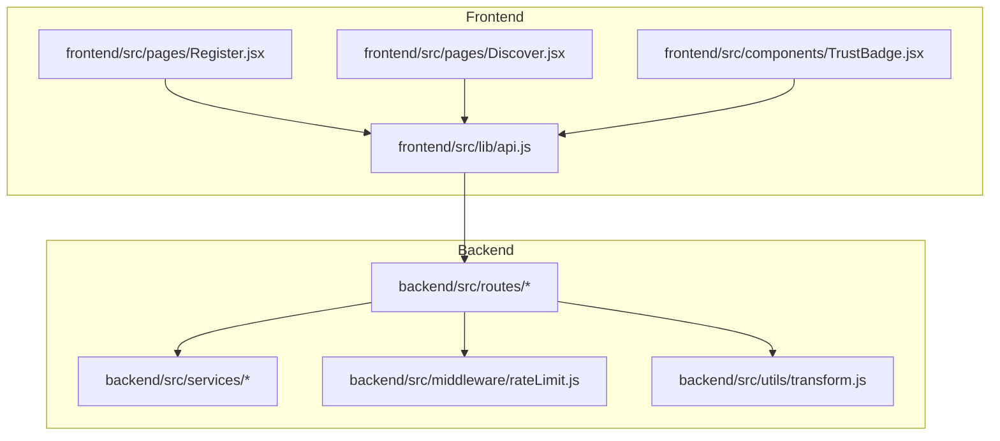
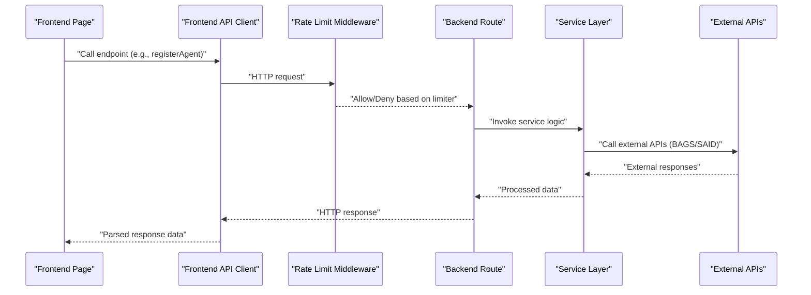
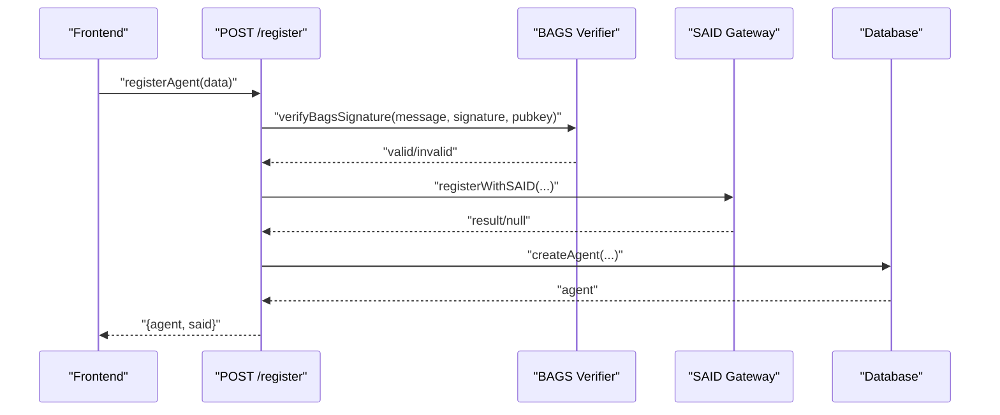
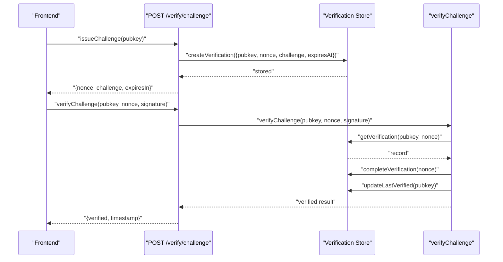
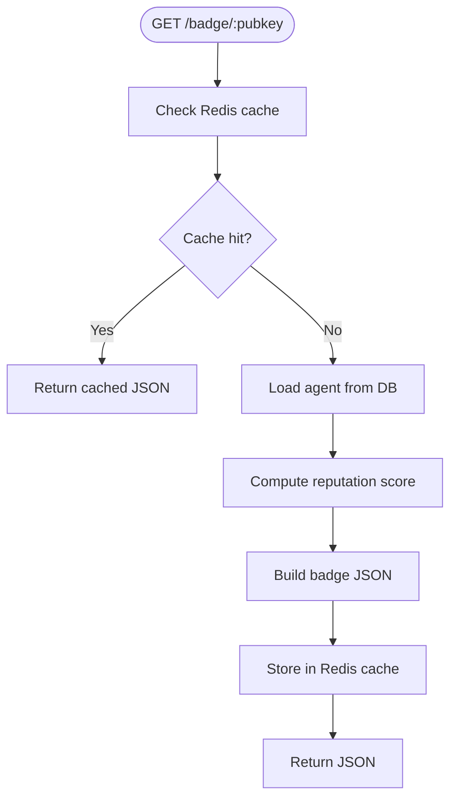
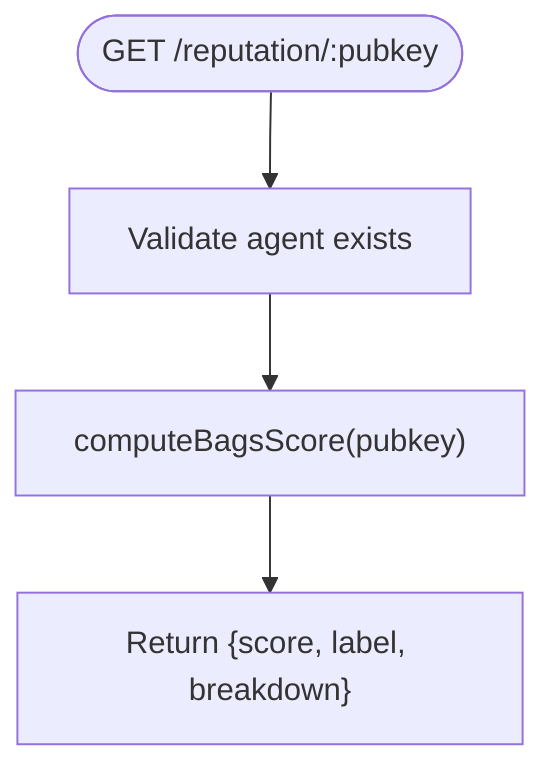
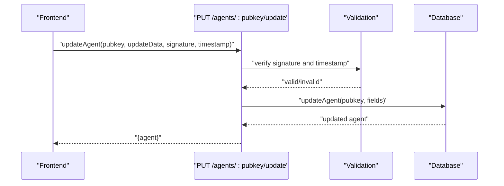
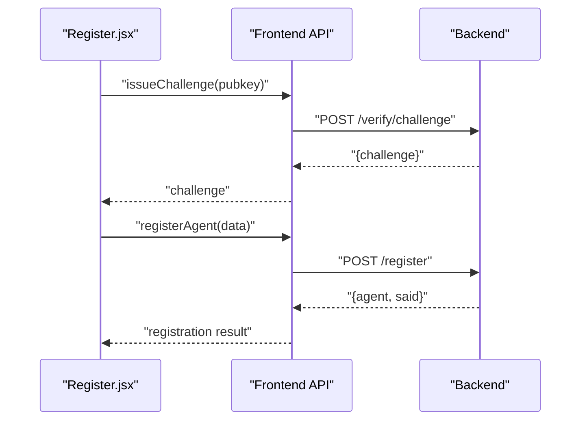
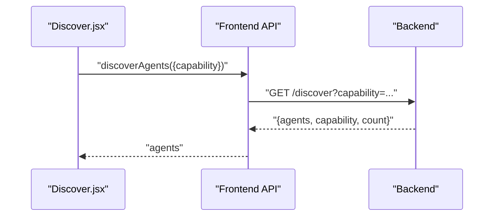
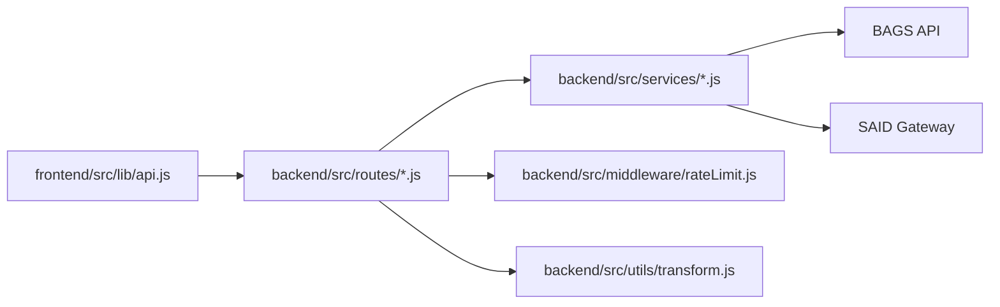

# API Integration

<cite>
**Referenced Files in This Document**
- [api.js](file://frontend/src/lib/api.js)
- [register.js](file://backend/src/routes/register.js)
- [verify.js](file://backend/src/routes/verify.js)
- [badge.js](file://backend/src/routes/badge.js)
- [reputation.js](file://backend/src/routes/reputation.js)
- [agents.js](file://backend/src/routes/agents.js)
- [rateLimit.js](file://backend/src/middleware/rateLimit.js)
- [bagsAuthVerifier.js](file://backend/src/services/bagsAuthVerifier.js)
- [pkiChallenge.js](file://backend/src/services/pkiChallenge.js)
- [badgeBuilder.js](file://backend/src/services/badgeBuilder.js)
- [bagsReputation.js](file://backend/src/services/bagsReputation.js)
- [saidBinding.js](file://backend/src/services/saidBinding.js)
- [transform.js](file://backend/src/utils/transform.js)
- [Register.jsx](file://frontend/src/pages/Register.jsx)
- [Discover.jsx](file://frontend/src/pages/Discover.jsx)
- [TrustBadge.jsx](file://frontend/src/components/TrustBadge.jsx)
</cite>

## Table of Contents
1. [Introduction](#introduction)
2. [Project Structure](#project-structure)
3. [Core Components](#core-components)
4. [Architecture Overview](#architecture-overview)
5. [Detailed Component Analysis](#detailed-component-analysis)
6. [Dependency Analysis](#dependency-analysis)
7. [Performance Considerations](#performance-considerations)
8. [Troubleshooting Guide](#troubleshooting-guide)
9. [Conclusion](#conclusion)
10. [Appendices](#appendices)

## Introduction
This document provides comprehensive documentation for the AgentID frontend API integration centered on the api.js client and backend communication patterns. It covers all API endpoints for agent registration, verification, badge retrieval, reputation scoring, and discovery services. It explains request/response patterns, error handling strategies, authentication mechanisms, data transformation utilities, caching strategies, offline handling approaches, examples of API calls and response processing, loading states, error recovery, integration with external services, rate limiting considerations, performance optimization techniques, and guidelines for extending the API client and adding new endpoints.

## Project Structure
The AgentID project is organized into two primary areas:
- Frontend: React application with a dedicated API client and pages/components that consume the backend.
- Backend: Express-based server exposing REST endpoints, middleware, services, and utilities.

**Diagram sources**
- [api.js:1-140](file://frontend/src/lib/api.js#L1-L140)
- [register.js:1-162](file://backend/src/routes/register.js#L1-L162)
- [verify.js:1-121](file://backend/src/routes/verify.js#L1-L121)
- [badge.js:1-58](file://backend/src/routes/badge.js#L1-L58)
- [reputation.js:1-44](file://backend/src/routes/reputation.js#L1-L44)
- [agents.js:1-255](file://backend/src/routes/agents.js#L1-L255)
- [rateLimit.js:1-62](file://backend/src/middleware/rateLimit.js#L1-L62)
- [transform.js:1-103](file://backend/src/utils/transform.js#L1-L103)

**Section sources**
- [api.js:1-140](file://frontend/src/lib/api.js#L1-L140)
- [register.js:1-162](file://backend/src/routes/register.js#L1-L162)
- [verify.js:1-121](file://backend/src/routes/verify.js#L1-L121)
- [badge.js:1-58](file://backend/src/routes/badge.js#L1-L58)
- [reputation.js:1-44](file://backend/src/routes/reputation.js#L1-L44)
- [agents.js:1-255](file://backend/src/routes/agents.js#L1-L255)
- [rateLimit.js:1-62](file://backend/src/middleware/rateLimit.js#L1-L62)
- [transform.js:1-103](file://backend/src/utils/transform.js#L1-L103)

## Core Components
- Frontend API Client: Centralized Axios instance with interceptors for authentication and global error handling, exposing typed functions for all backend endpoints.
- Backend Routes: REST endpoints for agents, registration, verification, badges, reputation, discovery, and widgets.
- Services: Business logic for authentication verification, PKI challenge-response, badge generation, reputation computation, and SAID integration.
- Middleware: Rate limiting configuration for default and strict auth endpoints.
- Utilities: Data transformation helpers for API responses and validation.

Key responsibilities:
- Authentication: Bearer token injection and 401 cleanup.
- Request/Response: Typed wrappers around HTTP calls, parameter serialization, and response parsing.
- Error Handling: Centralized response interceptor and route-level validation.
- Data Transformation: Snake_case to camelCase conversion and frontend compatibility mapping.
- Caching: Redis-backed caching for badge JSON generation.

**Section sources**
- [api.js:1-140](file://frontend/src/lib/api.js#L1-L140)
- [rateLimit.js:1-62](file://backend/src/middleware/rateLimit.js#L1-L62)
- [transform.js:1-103](file://backend/src/utils/transform.js#L1-L103)
- [badgeBuilder.js:1-497](file://backend/src/services/badgeBuilder.js#L1-L497)

## Architecture Overview
The frontend communicates with the backend via a centralized API client. The backend enforces rate limits, validates inputs, integrates with external services (BAGS, SAID), computes reputation scores, and caches frequently accessed data.

**Diagram sources**
- [api.js:1-140](file://frontend/src/lib/api.js#L1-L140)
- [rateLimit.js:1-62](file://backend/src/middleware/rateLimit.js#L1-L62)
- [register.js:1-162](file://backend/src/routes/register.js#L1-L162)
- [verify.js:1-121](file://backend/src/routes/verify.js#L1-L121)
- [badge.js:1-58](file://backend/src/routes/badge.js#L1-L58)
- [reputation.js:1-44](file://backend/src/routes/reputation.js#L1-L44)
- [agents.js:1-255](file://backend/src/routes/agents.js#L1-L255)
- [bagsAuthVerifier.js:1-93](file://backend/src/services/bagsAuthVerifier.js#L1-L93)
- [saidBinding.js:1-119](file://backend/src/services/saidBinding.js#L1-L119)

## Detailed Component Analysis

### Frontend API Client (api.js)
- Base configuration: Axios instance pointing to /api with JSON content-type.
- Authentication: Adds Authorization header if a token exists in localStorage.
- Global error handling: Removes token on 401 responses.
- Endpoints exposed:
  - Agents: getAgents(filters), getAgent(pubkey)
  - Trust Badge: getBadge(pubkey), getBadgeSvg(pubkey)
  - Reputation: getReputation(pubkey)
  - Registration: registerAgent(registrationData)
  - Verification: issueChallenge(pubkey), verifyChallenge(pubkey, nonce, signature)
  - Attestations: attestAgent(pubkey, data), flagAgent(pubkey, data)
  - Discovery: discoverAgents(params)
  - Widget: getWidgetHtml(pubkey)
  - Agent Updates: updateAgent(pubkey, updateData, signature, timestamp)
  - History: getAttestations(pubkey), getFlags(pubkey)

Processing logic highlights:
- Query parameter construction for filtering and pagination.
- Request body composition for POST/PUT operations.
- Response data extraction and return.

**Section sources**
- [api.js:1-140](file://frontend/src/lib/api.js#L1-L140)

### Backend Routes and Services

#### Registration (/register)
- Endpoint: POST /register
- Validation: Ensures required fields, pubkey format, and nonce presence in message.
- Authentication: Verifies Ed25519 signature against BAGS challenge using BAGS API key.
- SAID Binding: Attempts non-blocking registration with SAID Identity Gateway.
- Persistence: Stores agent record with capability set and metadata.
- Response: Returns created agent and SAID status.

**Diagram sources**
- [register.js:1-162](file://backend/src/routes/register.js#L1-L162)
- [bagsAuthVerifier.js:1-93](file://backend/src/services/bagsAuthVerifier.js#L1-L93)
- [saidBinding.js:1-119](file://backend/src/services/saidBinding.js#L1-L119)

**Section sources**
- [register.js:1-162](file://backend/src/routes/register.js#L1-L162)
- [bagsAuthVerifier.js:1-93](file://backend/src/services/bagsAuthVerifier.js#L1-L93)
- [saidBinding.js:1-119](file://backend/src/services/saidBinding.js#L1-L119)

#### Verification (/verify)
- Challenge Issuance: POST /verify/challenge validates pubkey, checks agent existence, and stores challenge with expiry.
- Response Verification: POST /verify/response validates nonce/signature, checks expiry, and marks completion while updating last verified timestamp.

**Diagram sources**
- [verify.js:1-121](file://backend/src/routes/verify.js#L1-L121)
- [pkiChallenge.js:1-102](file://backend/src/services/pkiChallenge.js#L1-L102)

**Section sources**
- [verify.js:1-121](file://backend/src/routes/verify.js#L1-L121)
- [pkiChallenge.js:1-102](file://backend/src/services/pkiChallenge.js#L1-L102)

#### Trust Badge (/badge)
- JSON Badge: GET /badge/:pubkey returns badge data with caching and agent lookup.
- SVG Badge: GET /badge/:pubkey/svg returns SVG image with dynamic theming.
- Widget HTML: GET /widget/:pubkey returns embedded HTML widget.

**Diagram sources**
- [badge.js:1-58](file://backend/src/routes/badge.js#L1-L58)
- [badgeBuilder.js:1-497](file://backend/src/services/badgeBuilder.js#L1-L497)

**Section sources**
- [badge.js:1-58](file://backend/src/routes/badge.js#L1-L58)
- [badgeBuilder.js:1-497](file://backend/src/services/badgeBuilder.js#L1-L497)

#### Reputation (/reputation)
- GET /reputation/:pubkey computes BAGS reputation score and returns structured breakdown.

**Diagram sources**
- [reputation.js:1-44](file://backend/src/routes/reputation.js#L1-L44)
- [bagsReputation.js:1-146](file://backend/src/services/bagsReputation.js#L1-L146)

**Section sources**
- [reputation.js:1-44](file://backend/src/routes/reputation.js#L1-L44)
- [bagsReputation.js:1-146](file://backend/src/services/bagsReputation.js#L1-L146)

#### Agents and Discovery (/agents, /discover, /agents/:pubkey/update)
- Listing: GET /agents supports filters, pagination, and total count.
- Detail: GET /agents/:pubkey returns agent plus reputation.
- Discovery: GET /discover finds agents by capability.
- Update: PUT /agents/:pubkey/update verifies Ed25519 signature, enforces timestamp window, and updates allowed fields.

**Diagram sources**
- [agents.js:1-255](file://backend/src/routes/agents.js#L1-L255)

**Section sources**
- [agents.js:1-255](file://backend/src/routes/agents.js#L1-L255)

### Frontend Pages and Components

#### Registration Flow (Register.jsx)
- Multi-step form: Identity, Challenge issuance, Metadata, Confirmation.
- Calls: issueChallenge(), registerAgent().
- Error handling: Localized validation and server-side error display.
- Success state: Renders TrustBadge with registration outcome.

**Diagram sources**
- [Register.jsx:1-733](file://frontend/src/pages/Register.jsx#L1-L733)
- [api.js:1-140](file://frontend/src/lib/api.js#L1-L140)
- [register.js:1-162](file://backend/src/routes/register.js#L1-L162)
- [verify.js:1-121](file://backend/src/routes/verify.js#L1-L121)

**Section sources**
- [Register.jsx:1-733](file://frontend/src/pages/Register.jsx#L1-L733)
- [api.js:1-140](file://frontend/src/lib/api.js#L1-L140)

#### Discovery (Discover.jsx)
- Capability-based search: discoverAgents({ capability }).
- Loading states, skeleton loaders, empty/error states.
- Renders TrustBadge for each agent.

**Diagram sources**
- [Discover.jsx:1-421](file://frontend/src/pages/Discover.jsx#L1-L421)
- [api.js:1-140](file://frontend/src/lib/api.js#L1-L140)
- [agents.js:1-255](file://backend/src/routes/agents.js#L1-L255)

**Section sources**
- [Discover.jsx:1-421](file://frontend/src/pages/Discover.jsx#L1-L421)
- [api.js:1-140](file://frontend/src/lib/api.js#L1-L140)

#### TrustBadge Component (TrustBadge.jsx)
- Renders status-specific visuals and metadata.
- Consumes props: status, name, score, registeredAt, totalActions.

**Section sources**
- [TrustBadge.jsx:1-145](file://frontend/src/components/TrustBadge.jsx#L1-L145)

## Dependency Analysis
- Frontend depends on api.js for all HTTP interactions.
- Backend routes depend on services for business logic and middleware for rate limiting.
- Services integrate with external APIs (BAGS, SAID) and internal models/queries.
- Data transformation utilities normalize backend responses for frontend consumption.

**Diagram sources**
- [api.js:1-140](file://frontend/src/lib/api.js#L1-L140)
- [register.js:1-162](file://backend/src/routes/register.js#L1-L162)
- [verify.js:1-121](file://backend/src/routes/verify.js#L1-L121)
- [badge.js:1-58](file://backend/src/routes/badge.js#L1-L58)
- [reputation.js:1-44](file://backend/src/routes/reputation.js#L1-L44)
- [agents.js:1-255](file://backend/src/routes/agents.js#L1-L255)
- [rateLimit.js:1-62](file://backend/src/middleware/rateLimit.js#L1-L62)
- [transform.js:1-103](file://backend/src/utils/transform.js#L1-L103)
- [bagsAuthVerifier.js:1-93](file://backend/src/services/bagsAuthVerifier.js#L1-L93)
- [saidBinding.js:1-119](file://backend/src/services/saidBinding.js#L1-L119)

**Section sources**
- [api.js:1-140](file://frontend/src/lib/api.js#L1-L140)
- [rateLimit.js:1-62](file://backend/src/middleware/rateLimit.js#L1-L62)
- [transform.js:1-103](file://backend/src/utils/transform.js#L1-L103)
- [bagsAuthVerifier.js:1-93](file://backend/src/services/bagsAuthVerifier.js#L1-L93)
- [saidBinding.js:1-119](file://backend/src/services/saidBinding.js#L1-L119)

## Performance Considerations
- Caching: Badge JSON is cached in Redis to reduce repeated computations and DB lookups.
- Pagination: Backend enforces max limit and returns total for efficient client-side pagination.
- Rate Limiting: Default and strict limits applied to protect endpoints; configure via middleware.
- External API timeouts: Services set timeouts to avoid blocking calls to BAGS/SAID.
- Frontend loading states: Skeleton loaders and compact layouts improve perceived performance during network-bound operations.

[No sources needed since this section provides general guidance]

## Troubleshooting Guide
Common scenarios and remedies:
- 401 Unauthorized: Token removed automatically by response interceptor; re-authenticate and retry.
- Validation errors: Ensure required fields and formats match backend validation (e.g., pubkey length/format).
- Challenge verification failures: Confirm nonce presence in message, correct signature encoding, and non-expired challenge.
- SAID integration failures: Non-blocking fallback; retry or monitor SAID gateway availability.
- Rate limit exceeded: Reduce request frequency or adjust client-side polling intervals.

**Section sources**
- [api.js:23-33](file://frontend/src/lib/api.js#L23-L33)
- [register.js:20-53](file://backend/src/routes/register.js#L20-L53)
- [verify.js:57-118](file://backend/src/routes/verify.js#L57-L118)
- [rateLimit.js:15-62](file://backend/src/middleware/rateLimit.js#L15-L62)

## Conclusion
The AgentID API integration provides a robust, secure, and scalable foundation for agent registration, verification, reputation scoring, badge generation, and discovery. The frontend API client encapsulates authentication and error handling, while the backend enforces validation, integrates external services, and optimizes performance through caching and rate limiting. The documented patterns enable safe extension with new endpoints and services.

[No sources needed since this section summarizes without analyzing specific files]

## Appendices

### API Endpoints Reference
- Agents
  - GET /agents?status=&capability=&limit=&offset=
  - GET /agents/:pubkey
  - PUT /agents/:pubkey/update (requires signature and timestamp)
- Trust Badge
  - GET /badge/:pubkey
  - GET /badge/:pubkey/svg
  - GET /widget/:pubkey
- Reputation
  - GET /reputation/:pubkey
- Registration
  - POST /register
- Verification
  - POST /verify/challenge
  - POST /verify/response
- Discovery
  - GET /discover?capability=
- Attestations and Flags
  - POST /agents/:pubkey/attest
  - POST /agents/:pubkey/flag
  - GET /agents/:pubkey/attestations
  - GET /agents/:pubkey/flags

**Section sources**
- [agents.js:1-255](file://backend/src/routes/agents.js#L1-L255)
- [badge.js:1-58](file://backend/src/routes/badge.js#L1-L58)
- [reputation.js:1-44](file://backend/src/routes/reputation.js#L1-L44)
- [register.js:1-162](file://backend/src/routes/register.js#L1-L162)
- [verify.js:1-121](file://backend/src/routes/verify.js#L1-L121)
- [agents.js:96-118](file://backend/src/routes/agents.js#L96-L118)

### Frontend Usage Examples
- Registration
  - Steps: Issue challenge, sign challenge, submit registration, show success.
  - Calls: issueChallenge(), registerAgent().
- Discovery
  - Search by capability, render results with TrustBadge, handle loading and error states.

**Section sources**
- [Register.jsx:295-341](file://frontend/src/pages/Register.jsx#L295-L341)
- [Discover.jsx:101-117](file://frontend/src/pages/Discover.jsx#L101-L117)

### Guidelines for Extending the API Client
- Add new endpoint function in api.js with appropriate request/response handling.
- Export the function for use across pages/components.
- Respect baseURL and interceptors for auth and error handling.
- Keep parameter serialization consistent with backend expectations.

**Section sources**
- [api.js:1-140](file://frontend/src/lib/api.js#L1-L140)

### Guidelines for Adding New Backend Endpoints
- Define route in backend/src/routes with validation and rate limiting.
- Implement service logic in backend/src/services.
- Integrate with external APIs and database as needed.
- Apply data transformation utilities for consistent response formats.
- Add caching where appropriate to improve performance.

**Section sources**
- [rateLimit.js:1-62](file://backend/src/middleware/rateLimit.js#L1-L62)
- [transform.js:1-103](file://backend/src/utils/transform.js#L1-L103)
- [badgeBuilder.js:1-497](file://backend/src/services/badgeBuilder.js#L1-L497)