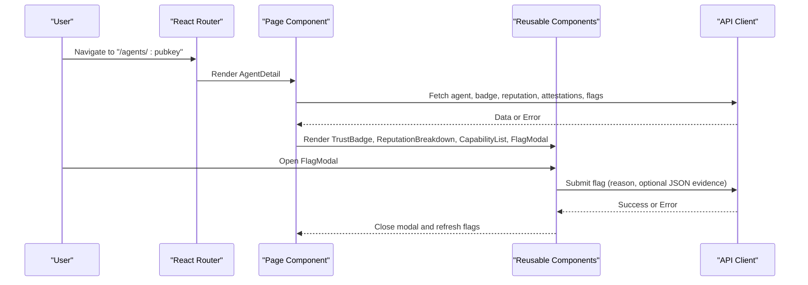
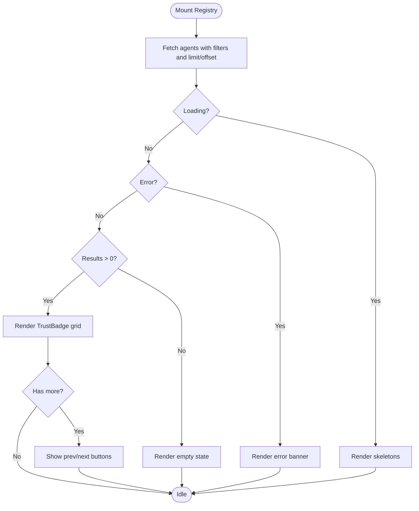
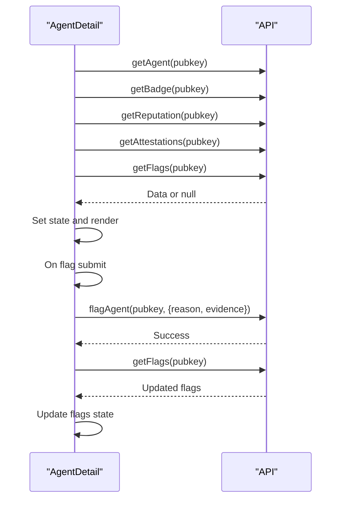
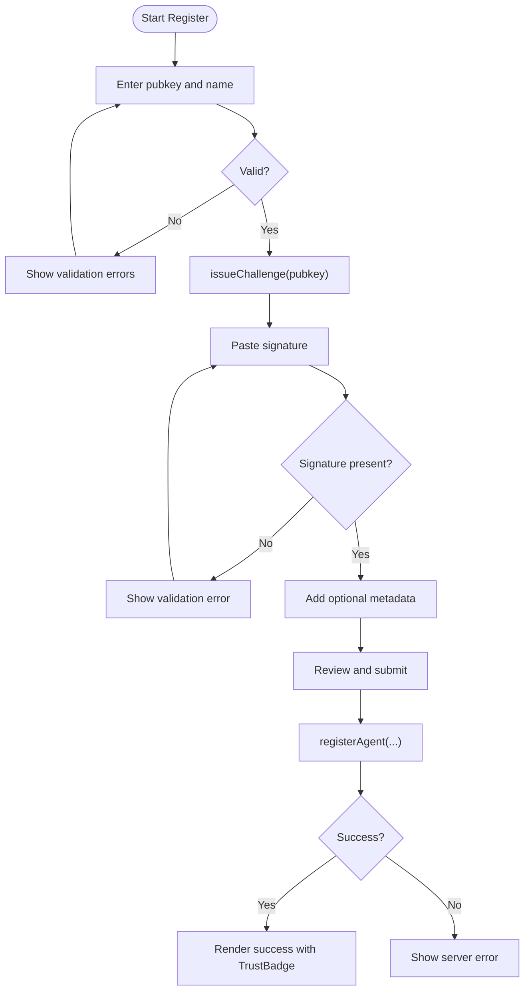
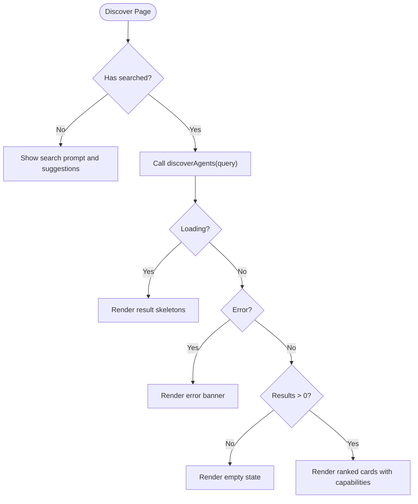
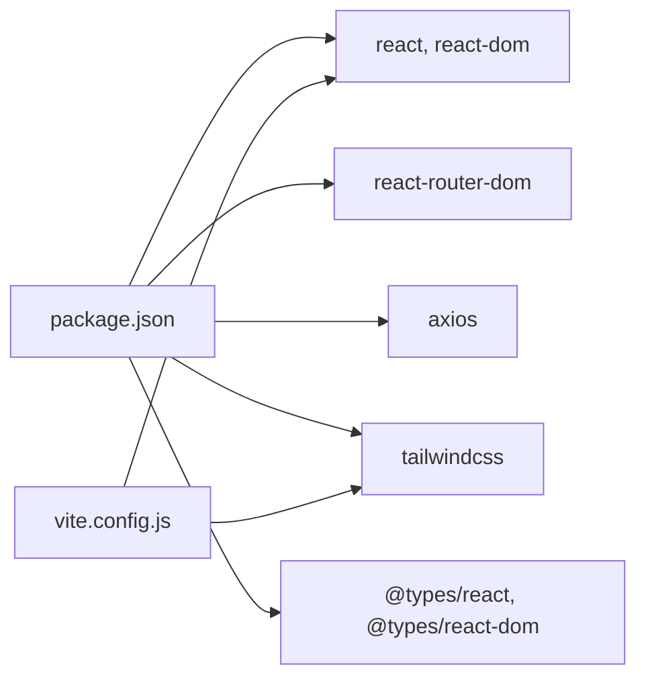

# Frontend Application

<cite>
**Referenced Files in This Document**
- [App.jsx](file://frontend/src/App.jsx)
- [main.jsx](file://frontend/src/main.jsx)
- [api.js](file://frontend/src/lib/api.js)
- [Registry.jsx](file://frontend/src/pages/Registry.jsx)
- [AgentDetail.jsx](file://frontend/src/pages/AgentDetail.jsx)
- [Register.jsx](file://frontend/src/pages/Register.jsx)
- [Discover.jsx](file://frontend/src/pages/Discover.jsx)
- [TrustBadge.jsx](file://frontend/src/components/TrustBadge.jsx)
- [ReputationBreakdown.jsx](file://frontend/src/components/ReputationBreakdown.jsx)
- [CapabilityList.jsx](file://frontend/src/components/CapabilityList.jsx)
- [FlagModal.jsx](file://frontend/src/components/FlagModal.jsx)
- [index.css](file://frontend/src/index.css)
- [package.json](file://frontend/package.json)
- [vite.config.js](file://frontend/vite.config.js)
</cite>

## Table of Contents
1. [Introduction](#introduction)
2. [Project Structure](#project-structure)
3. [Core Components](#core-components)
4. [Architecture Overview](#architecture-overview)
5. [Detailed Component Analysis](#detailed-component-analysis)
6. [Dependency Analysis](#dependency-analysis)
7. [Performance Considerations](#performance-considerations)
8. [Troubleshooting Guide](#troubleshooting-guide)
9. [Conclusion](#conclusion)
10. [Appendices](#appendices)

## Introduction
This document describes the AgentID frontend React application, focusing on the user interface and component architecture. It explains the routing configuration, state management approach, and styling strategy using TailwindCSS. It documents the key pages (Registry, AgentDetail, Register, Discover), reusable components (TrustBadge, ReputationBreakdown, CapabilityList, FlagModal), and integration patterns with the backend API. It also covers user workflows, form handling, error states, and responsive design considerations.

## Project Structure
The frontend is a Vite-powered React application with:
- Pages under src/pages for route handlers
- Reusable components under src/components
- Shared API client under src/lib/api.js
- Global styles under src/index.css
- Routing and navigation in src/App.jsx
- Application entry in src/main.jsx
- Build and development configuration in vite.config.js and package.json

```mermaid
graph TB
subgraph "Entry"
MAIN["main.jsx"]
APP["App.jsx"]
end
subgraph "Routing"
ROUTES["React Router Routes"]
NAV["Navigation"]
end
subgraph "Pages"
REG["Registry.jsx"]
DETAIL["AgentDetail.jsx"]
REGISTER["Register.jsx"]
DISCOVER["Discover.jsx"]
end
subgraph "Components"
BADGE["TrustBadge.jsx"]
REP["ReputationBreakdown.jsx"]
CAPS["CapabilityList.jsx"]
FLAG["FlagModal.jsx"]
end
subgraph "API"
API["api.js"]
end
MAIN --> APP
APP --> ROUTES
ROUTES --> REG
ROUTES --> DETAIL
ROUTES --> REGISTER
ROUTES --> DISCOVER
DETAIL --> BADGE
DETAIL --> REP
DETAIL --> CAPS
DETAIL --> FLAG
REG --> BADGE
DISCOVER --> BADGE
DISCOVER --> CAPS
REGISTER --> BADGE
REG --> API
DETAIL --> API
REGISTER --> API
DISCOVER --> API
```

**Diagram sources**
- [main.jsx:1-11](file://frontend/src/main.jsx#L1-L11)
- [App.jsx:87-104](file://frontend/src/App.jsx#L87-L104)
- [Registry.jsx:1-276](file://frontend/src/pages/Registry.jsx#L1-L276)
- [AgentDetail.jsx:1-497](file://frontend/src/pages/AgentDetail.jsx#L1-L497)
- [Register.jsx:1-673](file://frontend/src/pages/Register.jsx#L1-L673)
- [Discover.jsx:1-421](file://frontend/src/pages/Discover.jsx#L1-L421)
- [TrustBadge.jsx:1-145](file://frontend/src/components/TrustBadge.jsx#L1-L145)
- [ReputationBreakdown.jsx:1-165](file://frontend/src/components/ReputationBreakdown.jsx#L1-L165)
- [CapabilityList.jsx:1-111](file://frontend/src/components/CapabilityList.jsx#L1-L111)
- [FlagModal.jsx:1-179](file://frontend/src/components/FlagModal.jsx#L1-L179)
- [api.js:1-140](file://frontend/src/lib/api.js#L1-L140)

**Section sources**
- [main.jsx:1-11](file://frontend/src/main.jsx#L1-L11)
- [App.jsx:87-104](file://frontend/src/App.jsx#L87-L104)
- [package.json:1-33](file://frontend/package.json#L1-L33)
- [vite.config.js:1-42](file://frontend/vite.config.js#L1-L42)

## Core Components
- Navigation and Footer: Provide global site layout and links.
- Pages:
  - Registry: Browse agents with filters, pagination, and loading/error states.
  - AgentDetail: View agent profile, reputation, capabilities, flags/attestations, and flag submission.
  - Register: Multi-step agent onboarding with challenge-response and metadata collection.
  - Discover: Capability-based agent discovery with suggestions and ranking.
- Reusable Components:
  - TrustBadge: Visual trust status and score display.
  - ReputationBreakdown: Five-factor reputation scoring visualization.
  - CapabilityList: Capability tags with categorization and icons.
  - FlagModal: Controlled modal for reporting agents with validation.

**Section sources**
- [App.jsx:7-104](file://frontend/src/App.jsx#L7-L104)
- [Registry.jsx:51-276](file://frontend/src/pages/Registry.jsx#L51-L276)
- [AgentDetail.jsx:167-497](file://frontend/src/pages/AgentDetail.jsx#L167-L497)
- [Register.jsx:241-673](file://frontend/src/pages/Register.jsx#L241-L673)
- [Discover.jsx:94-421](file://frontend/src/pages/Discover.jsx#L94-L421)
- [TrustBadge.jsx:42-145](file://frontend/src/components/TrustBadge.jsx#L42-L145)
- [ReputationBreakdown.jsx:46-165](file://frontend/src/components/ReputationBreakdown.jsx#L46-L165)
- [CapabilityList.jsx:69-111](file://frontend/src/components/CapabilityList.jsx#L69-L111)
- [FlagModal.jsx:4-179](file://frontend/src/components/FlagModal.jsx#L4-L179)

## Architecture Overview
The app uses React Router for client-side routing and a shared Axios-based API client for backend integration. Pages orchestrate state and render reusable components. Styling relies on TailwindCSS with a custom dark theme and glass morphism effects.



**Diagram sources**
- [AgentDetail.jsx:167-497](file://frontend/src/pages/AgentDetail.jsx#L167-L497)
- [FlagModal.jsx:4-179](file://frontend/src/components/FlagModal.jsx#L4-L179)
- [api.js:1-140](file://frontend/src/lib/api.js#L1-L140)

**Section sources**
- [App.jsx:87-104](file://frontend/src/App.jsx#L87-L104)
- [api.js:1-140](file://frontend/src/lib/api.js#L1-L140)

## Detailed Component Analysis

### Routing and Navigation
- Routes:
  - "/" → Registry
  - "/agents/:pubkey" → AgentDetail
  - "/register" → Register
  - "/discover" → Discover
- Navigation highlights active route and includes responsive mobile menu.
- Footer provides informational links.

**Section sources**
- [App.jsx:1-104](file://frontend/src/App.jsx#L1-L104)

### Registry Page
- State: agents, loading, error, filters (status, capability), pagination (offset, total, hasMore).
- Behavior:
  - Fetches paginated agent list with filters.
  - Resets offset when filters change.
  - Renders skeletons while loading, error state, empty state, and grid of TrustBadges.
  - Pagination controls compute current and total pages.
- Backend integration: getAgents with status/capability/limit/offset.



**Diagram sources**
- [Registry.jsx:51-276](file://frontend/src/pages/Registry.jsx#L51-L276)
- [api.js:35-45](file://frontend/src/lib/api.js#L35-L45)

**Section sources**
- [Registry.jsx:51-276](file://frontend/src/pages/Registry.jsx#L51-L276)
- [api.js:35-45](file://frontend/src/lib/api.js#L35-L45)

### AgentDetail Page
- State: agent, badge, reputation, attestations, flags, loading/error, flag modal open, flag submitting.
- Behavior:
  - Parallel fetch of agent, badge, reputation, attestations, flags.
  - Renders hero with TrustBadge, reputation breakdown, details, action statistics, capabilities, description, and activity history.
  - Flag submission opens FlagModal, validates reason/evidence, submits via API, refreshes flags.
  - Handles 404 and generic errors with dedicated UI.
- Backend integration: getAgent, getBadge, getReputation, getAttestations, getFlags, flagAgent.



**Diagram sources**
- [AgentDetail.jsx:167-497](file://frontend/src/pages/AgentDetail.jsx#L167-L497)
- [api.js:47-94](file://frontend/src/lib/api.js#L47-L94)

**Section sources**
- [AgentDetail.jsx:167-497](file://frontend/src/pages/AgentDetail.jsx#L167-L497)
- [api.js:47-94](file://frontend/src/lib/api.js#L47-L94)

### Register Page
- State: currentStep, formData, errors, serverError, submitting, registeredAgent.
- Workflow:
  - Step 1: Collect pubkey and name; validates inputs.
  - Step 2: Fetch challenge via issueChallenge, user signs challenge, enters signature.
  - Step 3: Optional metadata (tokenMint, capabilities, creatorXHandle, creatorWallet, description).
  - Step 4: Review and submit registration via registerAgent.
- Backend integration: registerAgent, issueChallenge.



**Diagram sources**
- [Register.jsx:241-673](file://frontend/src/pages/Register.jsx#L241-L673)
- [api.js:64-83](file://frontend/src/lib/api.js#L64-L83)

**Section sources**
- [Register.jsx:241-673](file://frontend/src/pages/Register.jsx#L241-L673)
- [api.js:64-83](file://frontend/src/lib/api.js#L64-L83)

### Discover Page
- State: searchQuery, results, loading, hasSearched, error.
- Behavior:
  - Suggests capability keywords; user can search or click suggestions.
  - Calls discoverAgents with capability; renders ranked results with TrustBadge-like visuals and capability tags.
  - Provides empty state and error handling.
- Backend integration: discoverAgents.



**Diagram sources**
- [Discover.jsx:94-421](file://frontend/src/pages/Discover.jsx#L94-L421)
- [api.js:96-105](file://frontend/src/lib/api.js#L96-L105)

**Section sources**
- [Discover.jsx:94-421](file://frontend/src/pages/Discover.jsx#L94-L421)
- [api.js:96-105](file://frontend/src/lib/api.js#L96-L105)

### Reusable Components

#### TrustBadge
- Props: status, name, score, registeredAt, totalActions, className.
- Renders a visually distinct card per status (verified/unverified/flagged) with gradient glow and meta information.
- Uses Tailwind utilities and CSS variables for theming.

**Section sources**
- [TrustBadge.jsx:42-145](file://frontend/src/components/TrustBadge.jsx#L42-L145)

#### ReputationBreakdown
- Props: breakdown (object with five factors).
- Computes total/max, maps to color-coded bars, and displays legend thresholds.
- Supports flexible input shapes (plain number or {score,max}).

**Section sources**
- [ReputationBreakdown.jsx:46-165](file://frontend/src/components/ReputationBreakdown.jsx#L46-L165)

#### CapabilityList
- Props: capabilities (array), showLabel (boolean).
- Renders capability tags with category-specific colors/icons; falls back to default style.

**Section sources**
- [CapabilityList.jsx:69-111](file://frontend/src/components/CapabilityList.jsx#L69-L111)

#### FlagModal
- Props: isOpen, onClose, onSubmit, agentPubkey.
- Validates reason and optional JSON evidence; submits via onSubmit callback; closes on success.

**Section sources**
- [FlagModal.jsx:4-179](file://frontend/src/components/FlagModal.jsx#L4-L179)

### API Integration Patterns
- Centralized client in api.js with:
  - Base URL /api and JSON headers.
  - Request interceptor adds Authorization Bearer token from localStorage.
  - Response interceptor handles 401 by removing token.
  - Exposed functions for agents, badges, reputation, registration, verification, attestations, discovery, widgets, updates, and histories.

**Section sources**
- [api.js:1-140](file://frontend/src/lib/api.js#L1-L140)

### Styling and Theming
- TailwindCSS configured via Vite plugin.
- Custom CSS variables define dark theme palette (backgrounds, text, accents, borders, shadows).
- Utilities:
  - Glass morphism (.glass) with backdrop blur.
  - Gradient text.
  - Status badges for verified/unverified/flagged.
  - Animations (fade-in, slide-in, pulse-glow).
- Responsive design uses Tailwind’s responsive prefixes and flex/grid layouts.

**Section sources**
- [index.css:1-163](file://frontend/src/index.css#L1-L163)
- [vite.config.js:1-42](file://frontend/vite.config.js#L1-L42)

## Dependency Analysis
- Runtime dependencies: React, ReactDOM, React Router, Axios, Prop Types.
- Dev dependencies: Vite, TailwindCSS, React plugin, ESLint, TypeScript types.
- Build pipeline:
  - Vite serves index.html and widget.html.
  - Proxy /api to backend server.
  - Widget middleware rewrites /widget/* to widget.html.



**Diagram sources**
- [package.json:12-31](file://frontend/package.json#L12-L31)
- [vite.config.js:1-42](file://frontend/vite.config.js#L1-L42)

**Section sources**
- [package.json:12-31](file://frontend/package.json#L12-L31)
- [vite.config.js:1-42](file://frontend/vite.config.js#L1-L42)

## Performance Considerations
- Parallel API fetching in AgentDetail reduces total load time.
- Pagination in Registry prevents large DOM rendering.
- Skeleton loaders improve perceived performance during network requests.
- Debounce or throttle search in Discover could reduce API calls (not currently implemented).
- Lazy loading images (if added) and virtualizing long lists would further optimize.

## Troubleshooting Guide
- Authentication:
  - 401 responses automatically clear stored token; re-authenticate and retry.
- Network errors:
  - Check proxy configuration (/api to backend) and CORS settings.
- Form validation:
  - Register step 1 requires valid pubkey and name; step 2 requires signature.
  - FlagModal requires reason; optional JSON evidence must parse.
- Error boundaries:
  - Pages render explicit error banners and empty states for graceful degradation.

**Section sources**
- [api.js:23-33](file://frontend/src/lib/api.js#L23-L33)
- [Register.jsx:269-314](file://frontend/src/pages/Register.jsx#L269-L314)
- [FlagModal.jsx:12-47](file://frontend/src/components/FlagModal.jsx#L12-L47)
- [AgentDetail.jsx:260-281](file://frontend/src/pages/AgentDetail.jsx#L260-L281)

## Conclusion
The AgentID frontend is a modular, theme-consistent React application with clear separation of concerns. Pages manage UI state and orchestrate API calls, while reusable components encapsulate presentation logic. The routing and API client provide a solid foundation for user workflows spanning discovery, onboarding, and profile management.

## Appendices

### Component Usage Examples
- Registry: Pass TrustBadge to each agent card; apply className for sizing.
- AgentDetail: Compose TrustBadge, ReputationBreakdown, CapabilityList; embed FlagModal with callbacks.
- Register: Use FormField, TextAreaField, CapabilitiesInput; manage multi-step state transitions.
- Discover: Render suggested capabilities and clickable chips; pass results to result cards.

### Customization Options
- Theming: Adjust CSS variables in index.css to change palettes and glows.
- Components: Extend TrustBadge props to include tier or additional metrics; customize CapabilityList styles.
- API: Add interceptors for logging or retry policies; expand api.js with new endpoints.