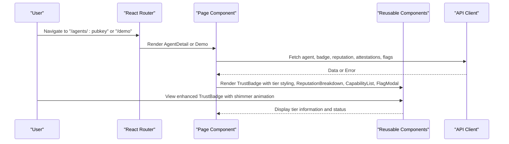
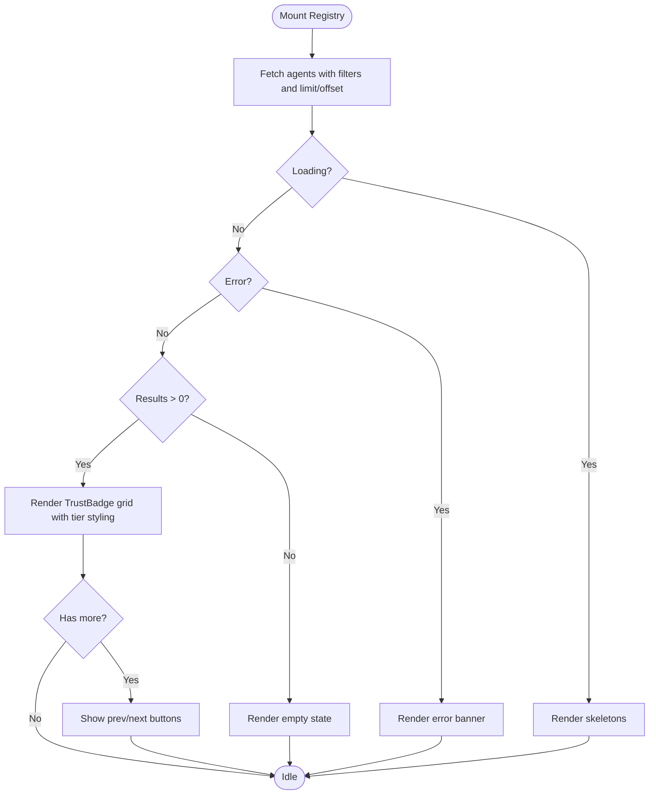
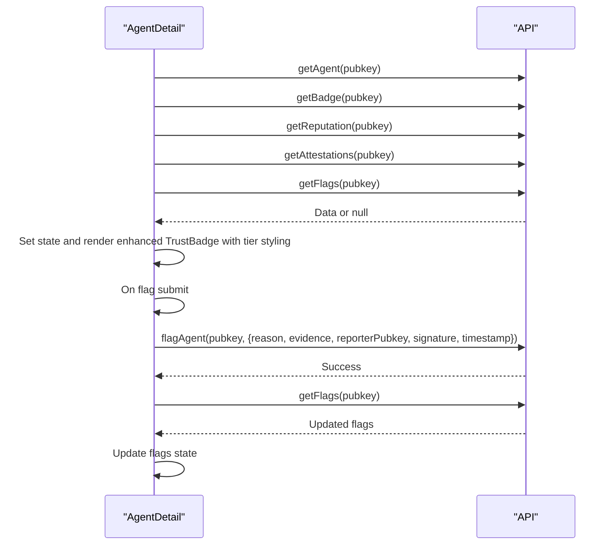
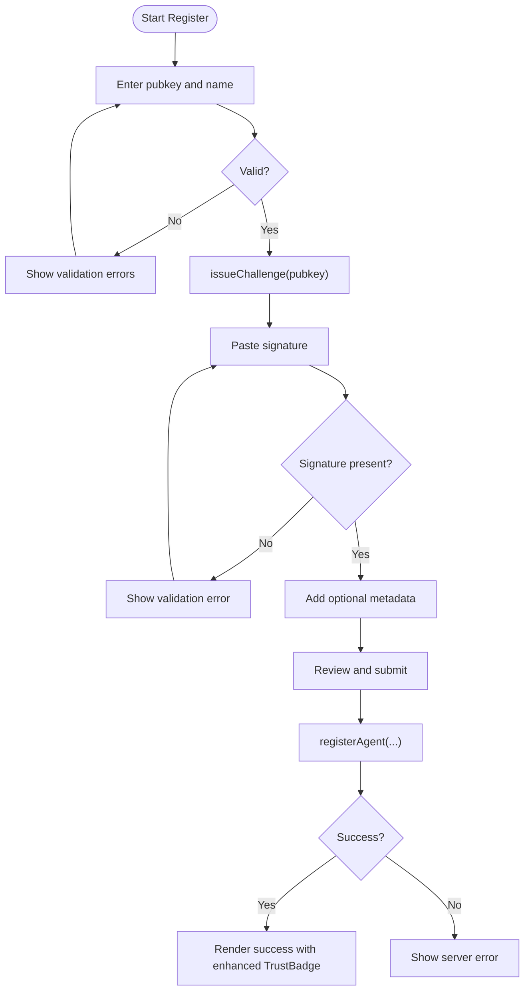
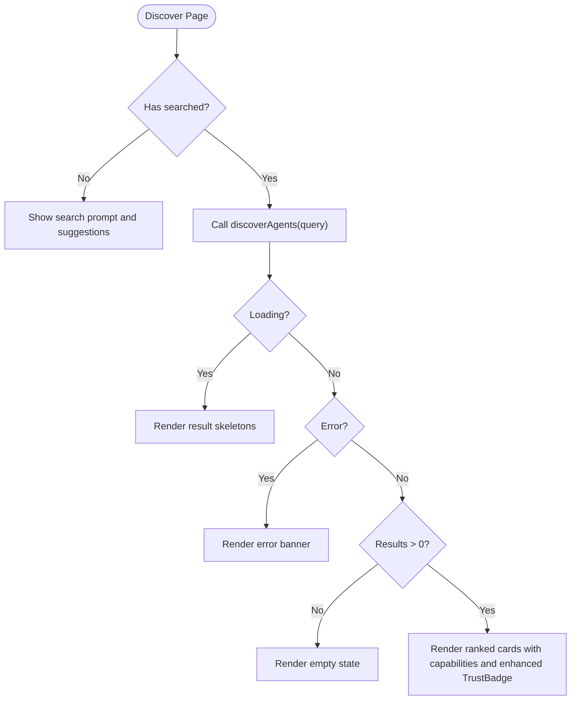
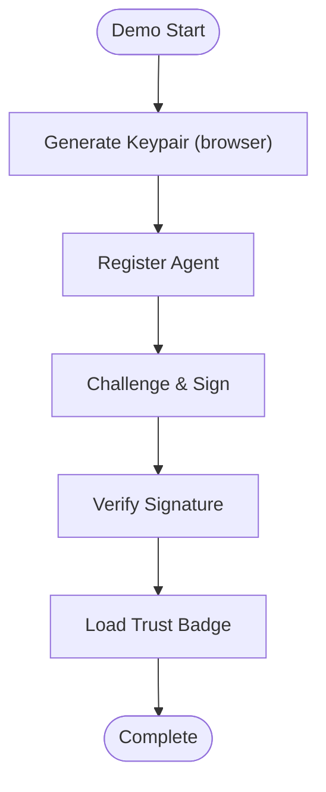
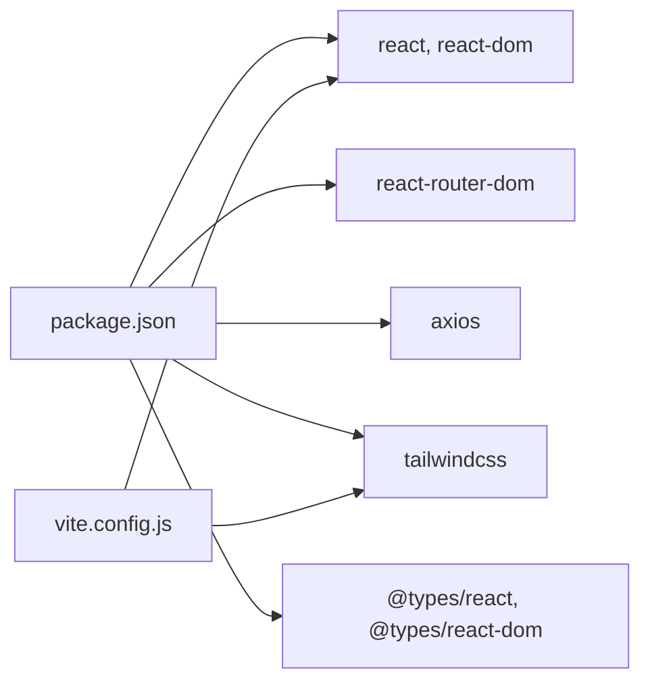

# Frontend Application

<cite>
**Referenced Files in This Document**
- [App.jsx](file://frontend/src/App.jsx)
- [main.jsx](file://frontend/src/main.jsx)
- [api.js](file://frontend/src/lib/api.js)
- [Registry.jsx](file://frontend/src/pages/Registry.jsx)
- [AgentDetail.jsx](file://frontend/src/pages/AgentDetail.jsx)
- [Register.jsx](file://frontend/src/pages/Register.jsx)
- [Discover.jsx](file://frontend/src/pages/Discover.jsx)
- [Demo.jsx](file://frontend/src/pages/Demo.jsx)
- [TrustBadge.jsx](file://frontend/src/components/TrustBadge.jsx)
- [ReputationBreakdown.jsx](file://frontend/src/components/ReputationBreakdown.jsx)
- [CapabilityList.jsx](file://frontend/src/components/CapabilityList.jsx)
- [FlagModal.jsx](file://frontend/src/components/FlagModal.jsx)
- [index.css](file://frontend/src/index.css)
- [package.json](file://frontend/package.json)
- [vite.config.js](file://frontend/vite.config.js)
</cite>

## Update Summary
**Changes Made**
- Enhanced TrustBadge component with verified tier styling, shimmer animations, and gold-themed visual indicators
- Updated AgentDetail page to display tier information alongside status badges
- Added Demo route and navigation elements for interactive demonstration
- **Updated Footer navigation links** from placeholder href='#' to functional URLs pointing to official documentation, API reference, and GitHub repository
- Updated component props and styling patterns to support tier-based visual hierarchy

## Table of Contents
1. [Introduction](#introduction)
2. [Project Structure](#project-structure)
3. [Core Components](#core-components)
4. [Architecture Overview](#architecture-overview)
5. [Detailed Component Analysis](#detailed-component-analysis)
6. [Dependency Analysis](#dependency-analysis)
7. [Performance Considerations](#performance-considerations)
8. [Troubleshooting Guide](#troubleshooting-guide)
9. [Conclusion](#conclusion)
10. [Appendices](#appendices)

## Introduction
This document describes the AgentID frontend React application, focusing on the user interface and component architecture. It explains the routing configuration, state management approach, and styling strategy using TailwindCSS. It documents the key pages (Registry, AgentDetail, Register, Discover, Demo), reusable components (TrustBadge, ReputationBreakdown, CapabilityList, FlagModal), and integration patterns with the backend API. It also covers user workflows, form handling, error states, and responsive design considerations.

## Project Structure
The frontend is a Vite-powered React application with:
- Pages under src/pages for route handlers
- Reusable components under src/components
- Shared API client under src/lib/api.js
- Global styles under src/index.css
- Routing and navigation in src/App.jsx
- Application entry in src/main.jsx
- Build and development configuration in vite.config.js and package.json

```mermaid
graph TB
subgraph "Entry"
MAIN["main.jsx"]
APP["App.jsx"]
end
subgraph "Routing"
ROUTES["React Router Routes"]
NAV["Navigation"]
DEMO["Demo Route"]
end
subgraph "Pages"
REG["Registry.jsx"]
DETAIL["AgentDetail.jsx"]
REGISTER["Register.jsx"]
DISCOVER["Discover.jsx"]
DEMO_PAGE["Demo.jsx"]
end
subgraph "Components"
BADGE["TrustBadge.jsx"]
REP["ReputationBreakdown.jsx"]
CAPS["CapabilityList.jsx"]
FLAG["FlagModal.jsx"]
end
subgraph "API"
API["api.js"]
end
MAIN --> APP
APP --> ROUTES
ROUTES --> REG
ROUTES --> DETAIL
ROUTES --> REGISTER
ROUTES --> DISCOVER
ROUTES --> DEMO
DEMO --> DEMO_PAGE
DETAIL --> BADGE
DETAIL --> REP
DETAIL --> CAPS
DETAIL --> FLAG
REG --> BADGE
DISCOVER --> BADGE
DISCOVER --> CAPS
REGISTER --> BADGE
DEMO_PAGE --> BADGE
REG --> API
DETAIL --> API
REGISTER --> API
DISCOVER --> API
DEMO_PAGE --> API
```

**Diagram sources**
- [main.jsx:1-11](file://frontend/src/main.jsx#L1-L11)
- [App.jsx:87-193](file://frontend/src/App.jsx#L87-L193)
- [Registry.jsx:1-276](file://frontend/src/pages/Registry.jsx#L1-L276)
- [AgentDetail.jsx:1-504](file://frontend/src/pages/AgentDetail.jsx#L1-L504)
- [Register.jsx:1-673](file://frontend/src/pages/Register.jsx#L1-L673)
- [Discover.jsx:1-421](file://frontend/src/pages/Discover.jsx#L1-L421)
- [Demo.jsx:1-780](file://frontend/src/pages/Demo.jsx#L1-L780)
- [TrustBadge.jsx:1-196](file://frontend/src/components/TrustBadge.jsx#L1-L196)
- [ReputationBreakdown.jsx:1-165](file://frontend/src/components/ReputationBreakdown.jsx#L1-L165)
- [CapabilityList.jsx:1-111](file://frontend/src/components/CapabilityList.jsx#L1-L111)
- [FlagModal.jsx:1-258](file://frontend/src/components/FlagModal.jsx#L1-L258)
- [api.js:1-141](file://frontend/src/lib/api.js#L1-L141)

**Section sources**
- [main.jsx:1-11](file://frontend/src/main.jsx#L1-L11)
- [App.jsx:87-193](file://frontend/src/App.jsx#L87-L193)
- [package.json:1-33](file://frontend/package.json#L1-L33)
- [vite.config.js:1-42](file://frontend/vite.config.js#L1-L42)

## Core Components
- Navigation and Footer: Provide global site layout and links with enhanced Demo route integration. **Updated** Footer now contains functional links to official documentation, API reference, and GitHub repository.
- Pages:
  - Registry: Browse agents with filters, pagination, and loading/error states.
  - AgentDetail: View agent profile, reputation, capabilities, flags/attestations, and flag submission with cryptographic authentication. Now displays tier information for verified agents.
  - Register: Multi-step agent onboarding with challenge-response and metadata collection.
  - Discover: Capability-based agent discovery with suggestions and ranking.
  - Demo: Interactive demonstration of the complete verification workflow with step-by-step guidance.
- Reusable Components:
  - TrustBadge: Enhanced with verified tier styling, shimmer animations, and gold-themed visual indicators for premium verified agents.
  - ReputationBreakdown: Five-factor reputation scoring visualization.
  - CapabilityList: Capability tags with categorization and icons.
  - FlagModal: Enhanced controlled modal for reporting agents with Ed25519 signature requirements and cryptographic authentication.

**Updated** Enhanced TrustBadge component now supports verified tier styling with shimmer animations and gold-themed visual indicators for premium verified agents. AgentDetail page now displays tier information alongside status badges for comprehensive agent verification context. **Footer navigation links have been updated to functional URLs for improved user experience.**

**Section sources**
- [App.jsx:7-193](file://frontend/src/App.jsx#L7-L193)
- [Registry.jsx:51-276](file://frontend/src/pages/Registry.jsx#L51-L276)
- [AgentDetail.jsx:167-504](file://frontend/src/pages/AgentDetail.jsx#L167-L504)
- [Register.jsx:241-673](file://frontend/src/pages/Register.jsx#L241-L673)
- [Discover.jsx:94-421](file://frontend/src/pages/Discover.jsx#L94-L421)
- [Demo.jsx:121-780](file://frontend/src/pages/Demo.jsx#L121-L780)
- [TrustBadge.jsx:42-196](file://frontend/src/components/TrustBadge.jsx#L42-L196)
- [ReputationBreakdown.jsx:46-165](file://frontend/src/components/ReputationBreakdown.jsx#L46-L165)
- [CapabilityList.jsx:69-111](file://frontend/src/components/CapabilityList.jsx#L69-L111)
- [FlagModal.jsx:4-258](file://frontend/src/components/FlagModal.jsx#L4-L258)

## Architecture Overview
The app uses React Router for client-side routing and a shared Axios-based API client for backend integration. Pages orchestrate state and render reusable components. Styling relies on TailwindCSS with a custom dark theme and glass morphism effects. The enhanced TrustBadge component now supports tier-based visual hierarchy with premium verified agents receiving gold-themed styling and shimmer animations.



**Diagram sources**
- [AgentDetail.jsx:167-504](file://frontend/src/pages/AgentDetail.jsx#L167-L504)
- [Demo.jsx:121-780](file://frontend/src/pages/Demo.jsx#L121-L780)
- [TrustBadge.jsx:42-196](file://frontend/src/components/TrustBadge.jsx#L42-L196)
- [FlagModal.jsx:4-258](file://frontend/src/components/FlagModal.jsx#L4-L258)
- [api.js:1-141](file://frontend/src/lib/api.js#L1-L141)

**Section sources**
- [App.jsx:87-193](file://frontend/src/App.jsx#L87-L193)
- [api.js:1-141](file://frontend/src/lib/api.js#L1-L141)

## Detailed Component Analysis

### Routing and Navigation
- Routes:
  - "/" → Registry
  - "/agents/:pubkey" → AgentDetail
  - "/register" → Register
  - "/discover" → Discover
  - "/demo" → Demo (new)
- Navigation highlights active route and includes responsive mobile menu with Demo route integration.
- Footer provides informational links with **updated functional URLs** for improved user accessibility.

**Updated** Added Demo route with dedicated navigation elements and styling for interactive demonstration. **Footer navigation links now point to official external resources instead of placeholder links.**

**Section sources**
- [App.jsx:1-193](file://frontend/src/App.jsx#L1-L193)

### Registry Page
- State: agents, loading, error, filters (status, capability), pagination (offset, total, hasMore).
- Behavior:
  - Fetches paginated agent list with filters.
  - Resets offset when filters change.
  - Renders skeletons while loading, error state, empty state, and grid of TrustBadges with tier styling.
  - Pagination controls compute current and total pages.
- Backend integration: getAgents with status/capability/limit/offset.



**Diagram sources**
- [Registry.jsx:51-276](file://frontend/src/pages/Registry.jsx#L51-L276)
- [api.js:35-45](file://frontend/src/lib/api.js#L35-L45)
- [TrustBadge.jsx:42-196](file://frontend/src/components/TrustBadge.jsx#L42-L196)

**Section sources**
- [Registry.jsx:51-276](file://frontend/src/pages/Registry.jsx#L51-L276)
- [api.js:35-45](file://frontend/src/lib/api.js#L35-L45)
- [TrustBadge.jsx:42-196](file://frontend/src/components/TrustBadge.jsx#L42-L196)

### AgentDetail Page
- State: agent, badge, reputation, attestations, flags, loading/error, flag modal open, flag submitting.
- Behavior:
  - Parallel fetch of agent, badge, reputation, attestations, flags.
  - Renders hero with TrustBadge (enhanced with tier styling), reputation breakdown, details, action statistics, capabilities, description, and activity history.
  - Displays tier information alongside status badges for verified agents.
  - Flag submission opens FlagModal with cryptographic authentication, validates reason/evidence/signature/reporterPubkey, submits via API, refreshes flags.
  - Handles 404 and generic errors with dedicated UI.
- Backend integration: getAgent, getBadge, getReputation, getAttestations, getFlags, flagAgent.

**Updated** Enhanced TrustBadge rendering to display tier information for verified agents with gold-themed styling and shimmer animations. **Footer navigation provides direct links to official documentation and resources.**



**Diagram sources**
- [AgentDetail.jsx:167-504](file://frontend/src/pages/AgentDetail.jsx#L167-L504)
- [TrustBadge.jsx:42-196](file://frontend/src/components/TrustBadge.jsx#L42-L196)
- [api.js:91-95](file://frontend/src/lib/api.js#L91-L95)

**Section sources**
- [AgentDetail.jsx:167-504](file://frontend/src/pages/AgentDetail.jsx#L167-L504)
- [TrustBadge.jsx:42-196](file://frontend/src/components/TrustBadge.jsx#L42-L196)
- [api.js:91-95](file://frontend/src/lib/api.js#L91-L95)

### Register Page
- State: currentStep, formData, errors, serverError, submitting, registeredAgent.
- Workflow:
  - Step 1: Collect pubkey and name; validates inputs.
  - Step 2: Fetch challenge via issueChallenge, user signs challenge, enters signature.
  - Step 3: Optional metadata (tokenMint, capabilities, creatorXHandle, creatorWallet, description).
  - Step 4: Review and submit registration via registerAgent.
- Backend integration: registerAgent, issueChallenge.



**Diagram sources**
- [Register.jsx:241-673](file://frontend/src/pages/Register.jsx#L241-L673)
- [api.js:64-83](file://frontend/src/lib/api.js#L64-L83)
- [TrustBadge.jsx:42-196](file://frontend/src/components/TrustBadge.jsx#L42-L196)

**Section sources**
- [Register.jsx:241-673](file://frontend/src/pages/Register.jsx#L241-L673)
- [api.js:64-83](file://frontend/src/lib/api.js#L64-L83)
- [TrustBadge.jsx:42-196](file://frontend/src/components/TrustBadge.jsx#L42-L196)

### Discover Page
- State: searchQuery, results, loading, hasSearched, error.
- Behavior:
  - Suggests capability keywords; user can search or click suggestions.
  - Calls discoverAgents with capability; renders ranked results with TrustBadge-like visuals and capability tags.
  - Provides empty state and error handling.
- Backend integration: discoverAgents.



**Diagram sources**
- [Discover.jsx:94-421](file://frontend/src/pages/Discover.jsx#L94-L421)
- [api.js:96-105](file://frontend/src/lib/api.js#L96-L105)
- [TrustBadge.jsx:42-196](file://frontend/src/components/TrustBadge.jsx#L42-L196)

**Section sources**
- [Discover.jsx:94-421](file://frontend/src/pages/Discover.jsx#L94-L421)
- [api.js:96-105](file://frontend/src/lib/api.js#L96-L105)
- [TrustBadge.jsx:42-196](file://frontend/src/components/TrustBadge.jsx#L42-L196)

### Demo Page
- State: currentStep, keypair generation, agent registration, challenge-response verification, badge display.
- Workflow:
  - Step 1: Generate Ed25519 keypair in browser using tweetnacl.
  - Step 2: Register agent with metadata.
  - Step 3: Challenge-response verification with automatic signing.
  - Step 4: Display trust badge with embed options.
- Backend integration: registerAgent, issueChallenge, verifyChallenge, getBadge.

**New** Interactive demonstration page showcasing the complete AgentID verification workflow with step-by-step guidance and real-time feedback.



**Diagram sources**
- [Demo.jsx:121-780](file://frontend/src/pages/Demo.jsx#L121-L780)
- [api.js:64-83](file://frontend/src/lib/api.js#L64-L83)

**Section sources**
- [Demo.jsx:121-780](file://frontend/src/pages/Demo.jsx#L121-L780)
- [api.js:64-83](file://frontend/src/lib/api.js#L64-L83)

### Reusable Components

#### Enhanced TrustBadge
- Props: status, name, score, registeredAt, totalActions, tier, tierColor, className.
- **Enhanced** with verified tier styling:
  - Premium verified agents receive gold-themed styling with shimmer animations
  - Standard verified agents get blue-themed styling without shimmer
  - Verified tier badge displays ★ for premium verified agents
  - Enhanced visual hierarchy with gradient backgrounds and border styling
- Renders a visually distinct card per status with enhanced tier-based styling and gradient glow effects.
- Uses Tailwind utilities and CSS variables for theming with shimmer animation support.

**Updated** Added tier configuration system with verified tier styling, shimmer animations, and gold-themed visual indicators for premium verified agents.

**Section sources**
- [TrustBadge.jsx:42-196](file://frontend/src/components/TrustBadge.jsx#L42-L196)

#### ReputationBreakdown
- Props: breakdown (object with five factors).
- Computes total/max, maps to color-coded bars, and displays legend thresholds.
- Supports flexible input shapes (plain number or {score,max}).

**Section sources**
- [ReputationBreakdown.jsx:46-165](file://frontend/src/components/ReputationBreakdown.jsx#L46-L165)

#### CapabilityList
- Props: capabilities (array), showLabel (boolean).
- Renders capability tags with category-specific colors/icons; falls back to default style.

**Section sources**
- [CapabilityList.jsx:69-111](file://frontend/src/components/CapabilityList.jsx#L69-L111)

#### FlagModal
- Props: isOpen, onClose, onSubmit, agentPubkey.
- **Enhanced** with Ed25519 signature requirements and cryptographic authentication:
  - **New State Management**: Added reporterPubkey, signature, timestamp, and messageToSign state variables.
  - **Cryptographic Message Construction**: Generates standardized message format: `AGENTID-FLAG:{agentPubkey}:{reporterPubkey}:{timestamp}`.
  - **Ed25519 Signature Validation**: Requires base58-encoded Ed25519 signatures for authentication.
  - **Enhanced Form Fields**: Includes reporterPubkey input, dynamic message display, and signature textarea.
  - **Real-time Message Generation**: Automatically updates message when reporterPubkey or timestamp changes.
  - **Timestamp Management**: Updates timestamp when modal opens and includes it in authentication.
  - **Validation Improvements**: Validates signature presence and provides clear error messages for cryptographic requirements.
  - **Integration Flow**: Submits {reason, evidence, reporterPubkey, signature, timestamp} to onSubmit callback.

**Section sources**
- [FlagModal.jsx:4-258](file://frontend/src/components/FlagModal.jsx#L4-L258)

### API Integration Patterns
- Centralized client in api.js with:
  - Base URL /api and JSON headers.
  - Request interceptor adds Authorization Bearer token from localStorage.
  - Response interceptor handles 401 by removing token.
  - Exposed functions for agents, badges, reputation, registration, verification, attestations, discovery, widgets, updates, and histories.
  - **New Function**: flagAgent(pubkey, flagData) - posts flag data with cryptographic authentication.

**Section sources**
- [api.js:1-141](file://frontend/src/lib/api.js#L1-L141)

### Styling and Theming
- TailwindCSS configured via Vite plugin.
- Custom CSS variables define dark theme palette (backgrounds, text, accents, borders, shadows).
- **Enhanced** with shimmer animation support:
  - Shimmer animation for verified tier badges using @keyframes shimmer
  - Gold-themed visual indicators with yellow-400 and amber-500 gradients
  - Enhanced gradient text and status badge utilities
- Utilities:
  - Glass morphism (.glass) with backdrop blur.
  - Gradient text.
  - Status badges for verified/unverified/flagged.
  - Animations (fade-in, slide-in, pulse-glow, shimmer).
- Responsive design uses Tailwind's responsive prefixes and flex/grid layouts.

**Updated** Added shimmer animation support and gold-themed visual indicators for premium verified agents.

**Section sources**
- [index.css:1-173](file://frontend/src/index.css#L1-L173)
- [vite.config.js:1-42](file://frontend/vite.config.js#L1-L42)

## Dependency Analysis
- Runtime dependencies: React, ReactDOM, React Router, Axios, Prop Types.
- Dev dependencies: Vite, TailwindCSS, React plugin, ESLint, TypeScript types.
- Build pipeline:
  - Vite serves index.html and widget.html.
  - Proxy /api to backend server.
  - Widget middleware rewrites /widget/* to widget.html.



**Diagram sources**
- [package.json:12-31](file://frontend/package.json#L12-L31)
- [vite.config.js:1-42](file://frontend/vite.config.js#L1-L42)

**Section sources**
- [package.json:12-31](file://frontend/package.json#L12-L31)
- [vite.config.js:1-42](file://frontend/vite.config.js#L1-L42)

## Performance Considerations
- Parallel API fetching in AgentDetail reduces total load time.
- Pagination in Registry prevents large DOM rendering.
- Skeleton loaders improve perceived performance during network requests.
- Debounce or throttle search in Discover could reduce API calls (not currently implemented).
- Lazy loading images (if added) and virtualizing long lists would further optimize.
- **Enhanced** FlagModal performance: Real-time message generation and validation occur efficiently without blocking UI.
- **Enhanced** TrustBadge performance: Tier styling calculations are optimized with conditional rendering to minimize re-renders.

## Troubleshooting Guide
- Authentication:
  - 401 responses automatically clear stored token; re-authenticate and retry.
- Network errors:
  - Check proxy configuration (/api to backend) and CORS settings.
- Form validation:
  - Register step 1 requires valid pubkey and name; step 2 requires signature.
  - **Enhanced** FlagModal validation: Requires reason, reporterPubkey, signature, and optional JSON evidence; signature must be base58-encoded Ed25519 signature.
- Error boundaries:
  - Pages render explicit error banners and empty states for graceful degradation.
- **New** Cryptographic Authentication Issues:
  - Ensure reporterPubkey follows Solana wallet address format.
  - Verify signature is generated using Ed25519 private key and base58 encoding.
  - Confirm message format matches `AGENTID-FLAG:{agentPubkey}:{reporterPubkey}:{timestamp}`.
  - Check timestamp is current and included in authentication.
- **New** Demo Page Issues:
  - Ensure tweetnacl and bs58 libraries are properly loaded for keypair generation.
  - Verify browser supports WebCrypto API for cryptographic operations.
  - Check that API endpoints are accessible for registration and verification steps.
- **New** Footer Link Issues:
  - All footer links now point to official external resources and open in new tabs with proper security attributes.
  - Documentation link: https://github.com/RunTimeAdmin/AgentID/wiki
  - API reference link: https://github.com/RunTimeAdmin/AgentID/blob/main/docs/API_REFERENCE.md
  - GitHub repository link: https://github.com/RunTimeAdmin/AgentID

**Section sources**
- [api.js:23-33](file://frontend/src/lib/api.js#L23-L33)
- [Register.jsx:269-314](file://frontend/src/pages/Register.jsx#L269-L314)
- [FlagModal.jsx:12-73](file://frontend/src/components/FlagModal.jsx#L12-L73)
- [AgentDetail.jsx:214-227](file://frontend/src/pages/AgentDetail.jsx#L214-L227)
- [Demo.jsx:147-203](file://frontend/src/pages/Demo.jsx#L147-L203)
- [App.jsx:161-165](file://frontend/src/App.jsx#L161-L165)

## Conclusion
The AgentID frontend is a modular, theme-consistent React application with clear separation of concerns. Pages manage UI state and orchestrate API calls, while reusable components encapsulate presentation logic. The routing and API client provide a solid foundation for user workflows spanning discovery, onboarding, and profile management. **The TrustBadge enhancement introduces tier-based visual hierarchy with premium verified agents receiving gold-themed styling and shimmer animations, significantly improving visual distinction and trust communication. The addition of the Demo route provides comprehensive interactive guidance for users experiencing the complete verification workflow.** **The footer navigation has been enhanced with functional links to official documentation, API reference, and GitHub repository, improving user access to external resources.**

## Appendices

### Component Usage Examples
- Registry: Pass TrustBadge to each agent card; apply className for sizing; TrustBadge now supports tier styling.
- AgentDetail: Compose TrustBadge with tier information, ReputationBreakdown, CapabilityList; embed FlagModal with callbacks; TrustBadge displays enhanced tier styling.
- Register: Use FormField, TextAreaField, CapabilitiesInput; manage multi-step state transitions.
- Discover: Render suggested capabilities and clickable chips; pass results to result cards with enhanced TrustBadge visuals.
- Demo: Interactive demonstration of complete verification workflow with step-by-step guidance.

### Customization Options
- Theming: Adjust CSS variables in index.css to change palettes and glows; shimmer animation can be customized.
- Components: Extend TrustBadge props to include tier or additional metrics; customize CapabilityList styles.
- API: Add interceptors for logging or retry policies; expand api.js with new endpoints.
- **Enhanced** FlagModal: Customize message format, adjust signature requirements, or modify authentication parameters.
- **New** Demo Page: Customize step descriptions, add additional verification steps, or modify embed options.

### Enhanced TrustBadge Features
**New** The TrustBadge component now supports comprehensive tier-based styling:

1. **Tier Configuration System**: Separate configurations for verified and standard tiers
2. **Premium Verified Agents**: Gold-themed styling with shimmer animations using yellow-400 and amber-500 gradients
3. **Standard Verified Agents**: Blue-themed styling without shimmer effects
4. **Visual Hierarchy**: Enhanced gradient backgrounds, border styling, and status-specific colors
5. **Shimmer Animation**: Smooth horizontal shimmer effect for premium verified agents using CSS keyframes

**Section sources**
- [TrustBadge.jsx:42-196](file://frontend/src/components/TrustBadge.jsx#L42-L196)
- [index.css:164-173](file://frontend/src/index.css#L164-L173)

### Cryptographic Authentication Flow
**New** The FlagModal implements a comprehensive Ed25519 signature authentication system:

1. **Message Construction**: Generates standardized message format: `AGENTID-FLAG:{agentPubkey}:{reporterPubkey}:{timestamp}`
2. **Signature Requirement**: Requires base58-encoded Ed25519 signatures for cryptographic proof of ownership
3. **Real-time Validation**: Validates signature presence and provides clear error messages
4. **Timestamp Integration**: Includes current timestamp in authentication for freshness
5. **Secure Submission**: Submits all authentication data to backend for verification

**Section sources**
- [FlagModal.jsx:13-16](file://frontend/src/components/FlagModal.jsx#L13-L16)
- [FlagModal.jsx:47-51](file://frontend/src/components/FlagModal.jsx#L47-L51)
- [FlagModal.jsx:144](file://frontend/src/components/FlagModal.jsx#L144)
- [FlagModal.jsx:166](file://frontend/src/components/FlagModal.jsx#L166)

### Demo Page Interactive Features
**New** The Demo page provides comprehensive interactive guidance:

1. **Step-by-Step Workflow**: Four-phase demonstration of the verification process
2. **Browser-Based Cryptography**: In-browser keypair generation using tweetnacl
3. **Real-time Feedback**: Progress indicators and success/failure states
4. **Embed Options**: SVG badge generation and iframe embedding capabilities
5. **API Call Transparency**: Detailed API call examples for each step

**Section sources**
- [Demo.jsx:121-780](file://frontend/src/pages/Demo.jsx#L121-L780)

### Footer Navigation Enhancement
**New** The footer navigation has been enhanced with functional external links:

1. **Documentation Link**: Points to https://github.com/RunTimeAdmin/AgentID/wiki for comprehensive project documentation
2. **API Reference Link**: Points to https://github.com/RunTimeAdmin/AgentID/blob/main/docs/API_REFERENCE.md for technical API specifications
3. **GitHub Repository Link**: Points to https://github.com/RunTimeAdmin/AgentID for source code and project repository
4. **Security Attributes**: All links open in new tabs with `target="_blank"` and `rel="noopener noreferrer"` for security
5. **Consistent Styling**: Maintains the same hover effects and color scheme as other navigation elements

**Section sources**
- [App.jsx:161-165](file://frontend/src/App.jsx#L161-L165)