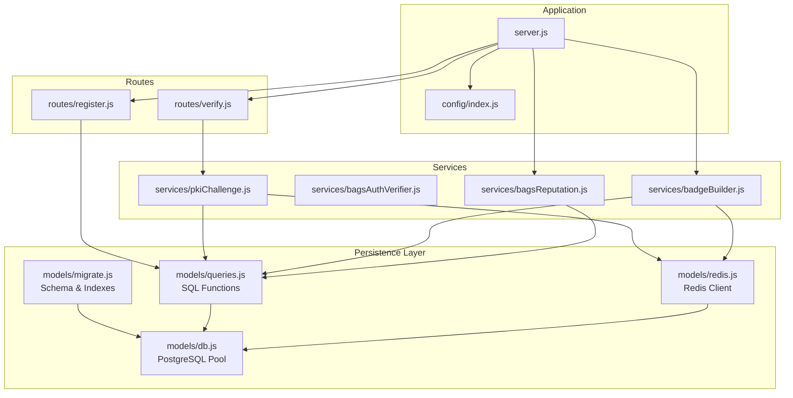
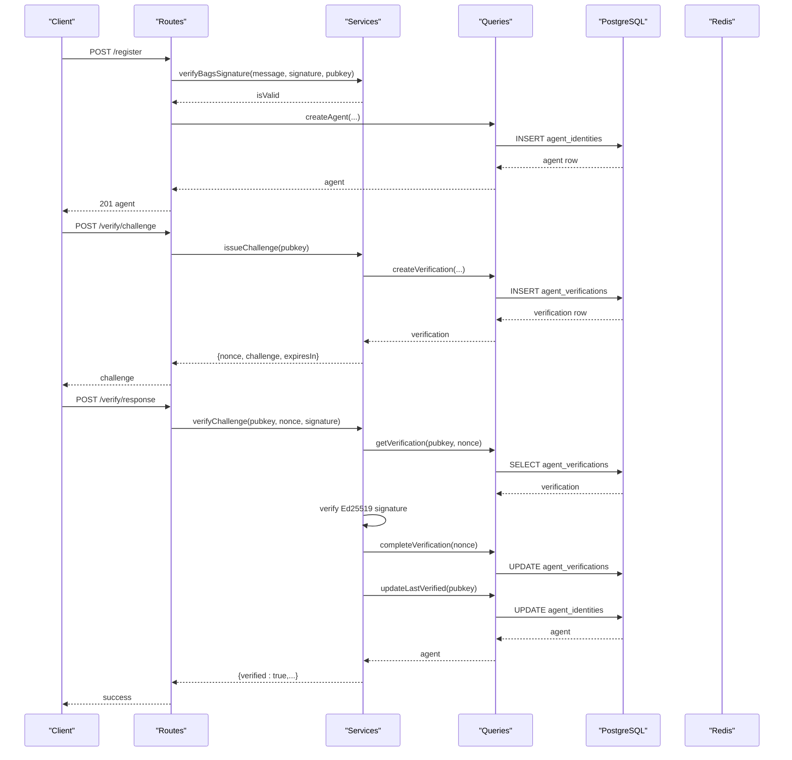
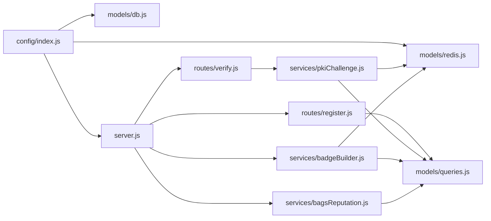

# AgentID Database Record

<cite>
**Referenced Files in This Document**
- [server.js](file://backend/server.js)
- [config/index.js](file://backend/src/config/index.js)
- [models/db.js](file://backend/src/models/db.js)
- [models/migrate.js](file://backend/src/models/migrate.js)
- [models/queries.js](file://backend/src/models/queries.js)
- [models/redis.js](file://backend/src/models/redis.js)
- [routes/register.js](file://backend/src/routes/register.js)
- [routes/verify.js](file://backend/src/routes/verify.js)
- [services/pkiChallenge.js](file://backend/src/services/pkiChallenge.js)
- [services/bagsAuthVerifier.js](file://backend/src/services/bagsAuthVerifier.js)
- [services/badgeBuilder.js](file://backend/src/services/badgeBuilder.js)
- [services/bagsReputation.js](file://backend/src/services/bagsReputation.js)
- [package.json](file://backend/package.json)
</cite>

## Table of Contents
1. [Introduction](#introduction)
2. [Project Structure](#project-structure)
3. [Core Components](#core-components)
4. [Architecture Overview](#architecture-overview)
5. [Detailed Component Analysis](#detailed-component-analysis)
6. [Dependency Analysis](#dependency-analysis)
7. [Performance Considerations](#performance-considerations)
8. [Troubleshooting Guide](#troubleshooting-guide)
9. [Conclusion](#conclusion)
10. [Appendices](#appendices)

## Introduction
This document describes the AgentID Database Record system with a focus on the PostgreSQL schema and data persistence layer. It documents the complete structure of the agent_identities table (including all 20+ columns), the agent_verifications table for challenge-response tracking, and the agent_flags table for community moderation. It also explains the database migration process, connection pooling configuration, and the role of Redis for nonce storage and caching. SQL examples for table creation, indexing strategies, and query patterns are included, along with data integrity measures, foreign key relationships, JSONB fields for capability_set and metadata, performance considerations, backup strategies, and the integration between PostgreSQL and Redis.

## Project Structure
The backend is organized around a layered architecture:
- Configuration and environment variables
- Database connection pool and migrations
- Query layer for reusable SQL operations
- Redis client for caching and ephemeral nonce storage
- Route handlers for API endpoints
- Services for business logic (challenge-response, reputation, badges)
- Application bootstrap and middleware

**Diagram sources**
- [server.js:1-91](file://backend/server.js#L1-L91)
- [config/index.js:1-31](file://backend/src/config/index.js#L1-L31)
- [models/db.js:1-45](file://backend/src/models/db.js#L1-L45)
- [models/migrate.js:1-100](file://backend/src/models/migrate.js#L1-L100)
- [models/queries.js:1-404](file://backend/src/models/queries.js#L1-L404)
- [models/redis.js:1-94](file://backend/src/models/redis.js#L1-L94)
- [routes/register.js:1-162](file://backend/src/routes/register.js#L1-L162)
- [routes/verify.js:1-121](file://backend/src/routes/verify.js#L1-L121)
- [services/pkiChallenge.js:1-102](file://backend/src/services/pkiChallenge.js#L1-L102)
- [services/bagsAuthVerifier.js:1-93](file://backend/src/services/bagsAuthVerifier.js#L1-L93)
- [services/badgeBuilder.js:1-497](file://backend/src/services/badgeBuilder.js#L1-L497)
- [services/bagsReputation.js:1-146](file://backend/src/services/bagsReputation.js#L1-L146)

**Section sources**
- [server.js:1-91](file://backend/server.js#L1-L91)
- [config/index.js:1-31](file://backend/src/config/index.js#L1-L31)

## Core Components
- PostgreSQL connection pool and query wrapper
- Migration script that creates tables and indexes
- Query functions for agent identities, verifications, flags, discovery, and counts
- Redis client for caching and ephemeral nonce storage
- Route handlers for registration and verification
- Services for PKI challenge-response and reputation computation

**Section sources**
- [models/db.js:1-45](file://backend/src/models/db.js#L1-L45)
- [models/migrate.js:1-100](file://backend/src/models/migrate.js#L1-L100)
- [models/queries.js:1-404](file://backend/src/models/queries.js#L1-L404)
- [models/redis.js:1-94](file://backend/src/models/redis.js#L1-L94)
- [routes/register.js:1-162](file://backend/src/routes/register.js#L1-L162)
- [routes/verify.js:1-121](file://backend/src/routes/verify.js#L1-L121)
- [services/pkiChallenge.js:1-102](file://backend/src/services/pkiChallenge.js#L1-L102)
- [services/bagsReputation.js:1-146](file://backend/src/services/bagsReputation.js#L1-L146)

## Architecture Overview
The system integrates PostgreSQL for durable identity and verification records with Redis for ephemeral challenge nonces and caching. Routes orchestrate requests, services encapsulate cryptographic and external API interactions, and the query layer ensures safe, parameterized SQL.

**Diagram sources**
- [routes/register.js:59-159](file://backend/src/routes/register.js#L59-L159)
- [routes/verify.js:18-118](file://backend/src/routes/verify.js#L18-L118)
- [services/pkiChallenge.js:17-96](file://backend/src/services/pkiChallenge.js#L17-L96)
- [services/bagsAuthVerifier.js:18-86](file://backend/src/services/bagsAuthVerifier.js#L18-L86)
- [models/queries.js:17-29](file://backend/src/models/queries.js#L17-L29)
- [models/queries.js:213-256](file://backend/src/models/queries.js#L213-L256)
- [models/queries.js:332-357](file://backend/src/models/queries.js#L332-L357)

## Detailed Component Analysis

### PostgreSQL Schema: agent_identities
The agent_identities table stores agent identity and reputation-related attributes. Below is the complete column inventory with data types, constraints, and roles.

- pubkey: VARCHAR(88) PRIMARY KEY
  - Unique identifier for the agent (Solana public key)
- name: VARCHAR(255) NOT NULL
  - Human-readable agent name
- description: TEXT
  - Optional description
- token_mint: VARCHAR(88)
  - Associated token mint for analytics
- bags_api_key_id: VARCHAR(255)
  - Reference to BAGS API key identifier
- said_registered: BOOLEAN DEFAULT false
  - Indicates SAID registration status
- said_trust_score: INTEGER DEFAULT 0
  - SAID trust score value
- capability_set: JSONB
  - Array of capabilities (e.g., ["swap", "stake"])
- creator_x: VARCHAR(255)
  - Creator social handle
- creator_wallet: VARCHAR(88)
  - Creator wallet address
- registered_at: TIMESTAMPTZ DEFAULT NOW()
  - Timestamp of registration
- last_verified: TIMESTAMPTZ
  - Timestamp of last successful verification
- status: VARCHAR(20) DEFAULT 'verified'
  - Agent status: verified, flagged, unverified
- flag_reason: TEXT
  - Reason for flagging
- bags_score: INTEGER DEFAULT 0
  - Computed BAGS reputation score
- total_actions: INTEGER DEFAULT 0
  - Total actions performed
- successful_actions: INTEGER DEFAULT 0
  - Successful actions
- failed_actions: INTEGER DEFAULT 0
  - Failed actions
- fee_claims_count: INTEGER DEFAULT 0
  - Count of fee claims
- fee_claims_sol: DECIMAL(18,9) DEFAULT 0
  - Total SOL claimed in fees
- swaps_count: INTEGER DEFAULT 0
  - Number of swaps
- launches_count: INTEGER DEFAULT 0
  - Number of launches

Constraints and relationships:
- Primary key on pubkey
- JSONB fields for capability_set and metadata-like fields
- Status and scores support reputation and moderation workflows

Indexes:
- idx_agent_identities_status
- idx_agent_identities_bags_score DESC

Example SQL (from migration):
- CREATE TABLE IF NOT EXISTS agent_identities (...)
- CREATE INDEX IF NOT EXISTS idx_agent_identities_status ON agent_identities(status);
- CREATE INDEX IF NOT EXISTS idx_agent_identities_bags_score ON agent_identities(bags_score DESC);

**Section sources**
- [models/migrate.js:11-34](file://backend/src/models/migrate.js#L11-L34)
- [models/migrate.js:58-65](file://backend/src/models/migrate.js#L58-L65)
- [models/queries.js:17-29](file://backend/src/models/queries.js#L17-L29)
- [models/queries.js:80-109](file://backend/src/models/queries.js#L80-L109)

### PostgreSQL Schema: agent_verifications
The agent_verifications table tracks challenge-response sessions for ongoing verification.

Columns:
- id: SERIAL PRIMARY KEY
- pubkey: VARCHAR(88) REFERENCES agent_identities(pubkey)
- nonce: VARCHAR(64) UNIQUE NOT NULL
- challenge: TEXT NOT NULL
- expires_at: TIMESTAMPTZ NOT NULL
- completed: BOOLEAN DEFAULT false
- created_at: TIMESTAMPTZ DEFAULT NOW()

Indexes:
- idx_agent_verifications_pubkey

Example SQL (from migration):
- CREATE TABLE IF NOT EXISTS agent_verifications (...)
- CREATE INDEX IF NOT EXISTS idx_agent_verifications_pubkey ON agent_verifications(pubkey);

Integration:
- Challenges are issued with a random UUID nonce and stored with an expiration timestamp
- Responses are validated against the stored challenge and nonce, then marked completed and last_verified is updated

**Section sources**
- [models/migrate.js:36-45](file://backend/src/models/migrate.js#L36-L45)
- [models/migrate.js:61](file://backend/src/models/migrate.js#L61)
- [models/queries.js:213-222](file://backend/src/models/queries.js#L213-L222)
- [models/queries.js:230-240](file://backend/src/models/queries.js#L230-L240)
- [models/queries.js:247-256](file://backend/src/models/queries.js#L247-L256)
- [services/pkiChallenge.js:17-39](file://backend/src/services/pkiChallenge.js#L17-L39)
- [services/pkiChallenge.js:49-96](file://backend/src/services/pkiChallenge.js#L49-L96)

### PostgreSQL Schema: agent_flags
The agent_flags table captures community moderation reports.

Columns:
- id: SERIAL PRIMARY KEY
- pubkey: VARCHAR(88) REFERENCES agent_identities(pubkey)
- reporter_pubkey: VARCHAR(88)
- reason: TEXT NOT NULL
- evidence: JSONB
- created_at: TIMESTAMPTZ DEFAULT NOW()
- resolved: BOOLEAN DEFAULT false

Indexes:
- idx_agent_flags_pubkey
- idx_agent_flags_resolved
- idx_agent_flags_pubkey_resolved

Example SQL (from migration):
- CREATE TABLE IF NOT EXISTS agent_flags (...)
- CREATE INDEX IF NOT EXISTS idx_agent_flags_pubkey ON agent_flags(pubkey);
- CREATE INDEX IF NOT EXISTS idx_agent_flags_resolved ON agent_flags(resolved);
- CREATE INDEX IF NOT EXISTS idx_agent_flags_pubkey_resolved ON agent_flags(pubkey, resolved);

Integration:
- Flags are created with reporter_pubkey, reason, and optional evidence
- Unresolved flag counts influence reputation scoring
- Flags can be resolved to false to indicate closure

**Section sources**
- [models/migrate.js:47-56](file://backend/src/models/migrate.js#L47-L56)
- [models/migrate.js:62-64](file://backend/src/models/migrate.js#L62-L64)
- [models/queries.js:267-279](file://backend/src/models/queries.js#L267-L279)
- [models/queries.js:286-305](file://backend/src/models/queries.js#L286-L305)
- [models/queries.js:312-321](file://backend/src/models/queries.js#L312-L321)
- [services/bagsReputation.js:77-90](file://backend/src/services/bagsReputation.js#L77-L90)

### Database Migration Process
The migration script performs the following:
- Connects to the database using the pool
- Begins a transaction
- Creates agent_identities, agent_verifications, and agent_flags tables
- Creates performance indexes
- Commits the transaction or rolls back on failure
- Exits the process with success or failure status

Operational notes:
- Run via npm script: migrate
- Uses a dedicated client connection to execute DDL safely
- Ensures atomicity for schema changes

**Section sources**
- [models/migrate.js:67-92](file://backend/src/models/migrate.js#L67-L92)
- [package.json:9](file://backend/package.json#L9)

### Connection Pooling Configuration
The PostgreSQL pool is configured with:
- connectionString from DATABASE_URL
- SSL settings enabled in production (rejectUnauthorized: false)
- Error event logging to prevent crashes
- A shared query wrapper that executes parameterized statements

Security and reliability:
- Reject unauthorized SSL in production environments
- Centralized error logging for pool issues
- Parameterized queries in the query layer prevent SQL injection

**Section sources**
- [models/db.js:10-18](file://backend/src/models/db.js#L10-L18)
- [models/db.js:21-23](file://backend/src/models/db.js#L21-L23)
- [models/queries.js:17-29](file://backend/src/models/queries.js#L17-L29)

### Redis Integration for Nonce Storage and Caching
Redis is used for:
- Ephemeral nonce storage for PKI challenges (challenge-response)
- Caching badge JSON data with TTL

Redis client configuration:
- retryStrategy with exponential backoff
- maxRetriesPerRequest to bound retry attempts
- enableOfflineQueue to buffer commands during reconnection
- getCache/setCache/deleteCache helpers with JSON serialization

PKI challenge flow:
- issueChallenge generates a nonce and challenge string, stores in agent_verifications, and returns base58-encoded challenge
- verifyChallenge retrieves the verification record, validates expiration and signature, marks completed, and updates last_verified

Badge caching:
- getBadgeJSON checks cache first, computes reputation and aggregates stats, caches result with TTL

**Section sources**
- [models/redis.js:10-20](file://backend/src/models/redis.js#L10-L20)
- [models/redis.js:22-34](file://backend/src/models/redis.js#L22-L34)
- [models/redis.js:41-71](file://backend/src/models/redis.js#L41-L71)
- [services/pkiChallenge.js:17-39](file://backend/src/services/pkiChallenge.js#L17-L39)
- [services/pkiChallenge.js:49-96](file://backend/src/services/pkiChallenge.js#L49-L96)
- [services/badgeBuilder.js:17-83](file://backend/src/services/badgeBuilder.js#L17-L83)

### Data Integrity Measures and Foreign Keys
- agent_verifications.pubkey references agent_identities.pubkey
- agent_flags.pubkey references agent_identities.pubkey
- UNIQUE constraint on agent_verifications.nonce prevents reuse
- Status and flag_reason fields support moderation workflows
- JSONB fields (capability_set, evidence) store structured metadata
- Parameterized queries and strict validations in routes enforce input integrity

**Section sources**
- [models/migrate.js:39](file://backend/src/models/migrate.js#L39)
- [models/migrate.js:50](file://backend/src/models/migrate.js#L50)
- [models/queries.js:267-279](file://backend/src/models/queries.js#L267-L279)
- [routes/register.js:20-53](file://backend/src/routes/register.js#L20-L53)
- [routes/verify.js:18-51](file://backend/src/routes/verify.js#L18-L51)

### SQL Examples and Query Patterns
- Create tables and indexes: see migration script
- Insert agent identity: parameterized insert with JSONB capability_set
- Update agent fields dynamically: allowed fields mapped to snake_case DB columns
- List agents with filters: status and JSONB containment for capability
- Discovery by capability: verified status + JSONB containment + score ordering
- Count agents: conditional WHERE clauses with JSONB containment
- Create verification: insert with pubkey, nonce, challenge, expires_at
- Get verification: pending, uncompleted, not expired
- Complete verification: mark completed and update last_verified
- Create flag: insert with reporter_pubkey, reason, optional evidence
- Get unresolved flag count: aggregation filtered by resolved=false

**Section sources**
- [models/migrate.js:9-65](file://backend/src/models/migrate.js#L9-L65)
- [models/queries.js:17-29](file://backend/src/models/queries.js#L17-L29)
- [models/queries.js:47-73](file://backend/src/models/queries.js#L47-L73)
- [models/queries.js:80-109](file://backend/src/models/queries.js#L80-L109)
- [models/queries.js:332-357](file://backend/src/models/queries.js#L332-L357)
- [models/queries.js:359-375](file://backend/src/models/queries.js#L359-L375)
- [models/queries.js:213-222](file://backend/src/models/queries.js#L213-L222)
- [models/queries.js:230-240](file://backend/src/models/queries.js#L230-L240)
- [models/queries.js:247-256](file://backend/src/models/queries.js#L247-L256)
- [models/queries.js:267-279](file://backend/src/models/queries.js#L267-L279)
- [models/queries.js:299-305](file://backend/src/models/queries.js#L299-L305)

## Dependency Analysis
The system exhibits clear separation of concerns:
- Routes depend on services and queries
- Services depend on queries and external APIs
- Queries depend on the database pool
- Redis is used by services and badge builder
- Configuration is centralized and consumed across modules

**Diagram sources**
- [config/index.js:1-31](file://backend/src/config/index.js#L1-L31)
- [models/db.js:1-45](file://backend/src/models/db.js#L1-L45)
- [models/redis.js:1-94](file://backend/src/models/redis.js#L1-L94)
- [server.js:20-28](file://backend/server.js#L20-L28)
- [routes/register.js:1-162](file://backend/src/routes/register.js#L1-L162)
- [routes/verify.js:1-121](file://backend/src/routes/verify.js#L1-L121)
- [services/pkiChallenge.js:1-102](file://backend/src/services/pkiChallenge.js#L1-L102)
- [services/badgeBuilder.js:1-497](file://backend/src/services/badgeBuilder.js#L1-L497)
- [services/bagsReputation.js:1-146](file://backend/src/services/bagsReputation.js#L1-L146)
- [models/queries.js:1-404](file://backend/src/models/queries.js#L1-L404)

**Section sources**
- [server.js:20-28](file://backend/server.js#L20-L28)
- [models/queries.js:1-404](file://backend/src/models/queries.js#L1-L404)

## Performance Considerations
- Indexes
  - agent_identities(status): supports filtering by status
  - agent_identities(bags_score DESC): optimizes reputation-based sorting
  - agent_verifications(pubkey): speeds up verification lookups
  - agent_flags(pubkey, resolved): supports efficient moderation queries
- JSONB containment
  - capability_set @> $1::jsonb enables fast capability filtering
- Caching
  - Redis cache for badge JSON reduces repeated computation and DB load
  - TTL controls freshness and memory usage
- Connection pooling
  - Single pool shared across the app improves resource utilization
  - SSL in production avoids handshake overhead while maintaining security
- Query patterns
  - Parameterized queries prevent plan cache pollution and improve reuse
  - Aggregation queries (counts, sums) should leverage indexes where possible

[No sources needed since this section provides general guidance]

## Troubleshooting Guide
Common issues and resolutions:
- Migration failures
  - Ensure DATABASE_URL is set and reachable
  - Review logs for rollback reasons
  - Confirm transaction boundaries and index creation steps
- Pool errors
  - Check connection string and network connectivity
  - Monitor pool error logs; application continues after logging
- Redis connectivity
  - Verify REDIS_URL and retry strategy
  - Offline queue allows buffered commands during reconnection
- Verification failures
  - Nonce not found or already completed
  - Expired challenge
  - Invalid signature or encoding
- Badge generation
  - Cache misses are expected; confirm TTL and setCache success
  - Reputation computation relies on external APIs; handle timeouts gracefully

**Section sources**
- [models/migrate.js:67-92](file://backend/src/models/migrate.js#L67-L92)
- [models/db.js:21-23](file://backend/src/models/db.js#L21-L23)
- [models/redis.js:22-34](file://backend/src/models/redis.js#L22-L34)
- [routes/verify.js:93-113](file://backend/src/routes/verify.js#L93-L113)
- [services/badgeBuilder.js:17-83](file://backend/src/services/badgeBuilder.js#L17-L83)

## Conclusion
The AgentID Database Record system combines a robust PostgreSQL schema with Redis for ephemeral and caching needs. The schema supports identity, verification, and moderation workflows, with strong integrity constraints and indexes for performance. The migration process is atomic and idempotent, and the query layer enforces safety and flexibility. Redis enhances responsiveness for challenge-response and badge generation. Together, these components form a scalable and maintainable foundation for agent identity and reputation management.

[No sources needed since this section summarizes without analyzing specific files]

## Appendices

### Appendix A: Environment Variables
- DATABASE_URL: PostgreSQL connection string
- REDIS_URL: Redis connection string
- BAGS_API_KEY: API key for BAGS integration
- SAID_GATEWAY_URL: SAID gateway endpoint
- AGENTID_BASE_URL: Base URL for widget links
- PORT: Server port
- NODE_ENV: Environment mode
- CORS_ORIGIN: Allowed origins
- BADGE_CACHE_TTL: Badge cache TTL in seconds
- CHALLENGE_EXPIRY_SECONDS: Challenge expiration in seconds

**Section sources**
- [config/index.js:6-28](file://backend/src/config/index.js#L6-L28)

### Appendix B: Example Queries
- Create tables and indexes: see migration script
- Insert agent identity: parameterized insert with JSONB capability_set
- Update agent fields: dynamic field mapping with JSONB serialization
- List agents by status and capability: JSONB containment
- Discovery by capability: verified + JSONB containment + score ordering
- Count agents: conditional WHERE clauses with JSONB containment
- Create verification: insert with pubkey, nonce, challenge, expires_at
- Get verification: pending, uncompleted, not expired
- Complete verification: mark completed and update last_verified
- Create flag: insert with reporter_pubkey, reason, optional evidence
- Get unresolved flag count: aggregation filtered by resolved=false

**Section sources**
- [models/migrate.js:9-65](file://backend/src/models/migrate.js#L9-L65)
- [models/queries.js:17-29](file://backend/src/models/queries.js#L17-L29)
- [models/queries.js:47-73](file://backend/src/models/queries.js#L47-L73)
- [models/queries.js:80-109](file://backend/src/models/queries.js#L80-L109)
- [models/queries.js:332-357](file://backend/src/models/queries.js#L332-L357)
- [models/queries.js:359-375](file://backend/src/models/queries.js#L359-L375)
- [models/queries.js:213-222](file://backend/src/models/queries.js#L213-L222)
- [models/queries.js:230-240](file://backend/src/models/queries.js#L230-L240)
- [models/queries.js:247-256](file://backend/src/models/queries.js#L247-L256)
- [models/queries.js:267-279](file://backend/src/models/queries.js#L267-L279)
- [models/queries.js:299-305](file://backend/src/models/queries.js#L299-L305)