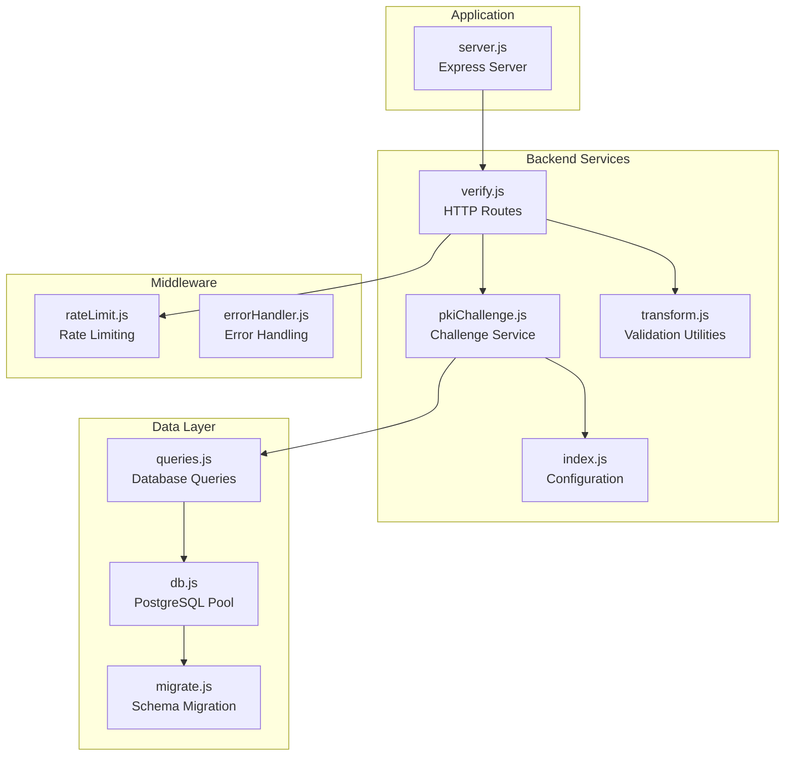
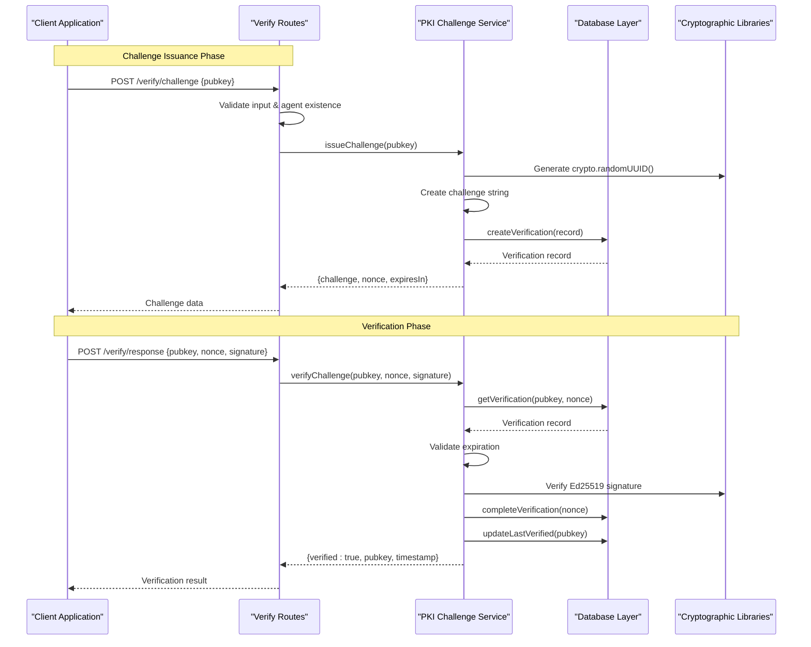
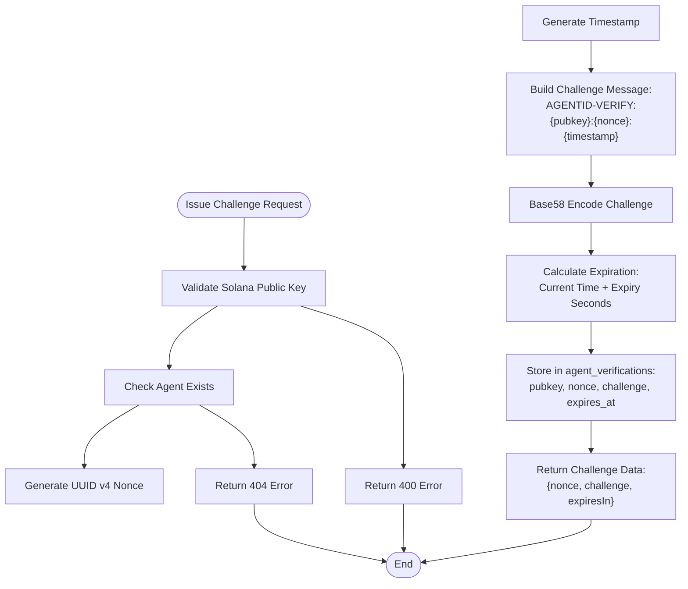
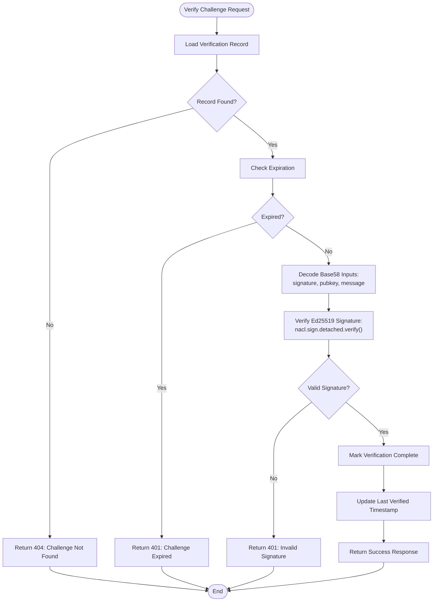
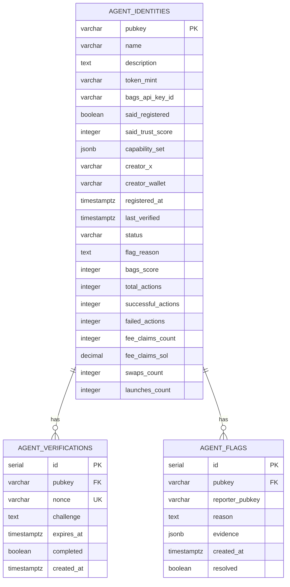
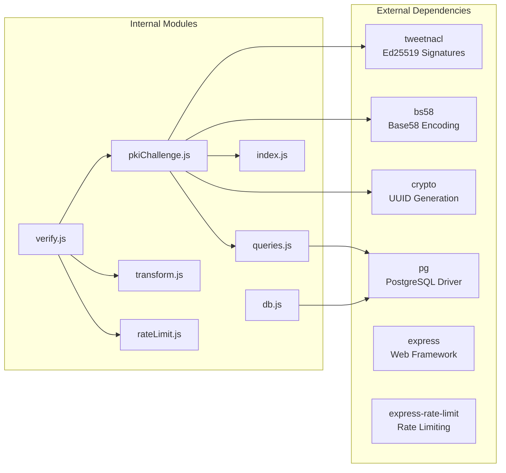

# PKI Challenge-Response System

<cite>
**Referenced Files in This Document**
- [pkiChallenge.js](file://backend/src/services/pkiChallenge.js)
- [verify.js](file://backend/src/routes/verify.js)
- [queries.js](file://backend/src/models/queries.js)
- [migrate.js](file://backend/src/models/migrate.js)
- [db.js](file://backend/src/models/db.js)
- [index.js](file://backend/src/config/index.js)
- [transform.js](file://backend/src/utils/transform.js)
- [rateLimit.js](file://backend/src/middleware/rateLimit.js)
- [server.js](file://backend/server.js)
</cite>

## Table of Contents
1. [Introduction](#introduction)
2. [Project Structure](#project-structure)
3. [Core Components](#core-components)
4. [Architecture Overview](#architecture-overview)
5. [Detailed Component Analysis](#detailed-component-analysis)
6. [Dependency Analysis](#dependency-analysis)
7. [Performance Considerations](#performance-considerations)
8. [Troubleshooting Guide](#troubleshooting-guide)
9. [Security Considerations](#security-considerations)
10. [Conclusion](#conclusion)

## Introduction
The PKI Challenge-Response system in AgentID provides cryptographic verification to prevent agent spoofing through Ed25519 digital signatures. This system implements a two-phase process: challenge issuance using cryptographically secure random nonces and timestamped messages, followed by signature verification using tweetnacl. The implementation includes replay attack prevention through nonce uniqueness, expiration handling, and single-use verification records stored in PostgreSQL.

## Project Structure
The PKI Challenge-Response system is organized across several key modules within the backend architecture:

**Diagram sources**
- [server.js:1-91](file://backend/server.js#L1-L91)
- [verify.js:1-121](file://backend/src/routes/verify.js#L1-L121)
- [pkiChallenge.js:1-102](file://backend/src/services/pkiChallenge.js#L1-L102)

**Section sources**
- [server.js:1-91](file://backend/server.js#L1-L91)
- [verify.js:1-121](file://backend/src/routes/verify.js#L1-L121)
- [pkiChallenge.js:1-102](file://backend/src/services/pkiChallenge.js#L1-L102)

## Core Components
The PKI Challenge-Response system consists of four primary components working together to provide secure agent authentication:

### Challenge Issuance Service
The challenge issuance service generates cryptographically secure challenges using the following process:
- Generates UUID v4 nonces using `crypto.randomUUID()`
- Creates timestamped challenge strings in the format `AGENTID-VERIFY:{pubkey}:{nonce}:{timestamp}`
- Encodes challenges using Base58 for transport
- Stores verification records with expiration timestamps

### Verification Service
The verification service validates challenge responses through:
- Cryptographic signature verification using Ed25519 with tweetnacl
- Nonce uniqueness enforcement through database constraints
- Expiration checking against stored timestamps
- Single-use verification marking to prevent replay attacks

### Database Schema
The system uses PostgreSQL with specialized tables for verification records:
- `agent_verifications` table with unique nonce constraints
- Automatic completion tracking and expiration handling
- Efficient indexing for pubkey and status queries

### HTTP API Layer
REST endpoints provide programmatic access to the challenge-response workflow:
- `/verify/challenge` endpoint for issuing challenges
- `/verify/response` endpoint for submitting verifications
- Comprehensive input validation and error handling

**Section sources**
- [pkiChallenge.js:17-39](file://backend/src/services/pkiChallenge.js#L17-L39)
- [pkiChallenge.js:49-96](file://backend/src/services/pkiChallenge.js#L49-L96)
- [queries.js:208-256](file://backend/src/models/queries.js#L208-L256)
- [verify.js:14-118](file://backend/src/routes/verify.js#L14-L118)

## Architecture Overview
The PKI Challenge-Response system follows a layered architecture with clear separation of concerns:

**Diagram sources**
- [verify.js:18-51](file://backend/src/routes/verify.js#L18-L51)
- [verify.js:57-118](file://backend/src/routes/verify.js#L57-L118)
- [pkiChallenge.js:17-39](file://backend/src/services/pkiChallenge.js#L17-L39)
- [pkiChallenge.js:49-96](file://backend/src/services/pkiChallenge.js#L49-L96)

## Detailed Component Analysis

### Challenge Issuance Process
The challenge issuance process implements multiple security measures to prevent spoofing and replay attacks:

**Diagram sources**
- [pkiChallenge.js:17-39](file://backend/src/services/pkiChallenge.js#L17-L39)
- [verify.js:18-51](file://backend/src/routes/verify.js#L18-L51)

The challenge message format follows a strict specification:
- **Format**: `AGENTID-VERIFY:{pubkey}:{nonce}:{timestamp}`
- **Components**: 
  - Fixed prefix `AGENTID-VERIFY`
  - Agent's public key (Base58 encoded)
  - Cryptographically secure nonce (UUID v4)
  - Unix timestamp in milliseconds
- **Transport**: Base58 encoded for compact representation

**Section sources**
- [pkiChallenge.js:17-39](file://backend/src/services/pkiChallenge.js#L17-L39)
- [verify.js:18-51](file://backend/src/routes/verify.js#L18-L51)

### Signature Verification Workflow
The verification process ensures cryptographic integrity and prevents replay attacks:

**Diagram sources**
- [pkiChallenge.js:49-96](file://backend/src/services/pkiChallenge.js#L49-L96)
- [verify.js:57-118](file://backend/src/routes/verify.js#L57-L118)

**Section sources**
- [pkiChallenge.js:49-96](file://backend/src/services/pkiChallenge.js#L49-L96)
- [verify.js:57-118](file://backend/src/routes/verify.js#L57-L118)

### Database Storage and Schema Design
The system uses PostgreSQL with carefully designed constraints for security and performance:

**Diagram sources**
- [migrate.js:9-65](file://backend/src/models/migrate.js#L9-L65)

Key database design features:
- **Unique Nonce Constraint**: Prevents replay attacks through database-level enforcement
- **Expiration Tracking**: Automatic cleanup of expired challenges
- **Completion Status**: Ensures single-use verification records
- **Foreign Key Relationships**: Maintains referential integrity with agent identities
- **Performance Indexes**: Optimized queries for common operations

**Section sources**
- [migrate.js:9-65](file://backend/src/models/migrate.js#L9-L65)
- [queries.js:208-256](file://backend/src/models/queries.js#L208-L256)

### Error Handling and Validation
The system implements comprehensive error handling across multiple layers:

| Error Type | HTTP Status | Description | Prevention |
|------------|-------------|-------------|------------|
| Invalid Public Key | 400 | Malformed Solana address format | Input validation |
| Agent Not Found | 404 | Non-existent agent identity | Pre-authentication check |
| Challenge Not Found | 404 | Expired or completed verification | Single-use enforcement |
| Challenge Expired | 401 | Exceeded configured timeout | Expiration validation |
| Invalid Signature | 401 | Cryptographic verification failure | Ed25519 verification |
| Invalid Encoding | 401 | Base58 decoding failure | Input sanitization |

**Section sources**
- [verify.js:23-40](file://backend/src/routes/verify.js#L23-L40)
- [verify.js:93-112](file://backend/src/routes/verify.js#L93-L112)
- [pkiChallenge.js:74-76](file://backend/src/services/pkiChallenge.js#L74-L76)

## Dependency Analysis
The PKI Challenge-Response system has minimal external dependencies while maintaining strong security guarantees:

**Diagram sources**
- [pkiChallenge.js:6-10](file://backend/src/services/pkiChallenge.js#L6-L10)
- [verify.js:6-11](file://backend/src/routes/verify.js#L6-L11)
- [db.js:6-18](file://backend/src/models/db.js#L6-L18)

**Section sources**
- [pkiChallenge.js:6-10](file://backend/src/services/pkiChallenge.js#L6-L10)
- [verify.js:6-11](file://backend/src/routes/verify.js#L6-L11)
- [db.js:6-18](file://backend/src/models/db.js#L6-L18)

## Performance Considerations
The system is designed for optimal performance with the following characteristics:

### Database Performance
- **Connection Pooling**: PostgreSQL connection pooling reduces overhead
- **Index Optimization**: Strategic indexes on frequently queried columns
- **Parameterized Queries**: Prevents SQL injection and improves query plans
- **Minimal Data Transfer**: Base58 encoding reduces payload size

### Memory and CPU Efficiency
- **Streaming Operations**: Large payloads handled efficiently
- **Minimal String Manipulation**: Optimized message construction
- **Efficient Encoding**: Base58 provides compact representation

### Network Considerations
- **Rate Limiting**: Prevents abuse and ensures fair resource distribution
- **Timeout Configuration**: Balanced response times vs. reliability
- **Compression**: Optional gzip compression for large responses

**Section sources**
- [db.js:31-39](file://backend/src/models/db.js#L31-L39)
- [rateLimit.js:23-42](file://backend/src/middleware/rateLimit.js#L23-L42)

## Troubleshooting Guide

### Common Issues and Solutions

#### Challenge Not Found Errors
**Symptoms**: 404 responses when verifying challenges
**Causes**: 
- Expired verification records
- Incorrect nonce values
- Completed verification attempts
- Database cleanup processes

**Solutions**:
- Request a new challenge from `/verify/challenge`
- Verify nonce and pubkey match the original issuance
- Check challenge expiration (default 300 seconds)

#### Expiration Timeout Issues
**Symptoms**: 401 Unauthorized with "Challenge has expired"
**Causes**:
- Client-server time synchronization issues
- Network latency causing late submissions
- Misconfigured challenge expiry

**Solutions**:
- Implement clock drift compensation
- Add retry logic with exponential backoff
- Verify system time synchronization

#### Signature Verification Failures
**Symptoms**: 401 Unauthorized with "Invalid signature"
**Causes**:
- Incorrect private key usage
- Message tampering during transmission
- Base58 encoding/decoding errors
- Wrong public key format

**Solutions**:
- Verify Ed25519 key pair integrity
- Check message format compliance
- Validate Base58 encoding correctness
- Confirm public key is 32-byte Ed25519 key

#### Database Connectivity Issues
**Symptoms**: Internal server errors or timeouts
**Causes**:
- PostgreSQL connection failures
- Query timeout exceeded
- Database maintenance windows

**Solutions**:
- Implement connection retry logic
- Monitor database health metrics
- Configure appropriate connection limits

**Section sources**
- [verify.js:93-112](file://backend/src/routes/verify.js#L93-L112)
- [pkiChallenge.js:54-63](file://backend/src/services/pkiChallenge.js#L54-L63)

## Security Considerations

### Cryptographic Security
- **Ed25519 Signatures**: Industry-standard elliptic curve cryptography
- **Random Nonces**: UUID v4 provides cryptographically secure randomness
- **Base58 Encoding**: Compact, URL-safe encoding for transport
- **Message Authentication**: Complete challenge string verification

### Replay Attack Prevention
- **Nonce Uniqueness**: Database-level unique constraint prevents reuse
- **Expiration Mechanisms**: Configurable timeout prevents long-term reuse
- **Single-Use Records**: Completion flag ensures one-time use
- **Timestamp Validation**: Prevents future/expired message acceptance

### Input Validation and Sanitization
- **Public Key Validation**: Solana address format verification
- **Base58 Decoding**: Robust error handling for malformed inputs
- **Rate Limiting**: Protection against brute force attacks
- **CORS Configuration**: Cross-origin resource sharing controls

### Privacy and Data Protection
- **Minimal Data Collection**: Only essential information stored
- **Secure Transmission**: HTTPS required for all endpoints
- **Audit Logging**: Comprehensive logging for security monitoring
- **Data Retention**: Automatic cleanup of expired records

### Integration Security
- **External API Safety**: Timeout and error handling for SAID integration
- **Dependency Management**: Regular security updates for all packages
- **Environment Configuration**: Secure handling of secrets and configuration
- **Health Monitoring**: Proactive detection of security issues

**Section sources**
- [pkiChallenge.js:78-83](file://backend/src/services/pkiChallenge.js#L78-L83)
- [verify.js:23-31](file://backend/src/routes/verify.js#L23-L31)
- [rateLimit.js:23-42](file://backend/src/middleware/rateLimit.js#L23-L42)

## Relationship to SAID's Similar Verification Approach
The AgentID PKI Challenge-Response system shares conceptual similarities with SAID's verification approach while implementing distinct technical solutions:

### Similarities
- **Identity Verification**: Both systems authenticate agent identities
- **Cryptographic Foundation**: Both rely on Ed25519 digital signatures
- **Challenge-Response Pattern**: Both use challenge-based authentication
- **Trust Scoring Integration**: Both integrate with broader trust ecosystems

### Key Differences
- **Implementation Approach**: AgentID uses tweetnacl for Ed25519, while SAID has its own verification protocol
- **Storage Strategy**: AgentID maintains local verification records, while SAID centralizes identity management
- **Integration Model**: AgentID provides standalone verification, while SAID offers federated identity services
- **Deployment Model**: AgentID focuses on decentralized verification, while SAID emphasizes centralized identity infrastructure

### Complementary Features
The systems can work together to provide comprehensive identity verification:
- AgentID handles immediate verification needs
- SAID provides broader identity ecosystem integration
- Combined approach offers both local control and global recognition

**Section sources**
- [pkiChallenge.js:78-83](file://backend/src/services/pkiChallenge.js#L78-L83)
- [server.js:84-86](file://backend/server.js#L84-L86)

## Conclusion
The PKI Challenge-Response system in AgentID provides a robust, secure solution for preventing agent spoofing through cryptographic verification. The implementation demonstrates strong security practices including cryptographically secure random nonce generation, Ed25519 signature verification, replay attack prevention, and comprehensive error handling. The modular architecture ensures maintainability while the database design provides efficient storage and retrieval of verification records.

Key strengths of the system include:
- **Strong Cryptographic Foundation**: Ed25519 signatures with proper key management
- **Replay Attack Prevention**: Multi-layered protection through nonce uniqueness, expiration, and single-use enforcement
- **Comprehensive Error Handling**: Clear error responses with appropriate HTTP status codes
- **Performance Optimization**: Efficient database design and connection pooling
- **Security Best Practices**: Input validation, rate limiting, and secure configuration management

The system serves as a foundation for broader identity verification workflows while maintaining independence from external identity providers, offering flexibility for various deployment scenarios and integration requirements.