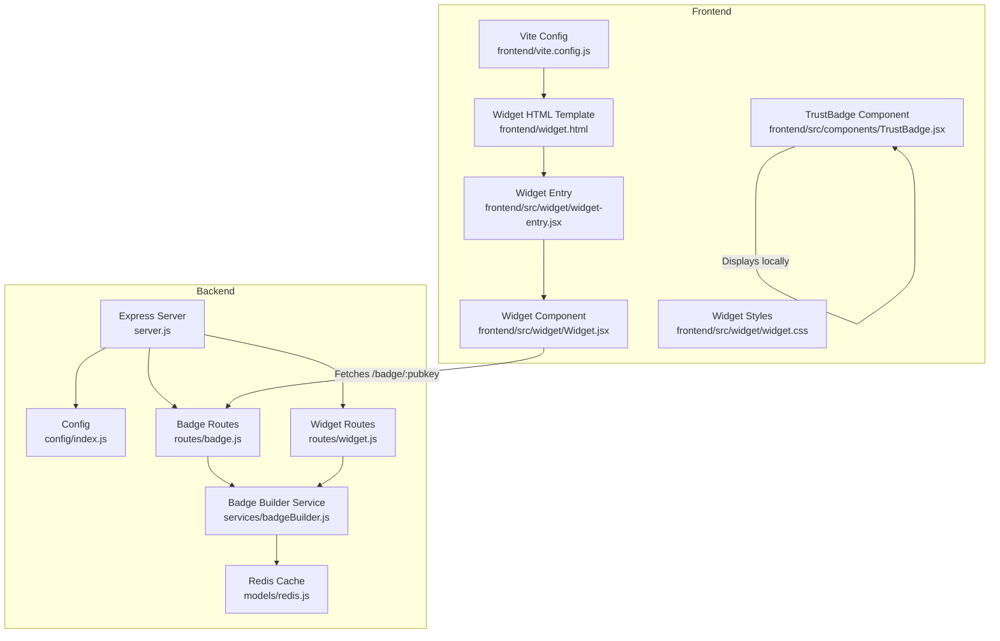
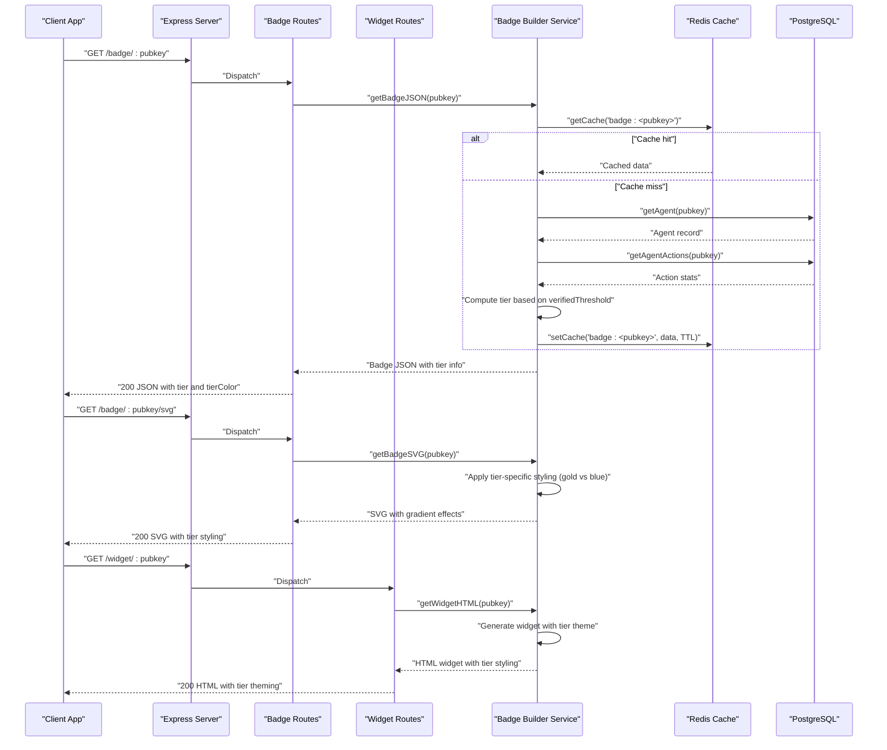
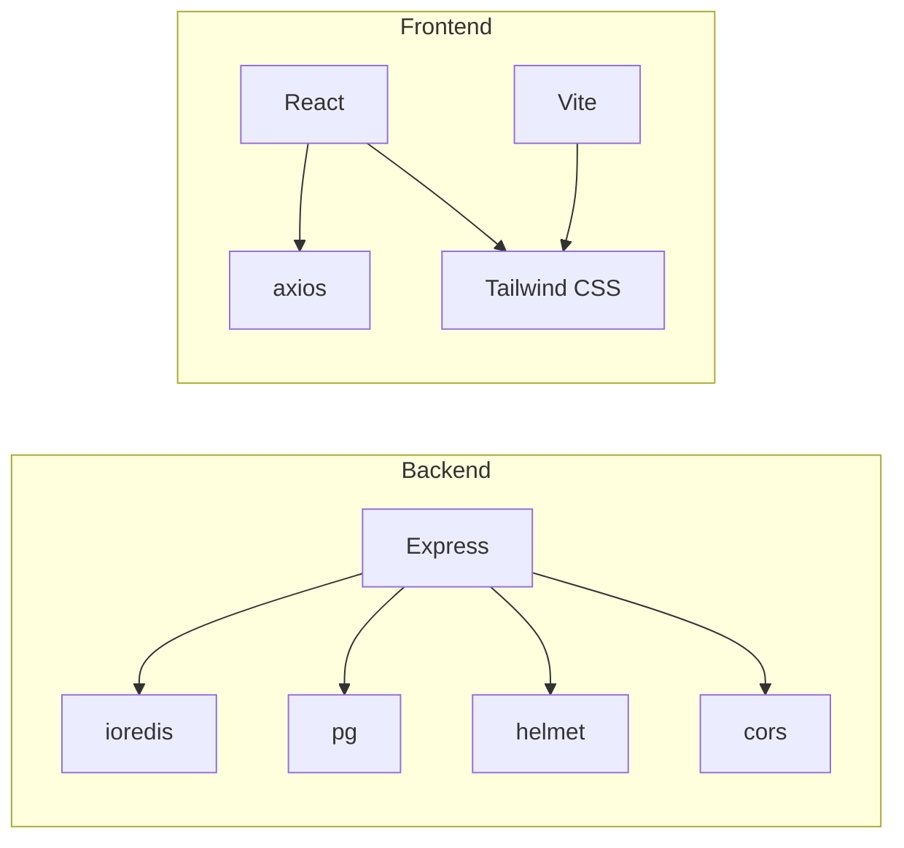

# Trust Badge API and Widget System

<cite>
**Referenced Files in This Document**
- [server.js](file://backend/server.js)
- [config/index.js](file://backend/src/config/index.js)
- [routes/badge.js](file://backend/src/routes/badge.js)
- [routes/widget.js](file://backend/src/routes/widget.js)
- [services/badgeBuilder.js](file://backend/src/services/badgeBuilder.js)
- [models/redis.js](file://backend/src/models/redis.js)
- [frontend/src/components/TrustBadge.jsx](file://frontend/src/components/TrustBadge.jsx)
- [frontend/src/widget/Widget.jsx](file://frontend/src/widget/Widget.jsx)
- [frontend/src/widget/widget-entry.jsx](file://frontend/src/widget/widget-entry.jsx)
- [frontend/src/widget/widget.css](file://frontend/src/widget/widget.css)
- [frontend/vite.config.js](file://frontend/vite.config.js)
- [frontend/widget.html](file://frontend/widget.html)
</cite>

## Update Summary
**Changes Made**
- Added comprehensive Verified tier system with token-gated threshold configuration
- Enhanced badge styling with gold accents and shimmer animations for premium tier
- Implemented tier-based badge rendering logic with verified and standard tiers
- Updated badge JSON response to include tier information and tierColor properties
- Enhanced SVG generation with gold gradient effects and shimmer animations
- Updated frontend TrustBadge component with tier-aware styling and shimmer effects

## Table of Contents
1. [Introduction](#introduction)
2. [Project Structure](#project-structure)
3. [Core Components](#core-components)
4. [Architecture Overview](#architecture-overview)
5. [Detailed Component Analysis](#detailed-component-analysis)
6. [Dependency Analysis](#dependency-analysis)
7. [Performance Considerations](#performance-considerations)
8. [Troubleshooting Guide](#troubleshooting-guide)
9. [Conclusion](#conclusion)

## Introduction
This document describes the Trust Badge API and Widget System that powers human-readable trust displays for agents. The system now features an enhanced tier-based verification system with premium Verified tier capabilities, token-gated threshold configuration, and sophisticated styling with gold accents and shimmer animations.

Key features include:
- The GET /badge/:pubkey endpoint response structure including pubkey, name, status, badge emoji, label, scores, tier information, and metadata
- The widget generation process, SVG creation for README documentation, and the embeddable iframe system
- The React TrustBadge component implementation with tier-aware styling, the widget-entry.jsx integration, and the styling system using Tailwind CSS
- Integration patterns for third-party applications
- Caching strategies, widget URL generation, and real-time badge updates based on reputation changes
- Frontend components, customization options, and performance optimizations for badge delivery
- **New**: Verified tier system with configurable threshold, gold styling accents, and shimmer animations

## Project Structure
The system comprises:
- Backend API exposing badge and widget endpoints, with caching and reputation computation
- Frontend React components for displaying badges and an embeddable widget
- Vite configuration enabling standalone widget builds and development proxying
- **Enhanced**: Tier-based badge rendering with verified and standard tiers

**Diagram sources**
- [server.js:1-91](file://backend/server.js#L1-L91)
- [config/index.js:1-34](file://backend/src/config/index.js#L1-L34)
- [routes/badge.js:1-58](file://backend/src/routes/badge.js#L1-L58)
- [routes/widget.js:1-89](file://backend/src/routes/widget.js#L1-L89)
- [services/badgeBuilder.js:1-566](file://backend/src/services/badgeBuilder.js#L1-L566)
- [models/redis.js:1-94](file://backend/src/models/redis.js#L1-L94)
- [frontend/src/components/TrustBadge.jsx:1-196](file://frontend/src/components/TrustBadge.jsx#L1-L196)
- [frontend/src/widget/widget-entry.jsx:1-11](file://frontend/src/widget/widget-entry.jsx#L1-L11)
- [frontend/src/widget/Widget.jsx:1-218](file://frontend/src/widget/Widget.jsx#L1-L218)
- [frontend/src/widget/widget.css:1-70](file://frontend/src/widget/widget.css#L1-L70)
- [frontend/vite.config.js:1-42](file://frontend/vite.config.js#L1-L42)
- [frontend/widget.html:1-16](file://frontend/widget.html#L1-L16)

**Section sources**
- [server.js:1-91](file://backend/server.js#L1-L91)
- [frontend/vite.config.js:1-42](file://frontend/vite.config.js#L1-L42)

## Core Components
- Badge API endpoints:
  - GET /badge/:pubkey returns badge JSON with tier information
  - GET /badge/:pubkey/svg returns SVG badge with tier-specific styling
- Widget API endpoint:
  - GET /widget/:pubkey returns embeddable HTML widget with tier-aware theming
- Badge builder service:
  - Computes reputation scores, aggregates agent stats, and generates JSON, SVG, and HTML widget with tier-based rendering
- Frontend components:
  - TrustBadge: local React component for displaying badges with tier styling
  - Widget: standalone React component for iframe/embedded usage with live refresh
- Caching:
  - Redis-backed cache with configurable TTL for badge data
- **New**: Tier system:
  - Verified tier: premium tier with gold styling and shimmer effects
  - Standard tier: default blue styling for trusted agents
  - Configurable threshold via VERIFIED_THRESHOLD environment variable

**Section sources**
- [routes/badge.js:12-55](file://backend/src/routes/badge.js#L12-L55)
- [routes/widget.js:14-86](file://backend/src/routes/widget.js#L14-L86)
- [services/badgeBuilder.js:17-83](file://backend/src/services/badgeBuilder.js#L17-L83)
- [frontend/src/components/TrustBadge.jsx:42-135](file://frontend/src/components/TrustBadge.jsx#L42-L135)
- [frontend/src/widget/Widget.jsx:61-215](file://frontend/src/widget/Widget.jsx#L61-L215)
- [models/redis.js:41-71](file://backend/src/models/redis.js#L41-L71)
- [config/index.js:29-31](file://backend/src/config/index.js#L29-L31)

## Architecture Overview
The system integrates backend APIs with frontend components and a caching layer to deliver responsive trust badges with enhanced tier-based styling.

**Diagram sources**
- [server.js:56-63](file://backend/server.js#L56-L63)
- [routes/badge.js:16-55](file://backend/src/routes/badge.js#L16-L55)
- [routes/widget.js:18-86](file://backend/src/routes/widget.js#L18-L86)
- [services/badgeBuilder.js:17-83](file://backend/src/services/badgeBuilder.js#L17-L83)
- [models/redis.js:41-71](file://backend/src/models/redis.js#L41-L71)
- [config/index.js:29-31](file://backend/src/config/index.js#L29-L31)

## Detailed Component Analysis

### GET /badge/:pubkey Endpoint
- Purpose: Returns trust badge JSON for a given agent public key with enhanced tier information
- Response fields:
  - pubkey: Agent's public key
  - name: Human-readable agent name
  - status: One of verified, unverified, flagged
  - badge: Emoji representing status
  - label: Human-friendly status label
  - score: Numeric trust score (0–100)
  - bags_score: Same as score
  - saidTrustScore: SAID trust score (fallback 0)
  - saidLabel: SAID label
  - registeredAt: ISO date string or null
  - lastVerified: ISO date string or null
  - totalActions: Total actions performed
  - successRate: Ratio of successful to total actions
  - capabilities: Array of capability strings
  - tokenMint: Token mint identifier
  - widgetUrl: URL to the embeddable widget
  - **New**: tier: 'verified' or 'standard' based on threshold comparison
  - **New**: tierColor: '#FFD700' for verified tier, '#3B82F6' for standard tier
- Error handling:
  - 404 with JSON error payload when agent not found
  - Pass-through errors otherwise

**Section sources**
- [routes/badge.js:16-32](file://backend/src/routes/badge.js#L16-L32)
- [services/badgeBuilder.js:17-83](file://backend/src/services/badgeBuilder.js#L17-L83)

### GET /badge/:pubkey/svg Endpoint
- Purpose: Returns an SVG image of the badge with tier-specific styling
- Rendering logic:
  - Determines background and accent colors based on status and tier
  - **Enhanced**: Verified tier uses gold (#FFD700) gradients with shimmer effects
  - **Enhanced**: Standard tier uses blue gradients with subtle styling
  - Renders status icon (verified/checkmark, flagged/x, unverified/bang)
  - Displays agent name, status label, trust score, and a score bar with gradient
  - **New**: Gold border accents and glow effects for verified tier
  - **New**: Shimmer animation layer for verified tier badges
- Content-Type: image/svg+xml

**Section sources**
- [routes/badge.js:38-55](file://backend/src/routes/badge.js#L38-L55)
- [services/badgeBuilder.js:90-162](file://backend/src/services/badgeBuilder.js#L90-L162)

### GET /widget/:pubkey Endpoint
- Purpose: Returns an embeddable HTML widget suitable for iframe embedding with tier-aware theming
- Generation logic:
  - Builds theme colors based on status and tier (gold for verified, blue for standard)
  - Formats dates and success rate
  - Embeds a self-refreshing script that reloads every 60 seconds
  - **Enhanced**: Applies tier-specific styling with appropriate color schemes
- Error handling:
  - 404 with a simple HTML error page if agent not found

**Section sources**
- [routes/widget.js:18-86](file://backend/src/routes/widget.js#L18-L86)
- [services/badgeBuilder.js:169-475](file://backend/src/services/badgeBuilder.js#L169-L475)

### Badge Builder Service
Responsibilities:
- Cache-first retrieval of badge data
- Agent lookup and action statistics aggregation
- Reputation score computation via external services
- **Enhanced**: Tier determination based on configurable threshold (default 70)
- SVG generation with dynamic colors, gradients, and tier-specific effects
- HTML widget generation with theme-aware styles, live refresh, and tier theming

Key behaviors:
- Cache key: badge:<pubkey>
- Cache TTL: configured via environment variable
- Status determination:
  - flagged: agent.status == 'flagged'
  - verified: agent.status == 'verified' AND reputation.score >= 60
  - unverified: otherwise
- **New**: Tier determination:
  - verified: reputation.score >= VERIFIED_THRESHOLD (default 70)
  - standard: reputation.score < VERIFIED_THRESHOLD
- Widget URL construction uses base URL from configuration

**Section sources**
- [services/badgeBuilder.js:17-83](file://backend/src/services/badgeBuilder.js#L17-L83)
- [services/badgeBuilder.js:90-162](file://backend/src/services/badgeBuilder.js#L90-L162)
- [services/badgeBuilder.js:169-475](file://backend/src/services/badgeBuilder.js#L169-L475)
- [config/index.js:25-27](file://backend/src/config/index.js#L25-L27)
- [config/index.js:29-31](file://backend/src/config/index.js#L29-L31)

### React TrustBadge Component
- Props:
  - status: 'verified' | 'unverified' | 'flagged'
  - name: string
  - score: number
  - registeredAt: string (ISO date)
  - totalActions: number
  - tier: 'verified' | 'standard' (New)
  - tierColor: string (New)
  - className: string
- Features:
  - Status-specific styling with Tailwind CSS variables
  - **Enhanced**: Tier-aware styling with gold shimmer for verified tier
  - **Enhanced**: Gradient backgrounds and border accents for different tiers
  - Responsive layout with icons, labels, and metadata
  - Formatted dates and action counts
  - Hover scaling and subtle glow effects
  - **New**: Shimmer animation layer for verified tier badges

**Section sources**
- [frontend/src/components/TrustBadge.jsx:42-135](file://frontend/src/components/TrustBadge.jsx#L42-L135)
- [frontend/src/components/TrustBadge.jsx:42-66](file://frontend/src/components/TrustBadge.jsx#L42-L66)

### Widget Entry and Standalone Widget
- Entry point:
  - Creates a React root and renders the Widget component
- Widget component:
  - Fetches badge JSON from /api/badge/:pubkey
  - Auto-refreshes every 60 seconds
  - Handles loading, error, and success states
  - Extracts pubkey from URL path
  - **Enhanced**: Applies tier-aware theming based on badge data
- Build and dev:
  - Vite serves widget.html for /widget/* paths in development
  - Standalone build targets main and widget entries

**Section sources**
- [frontend/src/widget/widget-entry.jsx:1-11](file://frontend/src/widget/widget-entry.jsx#L1-L11)
- [frontend/src/widget/Widget.jsx:61-215](file://frontend/src/widget/Widget.jsx#L61-L215)
- [frontend/vite.config.js:9-22](file://frontend/vite.config.js#L9-L22)
- [frontend/widget.html:1-16](file://frontend/widget.html#L1-L16)

### Styling System (Tailwind CSS)
- Local component:
  - Uses CSS variables for theme colors and typography
  - **Enhanced**: Tier-specific styling with gold gradients for verified, blue for standard
  - Applies status-specific backgrounds, borders, and glows
  - **New**: Shimmer animation effects for verified tier badges
- Widget:
  - Defines CSS variables for dark theme and accents
  - Uses Tailwind utilities for layout and animations
  - Includes a pulse animation for loading states
  - **Enhanced**: Tier-aware color schemes with appropriate contrast

**Section sources**
- [frontend/src/components/TrustBadge.jsx:3-40](file://frontend/src/components/TrustBadge.jsx#L3-L40)
- [frontend/src/widget/widget.css:1-70](file://frontend/src/widget/widget.css#L1-L70)

### Real-time Badge Updates
- Widget auto-refresh:
  - The widget component sets an interval to reload badge data every 60 seconds
- Backend cache TTL:
  - Badge data is cached with a TTL controlled by environment configuration
- Combined effect:
  - Clients receive fresh data at predictable intervals while minimizing backend load

**Section sources**
- [frontend/src/widget/Widget.jsx:96-102](file://frontend/src/widget/Widget.jsx#L96-L102)
- [config/index.js:25-27](file://backend/src/config/index.js#L25-L27)
- [services/badgeBuilder.js:76-77](file://backend/src/services/badgeBuilder.js#L76-L77)

### Integration Patterns for Third Parties
- Embedding the widget:
  - Use the /widget/:pubkey endpoint in an iframe
  - The widget automatically fetches /api/badge/:pubkey
- Using the SVG:
  - Fetch /badge/:pubkey/svg for static badge images with tier styling
- Using the JSON:
  - Fetch /badge/:pubkey for programmatic integration with tier information
- Customization:
  - The widget's theme adapts to status and tier
  - The local TrustBadge component accepts props for styling and content
  - **New**: Tier information allows for custom styling based on verification level

**Section sources**
- [routes/widget.js:18-86](file://backend/src/routes/widget.js#L18-L86)
- [routes/badge.js:16-55](file://backend/src/routes/badge.js#L16-L55)
- [frontend/src/widget/Widget.jsx:82-94](file://frontend/src/widget/Widget.jsx#L82-L94)

## Dependency Analysis
- Backend dependencies:
  - Express for routing and middleware
  - Redis for caching
  - PostgreSQL via pg for persistence
  - Rate limiting and security middleware
- Frontend dependencies:
  - React and React DOM for components
  - Axios for HTTP requests
  - Tailwind CSS for styling
  - Vite for build and dev server

**Diagram sources**
- [backend/package.json:20-32](file://backend/package.json#L20-L32)
- [frontend/package.json:12-31](file://frontend/package.json#L12-L31)

**Section sources**
- [backend/package.json:20-32](file://backend/package.json#L20-L32)
- [frontend/package.json:12-31](file://frontend/package.json#L12-L31)

## Performance Considerations
- Caching:
  - Cache key: badge:<pubkey>
  - TTL configurable via environment variable
  - Redis client includes retry and offline queue strategies
- Request limits:
  - Rate limiting middleware applied globally
- Network efficiency:
  - SVG endpoint returns compact SVG with optimized gradients
  - Widget auto-refresh reduces polling overhead
- Build optimization:
  - Vite build targets separate bundles for main and widget
  - Dev proxy routes API requests to backend
- **New**: Tier calculation is computed once per cache miss, reducing repeated threshold comparisons

**Section sources**
- [models/redis.js:41-71](file://backend/src/models/redis.js#L41-L71)
- [config/index.js:25-27](file://backend/src/config/index.js#L25-L27)
- [routes/badge.js:8](file://backend/src/routes/badge.js#L8)
- [frontend/vite.config.js:23-41](file://frontend/vite.config.js#L23-L41)

## Troubleshooting Guide
- Agent not found:
  - Badge JSON endpoint returns 404 with error payload
  - Widget endpoint returns a simple HTML error page
- Redis connectivity issues:
  - Redis client logs errors but does not crash the service
  - Cache operations fail gracefully
- Widget fails to load:
  - Verify API base URL is correctly injected or configured
  - Ensure /api/badge/:pubkey is reachable from the widget's origin
- SVG rendering issues:
  - Confirm Content-Type header is image/svg+xml
  - Validate SVG generation logic and escape sequences
- **New**: Tier styling issues:
  - Verify VERIFIED_THRESHOLD environment variable is set correctly
  - Check that tier calculation logic matches expected threshold values
  - Ensure gold gradient effects render properly in target browsers

**Section sources**
- [routes/badge.js:23-31](file://backend/src/routes/badge.js#L23-L31)
- [routes/widget.js:24-77](file://backend/src/routes/widget.js#L24-L77)
- [models/redis.js:27-30](file://backend/src/models/redis.js#L27-L30)
- [frontend/src/widget/Widget.jsx:82-94](file://frontend/src/widget/Widget.jsx#L82-L94)
- [config/index.js:29-31](file://backend/src/config/index.js#L29-L31)

## Conclusion
The Trust Badge API and Widget System provides a robust, cache-backed solution for displaying agent trust in human-readable formats with enhanced tier-based verification capabilities. The system now features:

- Consistent JSON, SVG, and HTML widget outputs with tier information
- **New**: Verified tier system with configurable threshold (default 70) for premium verification
- **Enhanced**: Gold styling accents and shimmer animations for verified tier badges
- Real-time updates through cache TTL and widget refresh
- Flexible integration for websites and applications via iframe embedding
- Tailwind-powered styling with status-aware and tier-aware themes
- Strong separation between local components and embeddable widgets
- **New**: Comprehensive tier-based badge rendering logic with gradient effects and premium styling

The enhanced system provides clear visual distinction between standard trusted agents and premium verified agents, enabling users to quickly identify high-trust participants in the ecosystem while maintaining backward compatibility with existing integrations.