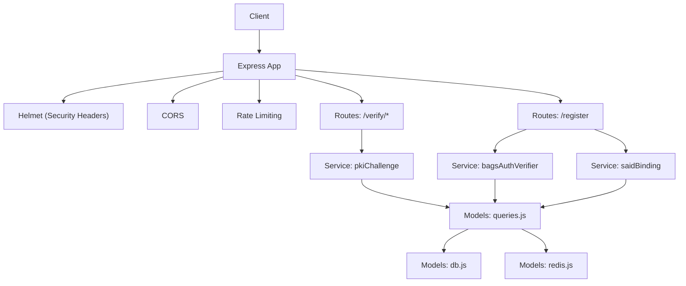
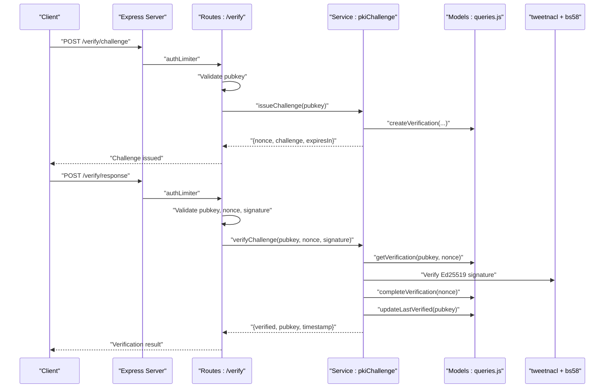
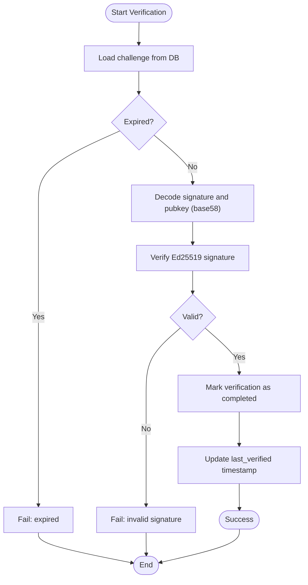
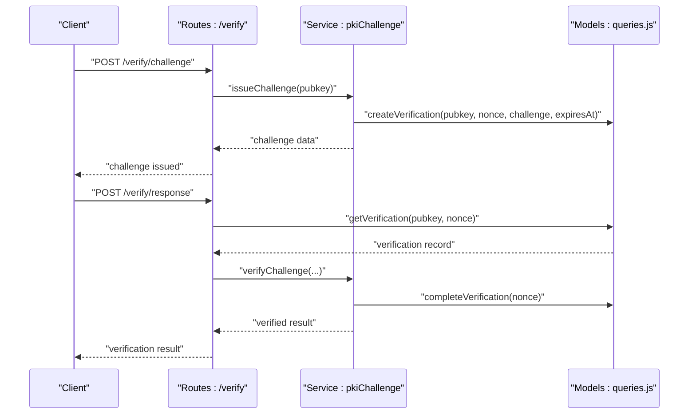
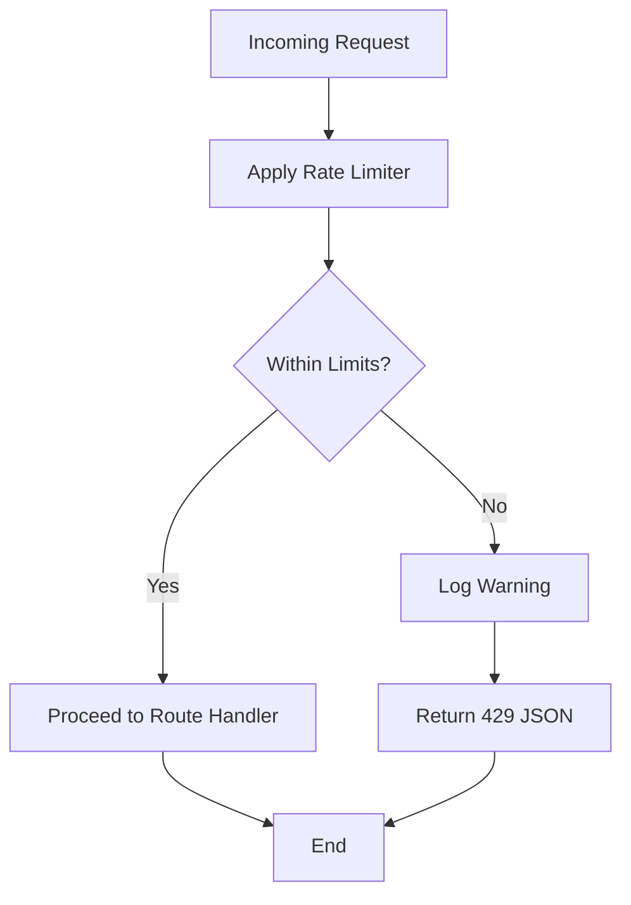
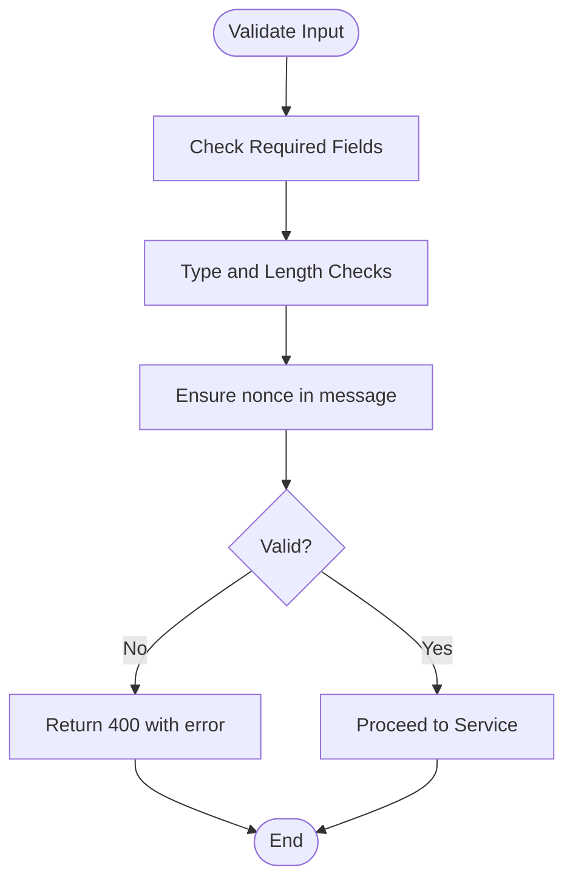
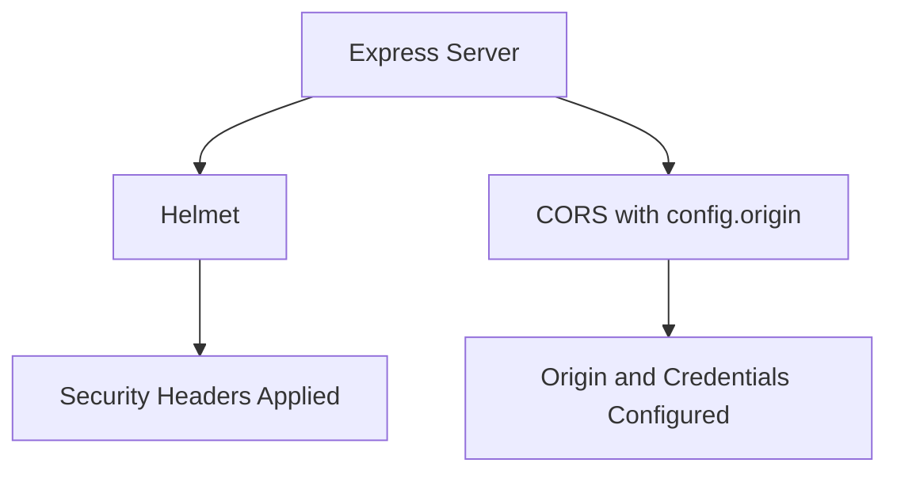
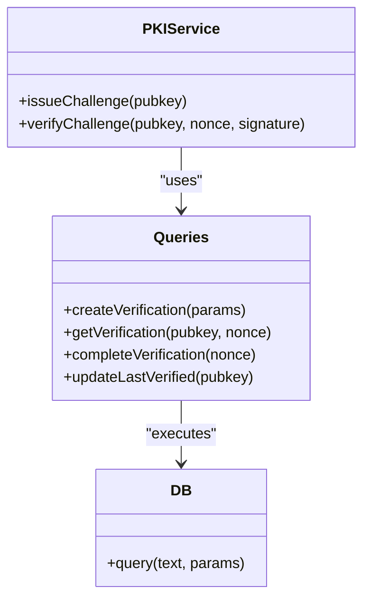
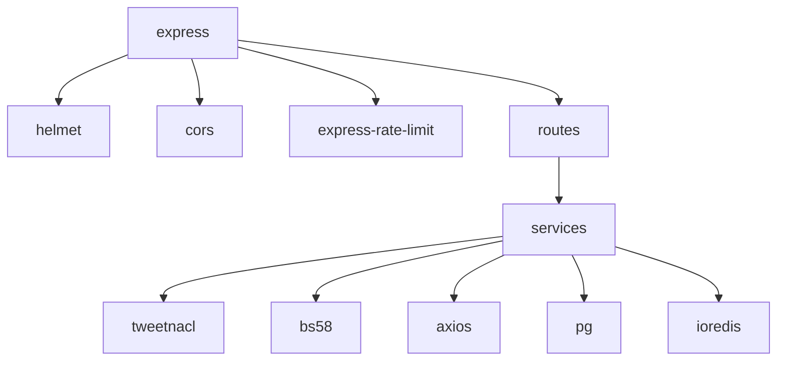

# Security Implementation

<cite>
**Referenced Files in This Document**
- [server.js](file://backend/server.js)
- [config/index.js](file://backend/src/config/index.js)
- [middleware/rateLimit.js](file://backend/src/middleware/rateLimit.js)
- [middleware/errorHandler.js](file://backend/src/middleware/errorHandler.js)
- [models/db.js](file://backend/src/models/db.js)
- [models/redis.js](file://backend/src/models/redis.js)
- [models/queries.js](file://backend/src/models/queries.js)
- [routes/verify.js](file://backend/src/routes/verify.js)
- [routes/register.js](file://backend/src/routes/register.js)
- [services/pkiChallenge.js](file://backend/src/services/pkiChallenge.js)
- [services/bagsAuthVerifier.js](file://backend/src/services/bagsAuthVerifier.js)
- [services/saidBinding.js](file://backend/src/services/saidBinding.js)
- [package.json](file://backend/package.json)
- [agentid_build_plan.md](file://agentid_build_plan.md)
</cite>

## Table of Contents
1. [Introduction](#introduction)
2. [Project Structure](#project-structure)
3. [Core Components](#core-components)
4. [Architecture Overview](#architecture-overview)
5. [Detailed Component Analysis](#detailed-component-analysis)
6. [Dependency Analysis](#dependency-analysis)
7. [Performance Considerations](#performance-considerations)
8. [Troubleshooting Guide](#troubleshooting-guide)
9. [Conclusion](#conclusion)
10. [Appendices](#appendices)

## Introduction
This document provides comprehensive security documentation for the AgentID system with a focus on authentication security, data protection, and API security measures. It explains the Ed25519 signature verification implementation, replay attack prevention through a challenge-response system, and rate limiting middleware configuration. It also covers input validation strategies, SQL injection prevention, CORS configuration, and security headers implementation. The PKI challenge-response system is detailed, including nonce management, expiration policies, and one-time use protection. Error handling security practices, sensitive data handling, and secure communication protocols are addressed. External API integrations, Redis security configuration, and database security measures are covered, along with threat modeling, security audit procedures, and incident response protocols.

## Project Structure
The backend follows a layered architecture:
- Entry point initializes Express, security middleware, CORS, rate limiting, routes, and global error handling.
- Configuration centralizes environment-driven settings for ports, external APIs, database, Redis, CORS, and expirations.
- Middleware provides rate limiting and centralized error handling.
- Models encapsulate database connectivity and Redis operations, with parameterized queries to prevent SQL injection.
- Services implement PKI challenge-response, external API verifications, and SAID binding.
- Routes define endpoints for registration and verification with input validation and rate limits.

**Diagram sources**
- [server.js:1-76](file://backend/server.js#L1-L76)
- [routes/verify.js:1-115](file://backend/src/routes/verify.js#L1-L115)
- [routes/register.js:1-156](file://backend/src/routes/register.js#L1-L156)
- [services/pkiChallenge.js:1-102](file://backend/src/services/pkiChallenge.js#L1-L102)
- [services/bagsAuthVerifier.js:1-87](file://backend/src/services/bagsAuthVerifier.js#L1-L87)
- [services/saidBinding.js:1-119](file://backend/src/services/saidBinding.js#L1-L119)
- [models/queries.js:1-385](file://backend/src/models/queries.js#L1-L385)
- [models/db.js:1-45](file://backend/src/models/db.js#L1-L45)
- [models/redis.js:1-94](file://backend/src/models/redis.js#L1-L94)

**Section sources**
- [server.js:1-76](file://backend/server.js#L1-L76)
- [config/index.js:1-30](file://backend/src/config/index.js#L1-L30)

## Core Components
- Authentication and Authorization
  - Ed25519 signature verification using tweetnacl and base58 decoding for both internal PKI challenges and external Bags verification.
  - PKI challenge-response with nonce generation, challenge creation, expiration enforcement, and one-time use marking.
  - Registration flow validates inputs, checks nonce inclusion in messages, and verifies external signatures before storing records.

- Data Protection
  - Parameterized queries in models prevent SQL injection.
  - Environment-driven secrets and URLs for external APIs and databases.
  - Sensitive data handling: API keys are passed via Authorization headers; raw keys are not stored; only identifiers are persisted.

- API Security Measures
  - Helmet sets robust security headers.
  - CORS configured with origin and credentials support.
  - Rate limiting applied globally and specifically to authentication endpoints.
  - Centralized error handling logs and sanitizes error responses.

- External Integrations
  - Bags API integration for wallet ownership verification.
  - SAID Identity Gateway integration for registry binding and trust score retrieval.
  - Redis used for caching and nonces; retry strategy and offline queue for resilience.

**Section sources**
- [services/pkiChallenge.js:1-102](file://backend/src/services/pkiChallenge.js#L1-L102)
- [routes/verify.js:1-115](file://backend/src/routes/verify.js#L1-L115)
- [routes/register.js:1-156](file://backend/src/routes/register.js#L1-L156)
- [services/bagsAuthVerifier.js:1-87](file://backend/src/services/bagsAuthVerifier.js#L1-L87)
- [services/saidBinding.js:1-119](file://backend/src/services/saidBinding.js#L1-L119)
- [models/queries.js:1-385](file://backend/src/models/queries.js#L1-L385)
- [models/db.js:1-45](file://backend/src/models/db.js#L1-L45)
- [models/redis.js:1-94](file://backend/src/models/redis.js#L1-L94)
- [middleware/rateLimit.js:1-62](file://backend/src/middleware/rateLimit.js#L1-L62)
- [middleware/errorHandler.js:1-44](file://backend/src/middleware/errorHandler.js#L1-L44)
- [server.js:1-76](file://backend/server.js#L1-L76)

## Architecture Overview
The system enforces authentication and authorization through Ed25519-based challenge-response, protects against replay attacks via nonces and expiration, and secures API access with rate limiting and security headers. Data integrity is ensured through parameterized queries and environment-driven configuration. External integrations are handled securely with timeouts and error logging.

**Diagram sources**
- [routes/verify.js:1-115](file://backend/src/routes/verify.js#L1-L115)
- [services/pkiChallenge.js:1-102](file://backend/src/services/pkiChallenge.js#L1-L102)
- [models/queries.js:207-256](file://backend/src/models/queries.js#L207-L256)
- [models/queries.js:130-143](file://backend/src/models/queries.js#L130-L143)

## Detailed Component Analysis

### Ed25519 Signature Verification Implementation
- Internal PKI challenge-response:
  - Challenge string includes pubkey, nonce, and timestamp.
  - Nonce is UUID-based random identifier.
  - Expiration enforced via database timestamp.
  - One-time use enforced by marking verification as completed after successful verification.
  - Ed25519 signature verified using tweetnacl with base58 decoding of inputs.

- External Bags verification:
  - Initialization and callback flows use Ed25519 verification with base58 decoding.
  - Authorization header carries BAGS_API_KEY for external API calls.

**Diagram sources**
- [services/pkiChallenge.js:49-96](file://backend/src/services/pkiChallenge.js#L49-L96)
- [models/queries.js:230-256](file://backend/src/models/queries.js#L230-L256)
- [models/queries.js:134-142](file://backend/src/models/queries.js#L134-L142)

**Section sources**
- [services/pkiChallenge.js:1-102](file://backend/src/services/pkiChallenge.js#L1-L102)
- [services/bagsAuthVerifier.js:1-87](file://backend/src/services/bagsAuthVerifier.js#L1-L87)
- [models/queries.js:207-256](file://backend/src/models/queries.js#L207-L256)

### Replay Attack Prevention Through Challenge-Response System
- Nonce management:
  - Random UUID generated per challenge.
  - Challenge string concatenation includes pubkey, nonce, and timestamp.
- Expiration policies:
  - Expiration configured via environment variable and enforced in database queries.
- One-time use protection:
  - Verification marked as completed upon successful signature validation.
- Input validation:
  - Routes validate presence and type of required fields (pubkey, nonce, signature).
  - Registration route ensures message includes nonce to prevent replay misuse.

**Diagram sources**
- [routes/verify.js:20-49](file://backend/src/routes/verify.js#L20-L49)
- [routes/verify.js:55-112](file://backend/src/routes/verify.js#L55-L112)
- [services/pkiChallenge.js:17-39](file://backend/src/services/pkiChallenge.js#L17-L39)
- [services/pkiChallenge.js:49-96](file://backend/src/services/pkiChallenge.js#L49-L96)
- [models/queries.js:213-256](file://backend/src/models/queries.js#L213-L256)

**Section sources**
- [routes/verify.js:13-112](file://backend/src/routes/verify.js#L13-L112)
- [services/pkiChallenge.js:17-96](file://backend/src/services/pkiChallenge.js#L17-L96)
- [models/queries.js:213-256](file://backend/src/models/queries.js#L213-L256)

### Rate Limiting Middleware Configuration
- Default rate limiter: 100 requests per 15 minutes per IP.
- Authentication-specific limiter: 20 requests per 15 minutes per IP.
- Standard headers enabled; legacy headers disabled.
- Custom handler logs exceeded limits and returns JSON with status 429.

**Diagram sources**
- [middleware/rateLimit.js:23-61](file://backend/src/middleware/rateLimit.js#L23-L61)

**Section sources**
- [middleware/rateLimit.js:1-62](file://backend/src/middleware/rateLimit.js#L1-L62)
- [server.js:44](file://backend/server.js#L44)
- [routes/verify.js:20, 55](file://backend/src/routes/verify.js#L20,L55)
- [routes/register.js:59](file://backend/src/routes/register.js#L59)

### Input Validation Strategies and SQL Injection Prevention
- Input validation:
  - Registration route validates presence, type, length, and nonce inclusion in message.
  - Verification routes validate presence and type of pubkey, nonce, and signature.
- SQL injection prevention:
  - All database queries use parameterized statements with the pg library.
  - Dynamic field updates construct parameterized SET clauses safely.

**Diagram sources**
- [routes/register.js:20-53](file://backend/src/routes/register.js#L20-L53)
- [routes/verify.js:22-76](file://backend/src/routes/verify.js#L22-L76)

**Section sources**
- [routes/register.js:20-53](file://backend/src/routes/register.js#L20-L53)
- [routes/register.js:59-153](file://backend/src/routes/register.js#L59-L153)
- [routes/verify.js:22-112](file://backend/src/routes/verify.js#L22-L112)
- [models/queries.js:17-73](file://backend/src/models/queries.js#L17-L73)

### CORS Configuration and Security Headers
- CORS:
  - Origin configured via environment variable with credentials support.
- Security headers:
  - Helmet middleware applied globally to set strict security headers.

**Diagram sources**
- [server.js:22-28](file://backend/server.js#L22-L28)
- [config/index.js:21-22](file://backend/src/config/index.js#L21-L22)

**Section sources**
- [server.js:22-28](file://backend/server.js#L22-L28)
- [config/index.js:21-22](file://backend/src/config/index.js#L21-L22)

### PKI Challenge-Response System Details
- Nonce management:
  - UUID-based random nonce per challenge.
  - Challenge string includes pubkey, nonce, and timestamp.
- Expiration policies:
  - Expiration seconds configured via environment variable.
  - Database query enforces expiration.
- One-time use protection:
  - Verification marked completed after successful validation.
- Signature verification:
  - Ed25519 verification using tweetnacl with base58 decoding.

**Diagram sources**
- [services/pkiChallenge.js:17-96](file://backend/src/services/pkiChallenge.js#L17-L96)
- [models/queries.js:213-256](file://backend/src/models/queries.js#L213-L256)
- [models/db.js:31-39](file://backend/src/models/db.js#L31-L39)

**Section sources**
- [services/pkiChallenge.js:17-96](file://backend/src/services/pkiChallenge.js#L17-L96)
- [models/queries.js:213-256](file://backend/src/models/queries.js#L213-L256)

### Error Handling Security Practices
- Centralized error handler logs error details, request context, and environment-specific stack traces in development.
- Sanitized error responses avoid leaking internal details in production.
- Rate limiter handler logs IP and path for exceeded limits.

**Section sources**
- [middleware/errorHandler.js:15-41](file://backend/src/middleware/errorHandler.js#L15-L41)
- [middleware/rateLimit.js:37-40](file://backend/src/middleware/rateLimit.js#L37-L40)

### Sensitive Data Handling and Secure Communication Protocols
- Sensitive data:
  - BAGS_API_KEY passed via Authorization header; raw key not stored.
  - Only API key identifiers are persisted.
- Secure communication:
  - HTTPS enforced by Helmet and deployment configuration.
  - External API calls use HTTPS endpoints with timeouts.

**Section sources**
- [services/bagsAuthVerifier.js:22-27](file://backend/src/services/bagsAuthVerifier.js#L22-L27)
- [services/saidBinding.js:38-47](file://backend/src/services/saidBinding.js#L38-L47)
- [server.js:22](file://backend/server.js#L22)

### External API Integrations Security
- Bags API:
  - Authorization header with BAGS_API_KEY.
  - Timeouts configured for outbound requests.
- SAID Gateway:
  - HTTPS endpoint for registry binding and trust score retrieval.
  - Timeouts configured for outbound requests.
- Redis:
  - Connection retry strategy and offline queue for resilience.
  - Cache operations with TTL support.

**Section sources**
- [services/bagsAuthVerifier.js:18-80](file://backend/src/services/bagsAuthVerifier.js#L18-L80)
- [services/saidBinding.js:21-112](file://backend/src/services/saidBinding.js#L21-L112)
- [models/redis.js:10-34](file://backend/src/models/redis.js#L10-L34)

### Database Security Measures
- Connection pooling with SSL configuration in production.
- Parameterized queries to prevent SQL injection.
- Separate tables for agent identities, verifications, and flags with appropriate constraints.

**Section sources**
- [models/db.js:10-18](file://backend/src/models/db.js#L10-L18)
- [models/queries.js:17-73](file://backend/src/models/queries.js#L17-L73)
- [agentid_build_plan.md:88-131](file://agentid_build_plan.md#L88-L131)

## Dependency Analysis
The system relies on several key dependencies for security:
- helmet: Provides security headers.
- cors: Controls cross-origin requests.
- express-rate-limit: Enforces rate limits.
- tweetnacl and bs58: Ed25519 signature verification and base58 encoding/decoding.
- axios: External API communication with timeouts.
- pg and ioredis: Database and Redis connectivity.

**Diagram sources**
- [package.json:18-29](file://backend/package.json#L18-L29)
- [server.js:3-8](file://backend/server.js#L3-L8)

**Section sources**
- [package.json:18-29](file://backend/package.json#L18-L29)
- [server.js:3-8](file://backend/server.js#L3-L8)

## Performance Considerations
- Rate limiting reduces load and mitigates abuse.
- Parameterized queries minimize SQL overhead and risk.
- Redis caching reduces database load for frequently accessed data.
- Helmet and CORS are lightweight middleware with minimal performance impact.

## Troubleshooting Guide
- Rate limit exceeded:
  - Check logs for warnings and adjust limits if necessary.
  - Review client-side retry logic.
- Signature verification failures:
  - Ensure base58 encoding/decoding is correct.
  - Verify challenge string composition and nonce usage.
- Database errors:
  - Review connection string and SSL configuration.
  - Check for query parameter mismatches.
- Redis connectivity:
  - Monitor retry strategy logs and offline queue behavior.

**Section sources**
- [middleware/rateLimit.js:37-40](file://backend/src/middleware/rateLimit.js#L37-L40)
- [services/pkiChallenge.js:70-76](file://backend/src/services/pkiChallenge.js#L70-L76)
- [models/db.js:21-23](file://backend/src/models/db.js#L21-L23)
- [models/redis.js:22-34](file://backend/src/models/redis.js#L22-L34)

## Conclusion
The AgentID system implements robust authentication and authorization through Ed25519-based challenge-response, prevents replay attacks with nonces and expiration, and secures API access with rate limiting and security headers. Data integrity is maintained via parameterized queries, while external integrations are handled securely with timeouts and error logging. The architecture balances security, performance, and maintainability, providing a strong foundation for trust verification in the Bags ecosystem.

## Appendices
- Threat Modeling:
  - Spoofing: Mitigated by Ed25519 private key requirement.
  - Replay: Mitigated by nonce, timestamp, expiration, and one-time use.
  - DDoS: Mitigated by rate limiting and timeouts.
  - Man-in-the-middle: Mitigated by HTTPS and helmet security headers.
- Security Audit Procedures:
  - Regular review of environment variables and secrets rotation.
  - Penetration testing of external API integrations.
  - Database and Redis security hardening.
- Incident Response Protocols:
  - Immediate rate limit increase for affected IPs.
  - External API outage handling with fallbacks.
  - Database and Redis connectivity monitoring with alerts.