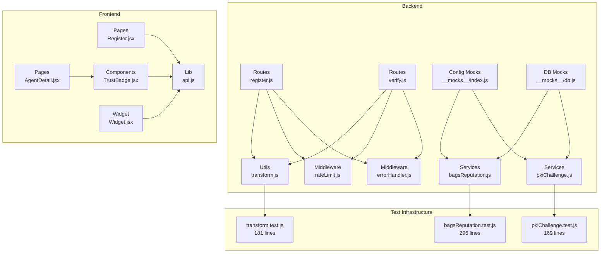
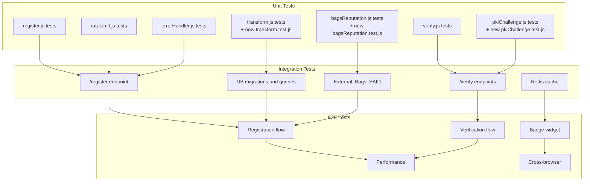
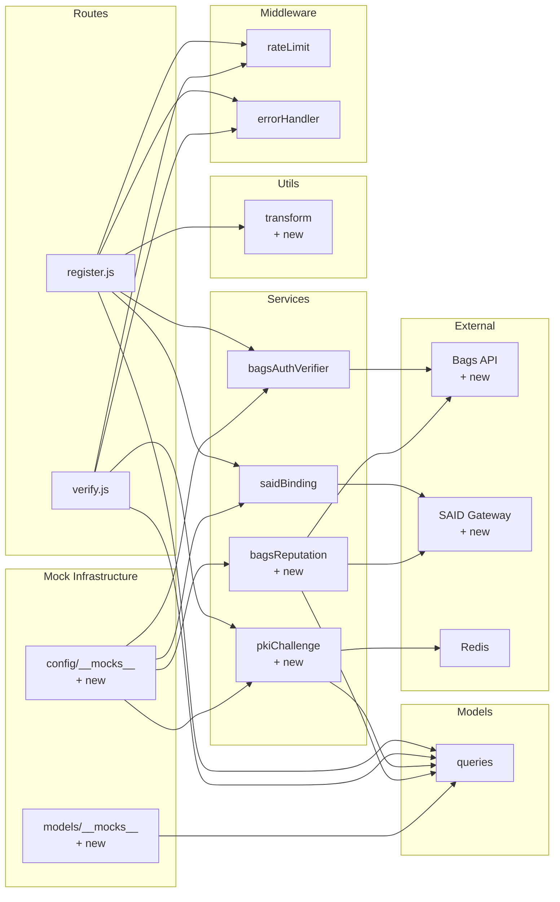

# Testing Strategy

<cite>
**Referenced Files in This Document**
- [agentid_build_plan.md](file://agentid_build_plan.md)
- [backend/package.json](file://backend/package.json)
- [frontend/package.json](file://frontend/package.json)
- [backend/src/routes/register.js](file://backend/src/routes/register.js)
- [backend/src/routes/verify.js](file://backend/src/routes/verify.js)
- [backend/src/utils/transform.js](file://backend/src/utils/transform.js)
- [backend/src/middleware/errorHandler.js](file://backend/src/middleware/errorHandler.js)
- [backend/src/middleware/rateLimit.js](file://backend/src/middleware/rateLimit.js)
- [backend/src/services/bagsReputation.js](file://backend/src/services/bagsReputation.js)
- [backend/src/services/pkiChallenge.js](file://backend/src/services/pkiChallenge.js)
- [backend/tests/bagsReputation.test.js](file://backend/tests/bagsReputation.test.js)
- [backend/tests/pkiChallenge.test.js](file://backend/tests/pkiChallenge.test.js)
- [backend/tests/transform.test.js](file://backend/tests/transform.test.js)
- [backend/src/config/__mocks__/index.js](file://backend/src/config/__mocks__/index.js)
- [backend/src/models/__mocks__/db.js](file://backend/src/models/__mocks__/db.js)
- [frontend/src/main.jsx](file://frontend/src/main.jsx)
- [frontend/src/App.jsx](file://frontend/src/App.jsx)
- [frontend/src/pages/Register.jsx](file://frontend/src/pages/Register.jsx)
- [frontend/src/pages/AgentDetail.jsx](file://frontend/src/pages/AgentDetail.jsx)
- [frontend/src/components/TrustBadge.jsx](file://frontend/src/components/TrustBadge.jsx)
- [frontend/src/lib/api.js](file://frontend/src/lib/api.js)
- [frontend/src/widget/Widget.jsx](file://frontend/src/widget/Widget.jsx)
- [frontend/vite.config.js](file://frontend/vite.config.js)
</cite>

## Update Summary
**Changes Made**
- Updated testing framework documentation to reflect migration from Vitest to Jest
- Enhanced service layer testing strategy to include comprehensive BAGS reputation scoring and PKI challenge system testing
- Added documentation for new dedicated mock modules for configuration and database interactions
- Expanded integration testing recommendations with sophisticated external dependency mocking
- Updated dependency analysis to include new service components and testing infrastructure

## Table of Contents
1. [Introduction](#introduction)
2. [Project Structure](#project-structure)
3. [Core Components](#core-components)
4. [Architecture Overview](#architecture-overview)
5. [Detailed Component Analysis](#detailed-component-analysis)
6. [Dependency Analysis](#dependency-analysis)
7. [Performance Considerations](#performance-considerations)
8. [Troubleshooting Guide](#troubleshooting-guide)
9. [Conclusion](#conclusion)
10. [Appendices](#appendices)

## Introduction
This document defines a comprehensive testing strategy for the AgentID system. It covers unit testing, integration testing, and end-to-end testing across backend services, frontend components, and widget integrations. The strategy emphasizes robustness against spoofing, accurate PKI challenge-response verification, reliable external service interactions, and consistent user experiences across browsers. The testing infrastructure has been significantly enhanced with comprehensive test suites for BAGS reputation scoring, PKI challenge system, and data transformation utilities, now powered by Jest as the primary testing framework.

## Project Structure
AgentID comprises:
- Backend (Node.js/Express): API routes, middleware, services, and models
- Frontend (React/Vite): Pages, components, and widget
- Comprehensive test infrastructure using Jest for unit testing with sophisticated mocking capabilities

**Diagram sources**
- [backend/src/routes/register.js:1-156](file://backend/src/routes/register.js#L1-L156)
- [backend/src/routes/verify.js:1-115](file://backend/src/routes/verify.js#L1-L115)
- [backend/src/utils/transform.js:1-103](file://backend/src/utils/transform.js#L1-L103)
- [backend/src/middleware/errorHandler.js:1-44](file://backend/src/middleware/errorHandler.js#L1-L44)
- [backend/src/middleware/rateLimit.js:1-62](file://backend/src/middleware/rateLimit.js#L1-L62)
- [backend/src/services/bagsReputation.js:1-146](file://backend/src/services/bagsReputation.js#L1-L146)
- [backend/src/services/pkiChallenge.js:1-102](file://backend/src/services/pkiChallenge.js#L1-L102)
- [backend/src/config/__mocks__/index.js:1-20](file://backend/src/config/__mocks__/index.js#L1-L20)
- [backend/src/models/__mocks__/db.js:1-13](file://backend/src/models/__mocks__/db.js#L1-L13)
- [backend/tests/bagsReputation.test.js:1-296](file://backend/tests/bagsReputation.test.js#L1-L296)
- [backend/tests/pkiChallenge.test.js:1-169](file://backend/tests/pkiChallenge.test.js#L1-L169)
- [backend/tests/transform.test.js:1-181](file://backend/tests/transform.test.js#L1-L181)
- [frontend/src/pages/Register.jsx](file://frontend/src/pages/Register.jsx)
- [frontend/src/pages/AgentDetail.jsx](file://frontend/src/pages/AgentDetail.jsx)
- [frontend/src/components/TrustBadge.jsx](file://frontend/src/components/TrustBadge.jsx)
- [frontend/src/lib/api.js](file://frontend/src/lib/api.js)
- [frontend/src/widget/Widget.jsx](file://frontend/src/widget/Widget.jsx)

**Section sources**
- [agentid_build_plan.md:258-302](file://agentid_build_plan.md#L258-L302)

## Core Components
- Registration route validates inputs, verifies Bags signatures, optionally binds to SAID, and persists agent records.
- Verification route issues and validates PKI challenges with replay protection and one-time use semantics.
- Utility transforms database snake_case fields to camelCase and normalizes API responses.
- Middleware enforces rate limits on endpoints and centralizes error handling.
- **New**: BAGS reputation service computes comprehensive reputation scores using 5 factors with graceful degradation.
- **New**: PKI challenge service manages Ed25519 challenge-response verification with base58 encoding.
- **New**: Enhanced transform utilities include HTML escaping and Solana address validation.
- **New**: Dedicated mock modules provide isolated testing with predictable behavior for external dependencies.

**Section sources**
- [backend/src/routes/register.js:15-153](file://backend/src/routes/register.js#L15-L153)
- [backend/src/routes/verify.js:16-112](file://backend/src/routes/verify.js#L16-L112)
- [backend/src/utils/transform.js:37-55](file://backend/src/utils/transform.js#L37-L55)
- [backend/src/middleware/rateLimit.js:15-61](file://backend/src/middleware/rateLimit.js#L15-L61)
- [backend/src/middleware/errorHandler.js:15-41](file://backend/src/middleware/errorHandler.js#L15-L41)
- [backend/src/services/bagsReputation.js:16-122](file://backend/src/services/bagsReputation.js#L16-L122)
- [backend/src/services/pkiChallenge.js:17-96](file://backend/src/services/pkiChallenge.js#L17-L96)
- [backend/src/config/__mocks__/index.js:5-16](file://backend/src/config/__mocks__/index.js#L5-L16)
- [backend/src/models/__mocks__/db.js:5-13](file://backend/src/models/__mocks__/db.js#L5-L13)

## Architecture Overview
The testing strategy targets four layers with comprehensive coverage:
- Unit tests: Route handlers, utilities, middleware, and new service components using Jest
- Integration tests: API endpoints, database, and external services
- End-to-end tests: User workflows, widget embedding, performance, and cross-browser compatibility
- **Enhanced**: Service layer testing with sophisticated mocking strategies for external dependencies

[No sources needed since this diagram shows conceptual workflow, not actual code structure]

## Detailed Component Analysis

### Unit Testing Strategy

#### Route Handlers
- Test input validation, error responses, and happy paths
- Mock middleware and model dependencies using Jest
- Validate transformed responses

Recommended tests:
- POST /register rejects missing fields and invalid lengths
- POST /register handles existing agent conflict
- POST /register continues despite SAID binding failure
- POST /verify/challenge returns 404 for unknown pubkey
- POST /verify/response handles not found, expired, and invalid signature scenarios

Mock strategies:
- Replace model calls with Jest spies/fakes
- Stub middleware behavior (rate limiter, error handler)
- Use deterministic nonces/timestamps for deterministic tests

Test data management:
- Define minimal valid payloads per route
- Maintain separate datasets for success and failure cases
- Use factories to generate consistent test fixtures

**Section sources**
- [backend/src/routes/register.js:15-153](file://backend/src/routes/register.js#L15-L153)
- [backend/src/routes/verify.js:16-112](file://backend/src/routes/verify.js#L16-L112)
- [backend/src/utils/transform.js:37-55](file://backend/src/utils/transform.js#L37-L55)
- [backend/src/middleware/rateLimit.js:15-61](file://backend/src/middleware/rateLimit.js#L15-L61)
- [backend/src/middleware/errorHandler.js:15-41](file://backend/src/middleware/errorHandler.js#L15-L41)

#### Services Layer Testing

##### BAGS Reputation Service
- **New**: Comprehensive testing for 5-factor scoring algorithm using Jest
- **New**: Graceful degradation when external APIs fail
- **New**: Label threshold validation (HIGH, MEDIUM, LOW, UNVERIFIED)
- **New**: Breakdown validation ensuring scores sum correctly

Recommended tests:
- Full scoring calculation with all 5 factors contributing
- Score breakdown validation where individual components sum to total
- Label threshold boundaries (>=80, >=60, >=40, <40)
- Graceful degradation when Bags API fails
- Graceful degradation when SAID API fails
- Mixed API failure scenarios

Mock strategies:
- Mock external API calls with axios using Jest
- Mock database queries for agent data and actions
- Mock SAID trust score service
- Use deterministic test data for reproducible results

Test data management:
- Create comprehensive test scenarios covering edge cases
- Use realistic but controlled fee amounts, success rates, and flag counts
- Validate mathematical calculations with known expected outcomes

**Section sources**
- [backend/src/services/bagsReputation.js:16-122](file://backend/src/services/bagsReputation.js#L16-L122)
- [backend/tests/bagsReputation.test.js:58-294](file://backend/tests/bagsReputation.test.js#L58-L294)

##### PKI Challenge Service
- **New**: Ed25519 signature verification testing using Jest
- **New**: Challenge issuance and format validation
- **New**: Base58 encoding/decoding verification
- **New**: Expiration and replay protection testing

Recommended tests:
- Challenge issuance with correct format and expiration
- Base58-encoded challenge validation
- Valid signature verification with real Ed25519 keys
- Invalid signature rejection with proper error messages
- Expired challenge detection and error handling
- Nonce-based replay protection

Mock strategies:
- Use tweetnacl for real cryptographic operations in tests
- Mock database verification records
- Test both positive and negative signature scenarios
- Validate challenge string format and encoding

Test data management:
- Generate real key pairs for signature testing
- Create deterministic nonces and timestamps
- Test edge cases like empty signatures and malformed data

**Section sources**
- [backend/src/services/pkiChallenge.js:17-96](file://backend/src/services/pkiChallenge.js#L17-L96)
- [backend/tests/pkiChallenge.test.js:45-185](file://backend/tests/pkiChallenge.test.js#L45-L185)

#### Utilities
- Validate key transformations and array handling
- Ensure capability_set mapping to capabilities
- **New**: HTML escaping for XSS prevention
- **New**: Solana address validation

Recommended tests:
- snakeToCamel converts nested objects and arrays
- transformAgent maps capability_set to capabilities
- transformAgents applies mapping to lists
- escapeHtml handles all HTML special characters
- isValidSolanaAddress validates correct and incorrect formats

Mock strategies:
- No external dependencies; pure functions
- Parameterized tests for various shapes of input
- Edge case testing for null, undefined, and primitive values

**Section sources**
- [backend/src/utils/transform.js:1-103](file://backend/src/utils/transform.js#L1-L103)
- [backend/tests/transform.test.js:9-181](file://backend/tests/transform.test.js#L9-L181)

#### Middleware
- Validate rate limit behavior and error responses
- Validate global error handler formatting and logging

Recommended tests:
- Default and auth-specific limits apply
- Error handler returns correct status and shape
- Stack traces included in development mode

Mock strategies:
- Capture console output for logging assertions
- Use fake timers for rate limit windows

**Section sources**
- [backend/src/middleware/rateLimit.js:15-61](file://backend/src/middleware/rateLimit.js#L15-L61)
- [backend/src/middleware/errorHandler.js:15-41](file://backend/src/middleware/errorHandler.js#L15-L41)

### Integration Testing Strategy

#### API Endpoints
- Database-backed routes: /register, /verify/*
- External service interactions: Bags, SAID
- Cache interactions: Redis

Recommended tests:
- End-to-end registration pipeline with mocks for external services
- End-to-end verification pipeline with challenge persistence and replay protection
- Error propagation from external services to clients

Mock strategies:
- Use Jest to stub external HTTP calls
- Use an in-memory Postgres container for DB tests
- Use a local Redis instance for cache tests

Test data management:
- Seed DB with deterministic agent records
- Use unique nonces per test run
- Snapshot external responses for deterministic assertions

**Section sources**
- [backend/src/routes/register.js:55-153](file://backend/src/routes/register.js#L55-L153)
- [backend/src/routes/verify.js:16-112](file://backend/src/routes/verify.js#L16-L112)

#### Database Interactions
- Migration readiness and idempotency
- Query correctness and transaction boundaries
- Index and constraint validations

Recommended tests:
- Run migrations in isolated transactions
- Validate insert/update/delete semantics
- Assert foreign key and uniqueness constraints

Mock strategies:
- Use a test database instance
- Rollback after each test

**Section sources**
- [agentid_build_plan.md:87-130](file://agentid_build_plan.md#L87-L130)

#### External Service Mocking
- Bags API: authentication initiation and callback
- SAID Gateway: registration and trust score retrieval
- Redis: challenge storage and badge caching

Recommended tests:
- Positive and negative paths for each external call
- Network failures and timeouts
- Partial responses and malformed data

Mock strategies:
- HTTP mocking libraries to simulate external APIs
- Use fake credentials and deterministic responses
- **New**: Dedicated mock modules for configuration and database interactions

**Section sources**
- [agentid_build_plan.md:42-86](file://agentid_build_plan.md#L42-L86)
- [agentid_build_plan.md:132-184](file://agentid_build_plan.md#L132-L184)
- [agentid_build_plan.md:185-227](file://agentid_build_plan.md#L185-L227)
- [backend/src/config/__mocks__/index.js:5-16](file://backend/src/config/__mocks__/index.js#L5-L16)
- [backend/src/models/__mocks__/db.js:5-13](file://backend/src/models/__mocks__/db.js#L5-L13)

### End-to-End Testing Strategy

#### User Workflows
- Registration flow: input validation, signature verification, SAID binding, DB persistence
- Verification flow: challenge issuance, response verification, replay protection
- Discovery and badge retrieval: capability filtering, reputation computation, badge rendering

Recommended tests:
- Cross-environment runs against staging
- Regression suites for critical flows

**Section sources**
- [agentid_build_plan.md:228-246](file://agentid_build_plan.md#L228-L246)

#### Widget Integration Testing
- Widget rendering in iframes
- Badge API responses consumed by the widget
- Responsive layout and accessibility

Recommended tests:
- Snapshot tests for rendered widget HTML
- Accessibility checks
- Resize and orientation changes

**Section sources**
- [frontend/src/widget/Widget.jsx](file://frontend/src/widget/Widget.jsx)
- [frontend/src/components/TrustBadge.jsx](file://frontend/src/components/TrustBadge.jsx)

#### Performance Testing
- Load tests for registration and verification under concurrency
- Latency targets for external service calls
- Memory and CPU profiling

Recommended tests:
- Use load testing tools to simulate bursts
- Monitor external service SLAs and retry policies
- Cache hit ratios for badge responses

**Section sources**
- [agentid_build_plan.md:309-330](file://agentid_build_plan.md#L309-L330)

#### Cross-Browser Compatibility
- Test widget and pages across major browsers
- Validate responsive behavior and fonts

Recommended tests:
- Automated browser matrix tests
- Manual validation for critical flows

**Section sources**
- [frontend/src/main.jsx:1-11](file://frontend/src/main.jsx#L1-L11)
- [frontend/src/App.jsx](file://frontend/src/App.jsx)
- [frontend/vite.config.js:31-40](file://frontend/vite.config.js#L31-L40)

## Dependency Analysis
Testing dependencies and coupling:
- Routes depend on services and models; isolate these with mocks
- Utilities are pure and low-risk; focus on boundary conditions
- Middleware depends on configuration; test both production and development modes
- Frontend components depend on API; mock API responses
- **New**: Service components have complex external dependencies requiring sophisticated mocking
- **New**: Dedicated mock modules facilitate isolated testing with predictable behavior

**Diagram sources**
- [backend/src/routes/register.js:6-13](file://backend/src/routes/register.js#L6-L13)
- [backend/src/routes/verify.js:6-11](file://backend/src/routes/verify.js#L6-L11)
- [backend/src/utils/transform.js:1-103](file://backend/src/utils/transform.js#L1-L103)
- [backend/src/middleware/rateLimit.js:1-62](file://backend/src/middleware/rateLimit.js#L1-L62)
- [backend/src/middleware/errorHandler.js:1-44](file://backend/src/middleware/errorHandler.js#L1-L44)
- [backend/src/services/bagsReputation.js:6-9](file://backend/src/services/bagsReputation.js#L6-L9)
- [backend/src/services/pkiChallenge.js:6-10](file://backend/src/services/pkiChallenge.js#L6-L10)
- [backend/src/config/__mocks__/index.js:5-16](file://backend/src/config/__mocks__/index.js#L5-L16)
- [backend/src/models/__mocks__/db.js:5-13](file://backend/src/models/__mocks__/db.js#L5-L13)
- [agentid_build_plan.md:42-86](file://agentid_build_plan.md#L42-L86)
- [agentid_build_plan.md:132-184](file://agentid_build_plan.md#L132-L184)

**Section sources**
- [backend/src/routes/register.js:6-13](file://backend/src/routes/register.js#L6-L13)
- [backend/src/routes/verify.js:6-11](file://backend/src/routes/verify.js#L6-L11)
- [backend/src/utils/transform.js:1-103](file://backend/src/utils/transform.js#L1-L103)
- [backend/src/middleware/rateLimit.js:1-62](file://backend/src/middleware/rateLimit.js#L1-L62)
- [backend/src/middleware/errorHandler.js:1-44](file://backend/src/middleware/errorHandler.js#L1-L44)

## Performance Considerations
- Enforce rate limits at the edge to protect downstream services
- Cache frequently accessed badges and reduce external calls
- Use streaming and pagination for large lists
- Monitor and alert on latency spikes and error rates
- **New**: Optimize service layer tests to minimize external API calls during unit testing
- **New**: Leverage Jest's efficient test runner for faster test execution

[No sources needed since this section provides general guidance]

## Troubleshooting Guide
Common issues and debugging techniques:
- Signature verification failures: validate message composition and encoding
- Replay attacks: confirm nonce expiry and one-time use flags
- External service outages: implement retries and circuit breaker behavior
- Database deadlocks: optimize queries and use connection pooling
- **New**: BAGS reputation scoring errors: validate API responses and fallback logic
- **New**: PKI challenge failures: verify base58 encoding and Ed25519 signature validation
- **New**: Jest-specific issues: check mock configurations and test environment setup

**Section sources**
- [backend/src/routes/verify.js:78-107](file://backend/src/routes/verify.js#L78-L107)
- [backend/src/middleware/rateLimit.js:37-41](file://backend/src/middleware/rateLimit.js#L37-L41)
- [agentid_build_plan.md:132-184](file://agentid_build_plan.md#L132-L184)

## Conclusion
A layered testing strategy ensures AgentID remains secure, reliable, and performant. Unit tests guard core logic including the new comprehensive service components, integration tests validate end-to-end flows with controlled external dependencies, and E2E tests validate user workflows and cross-browser compatibility. The enhanced testing infrastructure with Jest provides robust coverage for BAGS reputation scoring, PKI challenge systems, and data transformation utilities, along with sophisticated mocking capabilities through dedicated mock modules. Combined with performance and reliability practices, this approach supports safe releases and rapid iteration.

[No sources needed since this section summarizes without analyzing specific files]

## Appendices

### Testing Frameworks and Tooling
- Backend: **Enhanced**: Jest for unit testing with comprehensive mocking support and dedicated mock modules
- Frontend: Component testing library, snapshot testing, browser automation, performance tools
- CI/CD: Automated linting, unit and integration tests, E2E matrix, artifact publishing
- **New**: Sophisticated external dependency mocking with Jest
- **New**: Dedicated mock modules for configuration and database interactions

**Section sources**
- [backend/package.json:6-12](file://backend/package.json#L6-L12)
- [frontend/package.json:6-11](file://frontend/package.json#L6-L11)

### Test Coverage Requirements
- Unit tests: target high coverage for route handlers, utilities, middleware, and **new service components**
- Integration tests: ensure critical paths through models and external services
- E2E tests: cover primary user journeys and widget embedding
- **New**: Service components require comprehensive coverage for external API interactions and error handling
- **New**: Mock modules should be tested for proper isolation and predictable behavior

[No sources needed since this section provides general guidance]

### Continuous Integration and Automated Pipelines
- Trigger tests on pull requests and pushes
- Parallelize unit, integration, and E2E jobs
- Publish artifacts and maintain test reports
- **New**: Automated testing for service layer components with external dependency mocking
- **New**: Mock module validation in CI pipeline

[No sources needed since this section provides general guidance]

### Service Component Testing Best Practices
- **New**: Use real cryptographic libraries (tweetnacl) for signature testing
- **New**: Implement graceful degradation testing for external API failures
- **New**: Validate mathematical calculations with known expected outcomes
- **New**: Test boundary conditions for scoring algorithms and label thresholds
- **New**: Leverage Jest's advanced mocking capabilities for external dependencies
- **New**: Utilize dedicated mock modules for consistent test environments

**Section sources**
- [backend/tests/bagsReputation.test.js:58-294](file://backend/tests/bagsReputation.test.js#L58-L294)
- [backend/tests/pkiChallenge.test.js:45-185](file://backend/tests/pkiChallenge.test.js#L45-L185)
- [backend/tests/transform.test.js:9-181](file://backend/tests/transform.test.js#L9-L181)
- [backend/src/config/__mocks__/index.js:5-16](file://backend/src/config/__mocks__/index.js#L5-L16)
- [backend/src/models/__mocks__/db.js:5-13](file://backend/src/models/__mocks__/db.js#L5-L13)