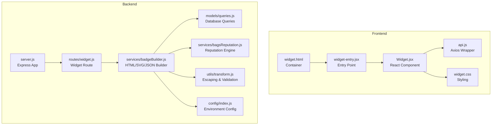
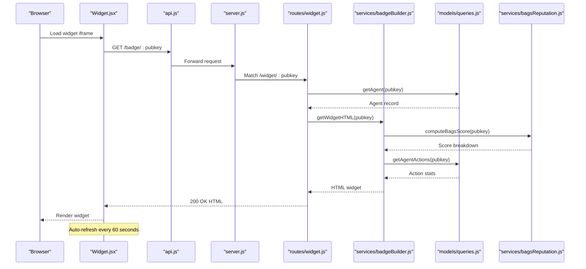
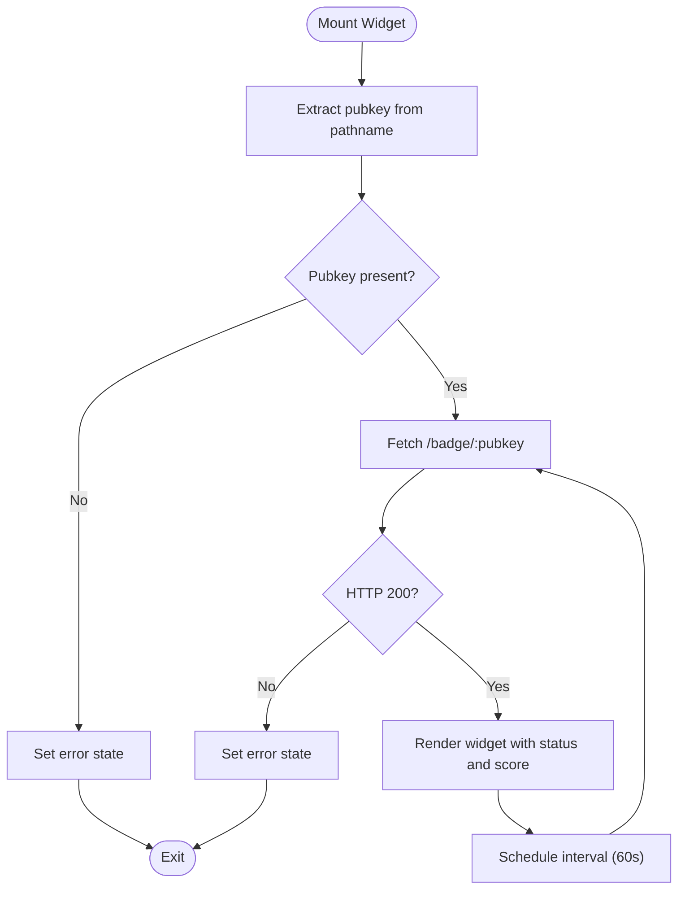
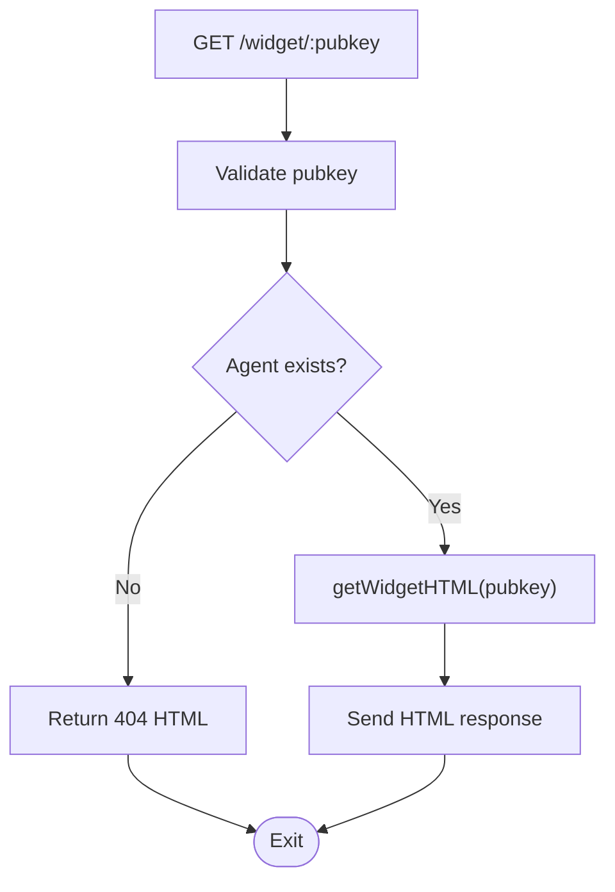
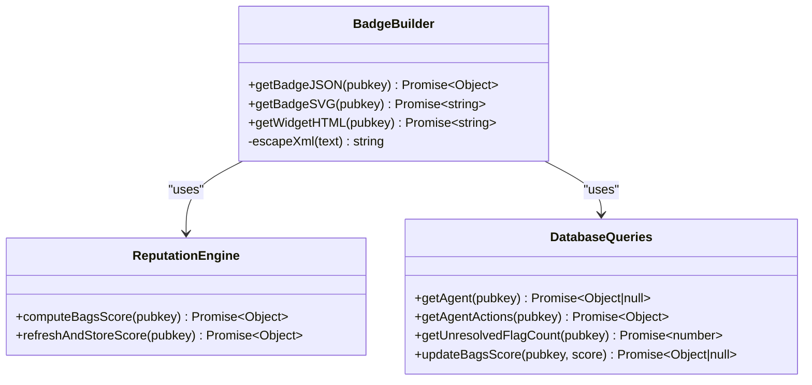
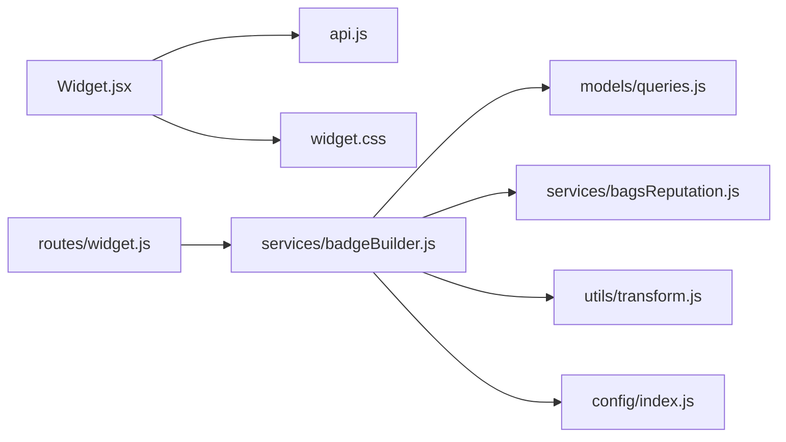

# Widget Guide

<cite>
**Referenced Files in This Document**
- [WIDGET_GUIDE.md](file://docs/WIDGET_GUIDE.md)
- [Widget.jsx](file://frontend/src/widget/Widget.jsx)
- [widget-entry.jsx](file://frontend/src/widget/widget-entry.jsx)
- [widget.css](file://frontend/src/widget/widget.css)
- [widget.js](file://backend/src/routes/widget.js)
- [badgeBuilder.js](file://backend/src/services/badgeBuilder.js)
- [queries.js](file://backend/src/models/queries.js)
- [api.js](file://frontend/src/lib/api.js)
- [index.js](file://backend/src/config/index.js)
- [server.js](file://backend/server.js)
- [transform.js](file://backend/src/utils/transform.js)
- [bagsReputation.js](file://backend/src/services/bagsReputation.js)
- [widget.html](file://frontend/widget.html)
- [README.md](file://README.md)
- [API_REFERENCE.md](file://docs/API_REFERENCE.md)
</cite>

## Update Summary
**Changes Made**
- Updated all domain references from `your-domain.io` to `agentid.provenanceai.network` in widget embedding examples
- Corrected the agent ID base URL configuration reference in the badge builder service
- Updated troubleshooting section to reflect the new production domain
- Enhanced security considerations with the new domain context

## Table of Contents
1. [Introduction](#introduction)
2. [Project Structure](#project-structure)
3. [Core Components](#core-components)
4. [Architecture Overview](#architecture-overview)
5. [Detailed Component Analysis](#detailed-component-analysis)
6. [Dependency Analysis](#dependency-analysis)
7. [Performance Considerations](#performance-considerations)
8. [Troubleshooting Guide](#troubleshooting-guide)
9. [Conclusion](#conclusion)

## Introduction
This guide explains how to integrate and customize the AgentID Widget, a visual trust indicator that displays real-time reputation data for agents. The widget supports three delivery modes:
- iframe embed for quick integration
- Self-hosted React component using the JSON API
- Direct SVG badge for documentation and README files

Key features include automatic 60-second refresh, responsive design, and zero external dependencies for the iframe version.

**Updated** Domain has been migrated from `your-domain.io` to `agentid.provenanceai.network` for production deployments.

## Project Structure
The widget spans both frontend and backend components:
- Frontend: React-based widget renderer with Tailwind CSS styling
- Backend: Express routes that serve HTML, JSON, and SVG badges
- Shared configuration and utilities for caching, reputation computation, and data transformation

**Diagram sources**
- [server.js:1-104](file://backend/server.js#L1-L104)
- [widget.js:1-89](file://backend/src/routes/widget.js#L1-L89)
- [badgeBuilder.js:1-566](file://backend/src/services/badgeBuilder.js#L1-L566)
- [Widget.jsx:1-218](file://frontend/src/widget/Widget.jsx#L1-L218)
- [widget-entry.jsx:1-11](file://frontend/src/widget/widget-entry.jsx#L1-L11)
- [widget.css:1-70](file://frontend/src/widget/widget.css#L1-L70)
- [api.js:1-141](file://frontend/src/lib/api.js#L1-L141)
- [index.js:1-34](file://backend/src/config/index.js#L1-L34)
- [transform.js:1-103](file://backend/src/utils/transform.js#L1-L103)
- [queries.js:1-404](file://backend/src/models/queries.js#L1-L404)
- [bagsReputation.js:1-146](file://backend/src/services/bagsReputation.js#L1-L146)

**Section sources**
- [server.js:1-104](file://backend/server.js#L1-L104)
- [widget.js:1-89](file://backend/src/routes/widget.js#L1-L89)
- [badgeBuilder.js:1-566](file://backend/src/services/badgeBuilder.js#L1-L566)
- [Widget.jsx:1-218](file://frontend/src/widget/Widget.jsx#L1-L218)
- [widget-entry.jsx:1-11](file://frontend/src/widget/widget-entry.jsx#L1-L11)
- [widget.css:1-70](file://frontend/src/widget/widget.css#L1-L70)
- [api.js:1-141](file://frontend/src/lib/api.js#L1-L141)
- [index.js:1-34](file://backend/src/config/index.js#L1-L34)
- [transform.js:1-103](file://backend/src/utils/transform.js#L1-L103)
- [queries.js:1-404](file://backend/src/models/queries.js#L1-L404)
- [bagsReputation.js:1-146](file://backend/src/services/bagsReputation.js#L1-L146)

## Core Components
- Widget React Component: Fetches badge data, renders status, score, and metadata, and auto-refreshes every 60 seconds.
- Widget Entry Point: Initializes the React root and mounts the widget.
- Widget Styles: Tailwind-based CSS with dark theme and animations.
- Backend Widget Route: Validates agent existence and serves prebuilt HTML widget.
- Badge Builder Service: Generates JSON, SVG, and HTML widget content with caching and reputation computation.
- API Layer: Axios wrapper for frontend requests and backend route handlers.

**Section sources**
- [Widget.jsx:1-218](file://frontend/src/widget/Widget.jsx#L1-L218)
- [widget-entry.jsx:1-11](file://frontend/src/widget/widget-entry.jsx#L1-L11)
- [widget.css:1-70](file://frontend/src/widget/widget.css#L1-L70)
- [widget.js:1-89](file://backend/src/routes/widget.js#L1-L89)
- [badgeBuilder.js:1-566](file://backend/src/services/badgeBuilder.js#L1-L566)
- [api.js:1-141](file://frontend/src/lib/api.js#L1-L141)

## Architecture Overview
The widget pipeline integrates frontend and backend components to deliver a responsive, secure, and performant trust indicator.

**Diagram sources**
- [Widget.jsx:73-102](file://frontend/src/widget/Widget.jsx#L73-L102)
- [api.js:52-56](file://frontend/src/lib/api.js#L52-L56)
- [server.js:66-76](file://backend/server.js#L66-L76)
- [widget.js:18-86](file://backend/src/routes/widget.js#L18-L86)
- [badgeBuilder.js:17-89](file://backend/src/services/badgeBuilder.js#L17-L89)
- [queries.js:36-202](file://backend/src/models/queries.js#L36-L202)
- [bagsReputation.js:16-122](file://backend/src/services/bagsReputation.js#L16-L122)

## Detailed Component Analysis

### Widget React Component
Responsibilities:
- Extract pubkey from URL path
- Fetch badge data via API with error handling
- Auto-refresh every 60 seconds
- Render status, score, and metadata with Tailwind classes
- Provide loading skeleton and error states

**Diagram sources**
- [Widget.jsx:61-102](file://frontend/src/widget/Widget.jsx#L61-L102)
- [Widget.jsx:73-94](file://frontend/src/widget/Widget.jsx#L73-L94)

**Section sources**
- [Widget.jsx:1-218](file://frontend/src/widget/Widget.jsx#L1-L218)

### Backend Widget Route
Responsibilities:
- Validate agent existence
- Return simple HTML error page for missing agents
- Generate and return HTML widget via builder service
- Apply rate limiting and sanitize inputs

**Diagram sources**
- [widget.js:18-86](file://backend/src/routes/widget.js#L18-L86)
- [badgeBuilder.js:220-544](file://backend/src/services/badgeBuilder.js#L220-L544)

**Section sources**
- [widget.js:1-89](file://backend/src/routes/widget.js#L1-L89)

### Badge Builder Service
Responsibilities:
- Compute BAGS reputation score using multiple factors
- Aggregate action statistics and derive success rate
- Determine status (verified/unverified/flagged) and tier (verified/standard)
- Generate JSON, SVG, and HTML widget content
- Apply caching with configurable TTL

**Diagram sources**
- [badgeBuilder.js:17-89](file://backend/src/services/badgeBuilder.js#L17-L89)
- [bagsReputation.js:16-140](file://backend/src/services/bagsReputation.js#L16-L140)
- [queries.js:36-202](file://backend/src/models/queries.js#L36-L202)

**Section sources**
- [badgeBuilder.js:1-566](file://backend/src/services/badgeBuilder.js#L1-L566)
- [bagsReputation.js:1-146](file://backend/src/services/bagsReputation.js#L1-L146)
- [queries.js:1-404](file://backend/src/models/queries.js#L1-L404)

### Configuration and Environment
- Port, CORS origin, cache TTL, and verified threshold are configured via environment variables
- Agent base URL is used to construct widget URLs in generated HTML

**Updated** The agent base URL configuration now uses `agentIdBaseUrl` which defaults to the production domain `agentid.provenanceai.network`.

**Section sources**
- [index.js:1-34](file://backend/src/config/index.js#L1-L34)
- [badgeBuilder.js:59](file://backend/src/services/badgeBuilder.js#L59)

## Dependency Analysis
The widget relies on a clear separation of concerns:
- Frontend depends on its own Axios wrapper and Tailwind CSS
- Backend routes depend on the badge builder service
- Badge builder depends on reputation computation and database queries
- Utilities provide escaping and validation

**Diagram sources**
- [Widget.jsx:1-218](file://frontend/src/widget/Widget.jsx#L1-L218)
- [api.js:1-141](file://frontend/src/lib/api.js#L1-L141)
- [widget.js:1-89](file://backend/src/routes/widget.js#L1-L89)
- [badgeBuilder.js:1-566](file://backend/src/services/badgeBuilder.js#L1-L566)
- [queries.js:1-404](file://backend/src/models/queries.js#L1-L404)
- [bagsReputation.js:1-146](file://backend/src/services/bagsReputation.js#L1-L146)
- [transform.js:1-103](file://backend/src/utils/transform.js#L1-L103)
- [index.js:1-34](file://backend/src/config/index.js#L1-L34)

**Section sources**
- [Widget.jsx:1-218](file://frontend/src/widget/Widget.jsx#L1-L218)
- [api.js:1-141](file://frontend/src/lib/api.js#L1-L141)
- [widget.js:1-89](file://backend/src/routes/widget.js#L1-L89)
- [badgeBuilder.js:1-566](file://backend/src/services/badgeBuilder.js#L1-L566)
- [queries.js:1-404](file://backend/src/models/queries.js#L1-L404)
- [bagsReputation.js:1-146](file://backend/src/services/bagsReputation.js#L1-L146)
- [transform.js:1-103](file://backend/src/utils/transform.js#L1-L103)
- [index.js:1-34](file://backend/src/config/index.js#L1-L34)

## Performance Considerations
- Caching: Badge data is cached with a configurable TTL to reduce database and upstream API load.
- Auto-refresh: The widget reloads every 60 seconds to balance freshness and performance.
- Lazy loading: For iframe embeds, use the native lazy loading attribute to defer rendering until visible.
- Minimizing payload: Prefer SVG badges for lightweight static displays in documentation.

## Troubleshooting Guide
Common issues and resolutions:
- CORS errors: Ensure the frontend origin is included in the CORS configuration.
- Widget not loading: Verify the pubkey format and agent registration; confirm minimum iframe dimensions.
- Data staleness: Understand the 60-second cache TTL and consider adding a cache-busting parameter.
- SVG rendering: Confirm correct endpoint and content-type; use raw SVG URLs for static hosts.
- Rate limiting: Default limits apply; implement client-side caching and avoid excessive polling.
- Styling conflicts: Use the seamless attribute or reset inherited styles in the container.

**Updated** Domain migration affects CORS configuration and widget URLs. Ensure your CORS_ORIGIN includes the new domain `agentid.provenanceai.network` and update any hardcoded widget URLs to use the new domain.

**Section sources**
- [WIDGET_GUIDE.md:396-474](file://docs/WIDGET_GUIDE.md#L396-L474)
- [index.js:22-27](file://backend/src/config/index.js#L22-L27)
- [badgeBuilder.js:20-24](file://backend/src/services/badgeBuilder.js#L20-L24)

## Conclusion
The AgentID Widget provides a flexible, secure, and performant way to display agent trust indicators. Choose the iframe embed for simplicity, self-hosted React for customization, or SVG for static documentation. Leverage caching, auto-refresh, and proper error handling to ensure a smooth user experience.

**Updated** The domain migration to `agentid.provenanceai.network` ensures production-ready deployment with proper SSL certificates and DNS configuration. All widget integrations should now use the new domain for reliable access to trust badges and reputation data.